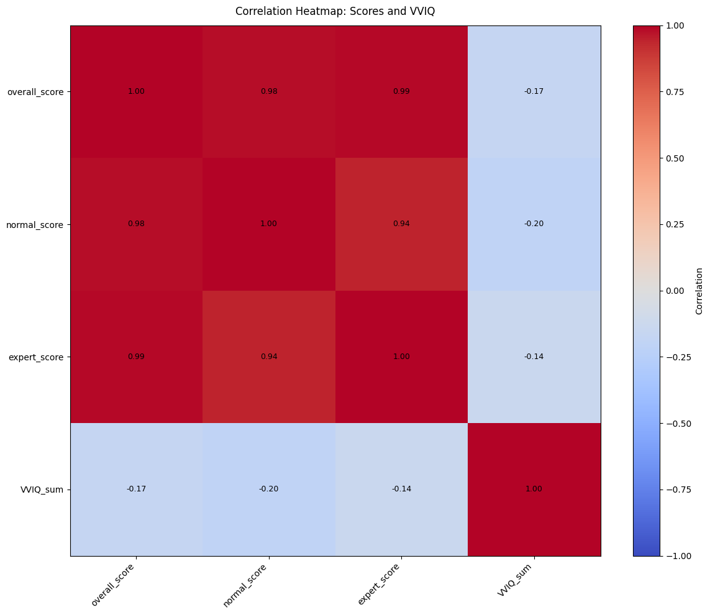

# Artificial Phantasia: Evidence for Propositional Reasoning-Based Mental Imagery in Large Language Models - Jupyter Notebook Data Analysis
by Anonymous Authors
2025-09-23


```python
import pandas as pd
import numpy as np
import re
import matplotlib.pyplot as plt
```

## 1) Load Data


```python
human_data = pd.read_csv('input_csvs/human_phantasia_data.csv')
llm_data = pd.read_csv('input_csvs/llm_phantasia_data.csv')
```


```python
human_data
```


<div>
<style scoped>
    .dataframe tbody tr th:only-of-type {
        vertical-align: middle;
    }

    .dataframe tbody tr th {
        vertical-align: top;
    }

    .dataframe thead th {
        text-align: right;
    }
</style>
<table border="1" class="dataframe">
  <thead>
    <tr style="text-align: right;">
      <th></th>
      <th>ResponseId</th>
      <th>001 - Response</th>
      <th>002 - Response</th>
      <th>003 - Response</th>
      <th>004 - Response</th>
      <th>005 - Response</th>
      <th>006 - Response</th>
      <th>007 - Response</th>
      <th>008 - Response</th>
      <th>009 - Response</th>
      <th>...</th>
      <th>VVIQ - 07</th>
      <th>VVIQ - 08</th>
      <th>VVIQ - 09</th>
      <th>VVIQ - 10</th>
      <th>VVIQ - 11</th>
      <th>VVIQ - 12</th>
      <th>VVIQ - 13</th>
      <th>VVIQ - 14</th>
      <th>VVIQ - 15</th>
      <th>VVIQ - 16</th>
    </tr>
  </thead>
  <tbody>
    <tr>
      <th>0</th>
      <td>R_6hazd14Iv0vRJV7</td>
      <td>two squares</td>
      <td>NaN</td>
      <td>key</td>
      <td>NaN</td>
      <td>NaN</td>
      <td>NaN</td>
      <td>NaN</td>
      <td>NaN</td>
      <td>NaN</td>
      <td>...</td>
      <td>5. Perfectly clear and as vivid as normal vision</td>
      <td>5. Perfectly clear and as vivid as normal vision</td>
      <td>1. No image at all, you only 'know' that you a...</td>
      <td>1. No image at all, you only 'know' that you a...</td>
      <td>4. Clear and reasonably vivid</td>
      <td>1. No image at all, you only 'know' that you a...</td>
      <td>5. Perfectly clear and as vivid as normal vision</td>
      <td>5. Perfectly clear and as vivid as normal vision</td>
      <td>5. Perfectly clear and as vivid as normal vision</td>
      <td>5. Perfectly clear and as vivid as normal vision</td>
    </tr>
    <tr>
      <th>1</th>
      <td>R_5vQ6Xf1WugueDND</td>
      <td>NaN</td>
      <td>NaN</td>
      <td>NaN</td>
      <td>NaN</td>
      <td>two chairs</td>
      <td>NaN</td>
      <td>NaN</td>
      <td>NaN</td>
      <td>NaN</td>
      <td>...</td>
      <td>5. Perfectly clear and as vivid as normal vision</td>
      <td>5. Perfectly clear and as vivid as normal vision</td>
      <td>5. Perfectly clear and as vivid as normal vision</td>
      <td>5. Perfectly clear and as vivid as normal vision</td>
      <td>4. Clear and reasonably vivid</td>
      <td>4. Clear and reasonably vivid</td>
      <td>5. Perfectly clear and as vivid as normal vision</td>
      <td>5. Perfectly clear and as vivid as normal vision</td>
      <td>5. Perfectly clear and as vivid as normal vision</td>
      <td>4. Clear and reasonably vivid</td>
    </tr>
    <tr>
      <th>2</th>
      <td>R_5KpdGyLKCFDJS5r</td>
      <td>NaN</td>
      <td>NaN</td>
      <td>NaN</td>
      <td>NaN</td>
      <td>NaN</td>
      <td>House</td>
      <td>NaN</td>
      <td>Butterfly</td>
      <td>Mountain</td>
      <td>...</td>
      <td>5. Perfectly clear and as vivid as normal vision</td>
      <td>5. Perfectly clear and as vivid as normal vision</td>
      <td>5. Perfectly clear and as vivid as normal vision</td>
      <td>5. Perfectly clear and as vivid as normal vision</td>
      <td>2. Vague and dim</td>
      <td>5. Perfectly clear and as vivid as normal vision</td>
      <td>1. No image at all, you only 'know' that you a...</td>
      <td>5. Perfectly clear and as vivid as normal vision</td>
      <td>4. Clear and reasonably vivid</td>
      <td>4. Clear and reasonably vivid</td>
    </tr>
    <tr>
      <th>3</th>
      <td>R_5hfsgpVmDBRxfr5</td>
      <td>NaN</td>
      <td>ladder</td>
      <td>NaN</td>
      <td>NaN</td>
      <td>NaN</td>
      <td>NaN</td>
      <td>NaN</td>
      <td>NaN</td>
      <td>NaN</td>
      <td>...</td>
      <td>3. Moderately clear and vivid</td>
      <td>3. Moderately clear and vivid</td>
      <td>3. Moderately clear and vivid</td>
      <td>2. Vague and dim</td>
      <td>3. Moderately clear and vivid</td>
      <td>3. Moderately clear and vivid</td>
      <td>3. Moderately clear and vivid</td>
      <td>3. Moderately clear and vivid</td>
      <td>3. Moderately clear and vivid</td>
      <td>3. Moderately clear and vivid</td>
    </tr>
    <tr>
      <th>4</th>
      <td>R_6Eu2oR7CwVBRwyp</td>
      <td>NaN</td>
      <td>NaN</td>
      <td>NaN</td>
      <td>NaN</td>
      <td>NaN</td>
      <td>NaN</td>
      <td>NaN</td>
      <td>butterfly</td>
      <td>butterfly</td>
      <td>...</td>
      <td>5. Perfectly clear and as vivid as normal vision</td>
      <td>5. Perfectly clear and as vivid as normal vision</td>
      <td>3. Moderately clear and vivid</td>
      <td>3. Moderately clear and vivid</td>
      <td>3. Moderately clear and vivid</td>
      <td>3. Moderately clear and vivid</td>
      <td>3. Moderately clear and vivid</td>
      <td>3. Moderately clear and vivid</td>
      <td>3. Moderately clear and vivid</td>
      <td>3. Moderately clear and vivid</td>
    </tr>
    <tr>
      <th>...</th>
      <td>...</td>
      <td>...</td>
      <td>...</td>
      <td>...</td>
      <td>...</td>
      <td>...</td>
      <td>...</td>
      <td>...</td>
      <td>...</td>
      <td>...</td>
      <td>...</td>
      <td>...</td>
      <td>...</td>
      <td>...</td>
      <td>...</td>
      <td>...</td>
      <td>...</td>
      <td>...</td>
      <td>...</td>
      <td>...</td>
      <td>...</td>
    </tr>
    <tr>
      <th>95</th>
      <td>R_6RqfSAN0DF8nnsa</td>
      <td>ladder</td>
      <td>NaN</td>
      <td>NaN</td>
      <td>NaN</td>
      <td>NaN</td>
      <td>NaN</td>
      <td>tree</td>
      <td>NaN</td>
      <td>NaN</td>
      <td>...</td>
      <td>5. Perfectly clear and as vivid as normal vision</td>
      <td>5. Perfectly clear and as vivid as normal vision</td>
      <td>5. Perfectly clear and as vivid as normal vision</td>
      <td>5. Perfectly clear and as vivid as normal vision</td>
      <td>4. Clear and reasonably vivid</td>
      <td>3. Moderately clear and vivid</td>
      <td>3. Moderately clear and vivid</td>
      <td>3. Moderately clear and vivid</td>
      <td>3. Moderately clear and vivid</td>
      <td>4. Clear and reasonably vivid</td>
    </tr>
    <tr>
      <th>96</th>
      <td>R_1paSSMOwVWpJyn2</td>
      <td>NaN</td>
      <td>NaN</td>
      <td>glasses</td>
      <td>NaN</td>
      <td>NaN</td>
      <td>NaN</td>
      <td>NaN</td>
      <td>bow tie</td>
      <td>NaN</td>
      <td>...</td>
      <td>4. Clear and reasonably vivid</td>
      <td>4. Clear and reasonably vivid</td>
      <td>3. Moderately clear and vivid</td>
      <td>3. Moderately clear and vivid</td>
      <td>2. Vague and dim</td>
      <td>3. Moderately clear and vivid</td>
      <td>4. Clear and reasonably vivid</td>
      <td>4. Clear and reasonably vivid</td>
      <td>4. Clear and reasonably vivid</td>
      <td>4. Clear and reasonably vivid</td>
    </tr>
    <tr>
      <th>97</th>
      <td>R_7NhDTJ2fxewY5qh</td>
      <td>NaN</td>
      <td>Ladder</td>
      <td>Circles</td>
      <td>NaN</td>
      <td>NaN</td>
      <td>NaN</td>
      <td>NaN</td>
      <td>NaN</td>
      <td>Butterfly</td>
      <td>...</td>
      <td>4. Clear and reasonably vivid</td>
      <td>4. Clear and reasonably vivid</td>
      <td>2. Vague and dim</td>
      <td>3. Moderately clear and vivid</td>
      <td>4. Clear and reasonably vivid</td>
      <td>4. Clear and reasonably vivid</td>
      <td>3. Moderately clear and vivid</td>
      <td>4. Clear and reasonably vivid</td>
      <td>5. Perfectly clear and as vivid as normal vision</td>
      <td>3. Moderately clear and vivid</td>
    </tr>
    <tr>
      <th>98</th>
      <td>R_5RvyCf53JoQh7Eg</td>
      <td>NaN</td>
      <td>Ladder</td>
      <td>NaN</td>
      <td>No idea</td>
      <td>The same as previous question</td>
      <td>fallen hourglass</td>
      <td>Arrow</td>
      <td>NaN</td>
      <td>Butterfly</td>
      <td>...</td>
      <td>5. Perfectly clear and as vivid as normal vision</td>
      <td>5. Perfectly clear and as vivid as normal vision</td>
      <td>4. Clear and reasonably vivid</td>
      <td>4. Clear and reasonably vivid</td>
      <td>5. Perfectly clear and as vivid as normal vision</td>
      <td>4. Clear and reasonably vivid</td>
      <td>5. Perfectly clear and as vivid as normal vision</td>
      <td>5. Perfectly clear and as vivid as normal vision</td>
      <td>5. Perfectly clear and as vivid as normal vision</td>
      <td>4. Clear and reasonably vivid</td>
    </tr>
    <tr>
      <th>99</th>
      <td>R_6YaCnTxmrtmyBmt</td>
      <td>NaN</td>
      <td>NaN</td>
      <td>bra</td>
      <td>NaN</td>
      <td>NaN</td>
      <td>NaN</td>
      <td>NaN</td>
      <td>NaN</td>
      <td>butterfly</td>
      <td>...</td>
      <td>3. Moderately clear and vivid</td>
      <td>5. Perfectly clear and as vivid as normal vision</td>
      <td>5. Perfectly clear and as vivid as normal vision</td>
      <td>4. Clear and reasonably vivid</td>
      <td>4. Clear and reasonably vivid</td>
      <td>5. Perfectly clear and as vivid as normal vision</td>
      <td>4. Clear and reasonably vivid</td>
      <td>4. Clear and reasonably vivid</td>
      <td>5. Perfectly clear and as vivid as normal vision</td>
      <td>4. Clear and reasonably vivid</td>
    </tr>
  </tbody>
</table>
<p>100 rows × 77 columns</p>
</div>


```python
llm_data
```


<div>
<style scoped>
    .dataframe tbody tr th:only-of-type {
        vertical-align: middle;
    }

    .dataframe tbody tr th {
        vertical-align: top;
    }

    .dataframe thead th {
        text-align: right;
    }
</style>
<table border="1" class="dataframe">
  <thead>
    <tr style="text-align: right;">
      <th></th>
      <th>Model</th>
      <th>001</th>
      <th>002</th>
      <th>003</th>
      <th>004</th>
      <th>005</th>
      <th>006</th>
      <th>007</th>
      <th>008</th>
      <th>009</th>
      <th>...</th>
      <th>50</th>
      <th>51</th>
      <th>52</th>
      <th>53</th>
      <th>54</th>
      <th>55</th>
      <th>56</th>
      <th>57</th>
      <th>58</th>
      <th>59</th>
    </tr>
  </thead>
  <tbody>
    <tr>
      <th>0</th>
      <td>Anthropic: Claude Opus 4.1 - Multiple Context ...</td>
      <td>Ladder</td>
      <td>Ladder</td>
      <td>Bunny ears</td>
      <td>Eyeglasses</td>
      <td>Butterfly wings</td>
      <td>Eyeglasses</td>
      <td>Christmas tree</td>
      <td>Human figure</td>
      <td>heart</td>
      <td>...</td>
      <td>Stick figure</td>
      <td>Stick figure</td>
      <td>Letter F</td>
      <td>Sailboat</td>
      <td>Music note</td>
      <td>Downward arrow</td>
      <td>Clock</td>
      <td>Hourglass</td>
      <td>Umbrella</td>
      <td>Upward arrow</td>
    </tr>
    <tr>
      <th>1</th>
      <td>Anthropic: Claude Sonnet 4 - Multiple Context ...</td>
      <td>Ladder</td>
      <td>Sideways ladder</td>
      <td>Handlebar mustache</td>
      <td>Figure eight</td>
      <td>Eyeglasses</td>
      <td>Eyeglasses</td>
      <td>Arrow shaft</td>
      <td>Ship anchor</td>
      <td>Ship anchor</td>
      <td>...</td>
      <td>Stick figure</td>
      <td>Stick figure</td>
      <td>flagpole</td>
      <td>Hanging lamp</td>
      <td>key</td>
      <td>Downward arrow</td>
      <td>Flag pole</td>
      <td>Railroad crossing</td>
      <td>Umbrella</td>
      <td>house</td>
    </tr>
    <tr>
      <th>2</th>
      <td>Anthropic: Claude Sonnet 4 - Single Context - ...</td>
      <td>Ladder</td>
      <td>Ladder</td>
      <td>Barbell</td>
      <td>Eyeglasses</td>
      <td>Eyeglasses</td>
      <td>Butterfly</td>
      <td>Arrow</td>
      <td>Cheerleader</td>
      <td>Cactus</td>
      <td>...</td>
      <td>Stick figure</td>
      <td>House</td>
      <td>Coat rack</td>
      <td>Hammer</td>
      <td>Hockey stick</td>
      <td>Arrow</td>
      <td>Clock</td>
      <td>Railroad crossing</td>
      <td>Umbrella</td>
      <td>House</td>
    </tr>
    <tr>
      <th>3</th>
      <td>DeepMind: Gemini 2.0 Flash - Multiple Context ...</td>
      <td>Stacked H's</td>
      <td>Ladder rungs</td>
      <td>bed</td>
      <td>bed</td>
      <td>Pregnant woman</td>
      <td>glasses</td>
      <td>hourglass</td>
      <td>butterfly</td>
      <td>heart</td>
      <td>...</td>
      <td>Wine glass</td>
      <td>keyhole</td>
      <td>crosshair</td>
      <td>Golf club</td>
      <td>Paperclip</td>
      <td>arrowhead</td>
      <td>Partial logo.</td>
      <td>hashtag</td>
      <td>Hanging scale</td>
      <td>arrowhead</td>
    </tr>
    <tr>
      <th>4</th>
      <td>DeepMind: Gemini 2.0 Flash - Single Context (2...</td>
      <td>Ladder rungs</td>
      <td>fence</td>
      <td>heart</td>
      <td>Belly button</td>
      <td>Belly button</td>
      <td>Handcuffs</td>
      <td>hourglass</td>
      <td>hourglass</td>
      <td>Cat ears</td>
      <td>...</td>
      <td>Martini glass</td>
      <td>Robot arm</td>
      <td>Picket fence</td>
      <td>sailboat</td>
      <td>Golf club</td>
      <td>christmas tree</td>
      <td>balloon string</td>
      <td>windmill blades</td>
      <td>Fishing hook</td>
      <td>house</td>
    </tr>
    <tr>
      <th>5</th>
      <td>DeepMind: Gemini 2.0 Flash w/ Images - Multipl...</td>
      <td>Stacked letters</td>
      <td>Ladder</td>
      <td>Dumbbell</td>
      <td>Stacked letters</td>
      <td>Joined letters</td>
      <td>Bow tie</td>
      <td>Skewered chevron</td>
      <td>Abstract glyph</td>
      <td>Stylized emblem</td>
      <td>...</td>
      <td>inverted trident</td>
      <td>Abstract logo</td>
      <td>inverted T</td>
      <td>Stylized number</td>
      <td>Stylized initial</td>
      <td>road sign</td>
      <td>partial clock</td>
      <td>Tilted letter</td>
      <td>Stylized monogram</td>
      <td>house</td>
    </tr>
    <tr>
      <th>6</th>
      <td>DeepMind: Gemini 2.5 Pro - Multiple Context - ...</td>
      <td>ladder</td>
      <td>Three-rung ladder</td>
      <td>bed</td>
      <td>bed</td>
      <td>bed</td>
      <td>snail</td>
      <td>arrow</td>
      <td>Winged Scepter</td>
      <td>Butterfly</td>
      <td>...</td>
      <td>Stick figure</td>
      <td>Birdhouse</td>
      <td>Shelf bracket</td>
      <td>sailboat</td>
      <td>skeleton key</td>
      <td>Planted sword</td>
      <td>Verified icon</td>
      <td>Letter Z</td>
      <td>anchor</td>
      <td>arrow</td>
    </tr>
    <tr>
      <th>7</th>
      <td>DeepMind: Gemini 2.5 Pro - Single Context - Dy...</td>
      <td>ladder</td>
      <td>Ladder</td>
      <td>Dumbbell</td>
      <td>Dumbbell</td>
      <td>Dumbbell</td>
      <td>eyeglasses</td>
      <td>Fletched arrow</td>
      <td>Butterfly</td>
      <td>Butterfly</td>
      <td>...</td>
      <td>Stick figure</td>
      <td>Medal</td>
      <td>Flagpole</td>
      <td>Bell</td>
      <td>key</td>
      <td>Spade symbol</td>
      <td>checkmark</td>
      <td>Hourglass</td>
      <td>Anchor</td>
      <td>up arrow</td>
    </tr>
    <tr>
      <th>8</th>
      <td>OpenAI: ChatGPT-4o - Multiple Context (2025-07...</td>
      <td>ladder structure</td>
      <td>Train tracks</td>
      <td>butterfly wings</td>
      <td>owl eyes</td>
      <td>glasses</td>
      <td>Steering wheel</td>
      <td>Rocket exhaust</td>
      <td>butterfly</td>
      <td>Butterfly</td>
      <td>...</td>
      <td>Upside-down tree</td>
      <td>figure</td>
      <td>Flagpole signpost</td>
      <td>Flag bracket</td>
      <td>music clef</td>
      <td>anchor</td>
      <td>Broken arrow</td>
      <td>hourglass</td>
      <td>Elephant trunk</td>
      <td>Campfire tripod</td>
    </tr>
    <tr>
      <th>9</th>
      <td>OpenAI: ChatGPT-4o - Single Context (2025-07-25)</td>
      <td>ladder</td>
      <td>ladder</td>
      <td>butterfly</td>
      <td>butterfly</td>
      <td>butterfly wings</td>
      <td>Insect head</td>
      <td>hourglass</td>
      <td>butterfly</td>
      <td>Butterfly</td>
      <td>...</td>
      <td>tree</td>
      <td>crest</td>
      <td>flagpole</td>
      <td>keyhole</td>
      <td>Treble clef</td>
      <td>Location marker</td>
      <td>arrow</td>
      <td>kite</td>
      <td>Umbrella</td>
      <td>arrow</td>
    </tr>
    <tr>
      <th>10</th>
      <td>OpenAI: GPT 4.1 - Multiple Context (2025-07-21)</td>
      <td>ladder rungs</td>
      <td>Ladder</td>
      <td>glasses</td>
      <td>Glasses</td>
      <td>eyeglasses</td>
      <td>glasses</td>
      <td>Wine glass</td>
      <td>butterfly</td>
      <td>owl face</td>
      <td>...</td>
      <td>Wine glass</td>
      <td>keyhole</td>
      <td>flagpole sign</td>
      <td>Musical note</td>
      <td>Gas pump</td>
      <td>anchor</td>
      <td>arm</td>
      <td>Railroad crossing</td>
      <td>Musical clef</td>
      <td>Gymnastics apparatus</td>
    </tr>
    <tr>
      <th>11</th>
      <td>OpenAI: GPT 4.1 - Single Context (2025-07-21)</td>
      <td>ladder</td>
      <td>Ladder</td>
      <td>playing spade</td>
      <td>heart</td>
      <td>butterfly wings</td>
      <td>glasses</td>
      <td>tree</td>
      <td>butterfly</td>
      <td>Butterfly</td>
      <td>...</td>
      <td>candelabra stand</td>
      <td>key</td>
      <td>flagpole</td>
      <td>sailboat</td>
      <td>music note</td>
      <td>Martini glass</td>
      <td>Peace sign</td>
      <td>Bow tie</td>
      <td>Umbrella</td>
      <td>Arrowhead ladder</td>
    </tr>
    <tr>
      <th>12</th>
      <td>OpenAI: GPT 4.1 w/ GPT-image-1 - Multiple Cont...</td>
      <td>ladder</td>
      <td>Ladder</td>
      <td>Eye glasses</td>
      <td>Butterfly wings</td>
      <td>bed</td>
      <td>barbell</td>
      <td>Railroad track</td>
      <td>Butterfly head</td>
      <td>Butterfly</td>
      <td>...</td>
      <td>slingshot</td>
      <td>keyhole</td>
      <td>Lowercase r</td>
      <td>Flag bracket</td>
      <td>music clef</td>
      <td>anchor</td>
      <td>Broken letter</td>
      <td>Zorro symbol</td>
      <td>Pipe wrench</td>
      <td>Gymnastics apparatus</td>
    </tr>
    <tr>
      <th>13</th>
      <td>OpenAI: GPT 4.1 w/ GPT-Image-1 - Single Contex...</td>
      <td>ladder</td>
      <td>fence</td>
      <td>Ballet shoes</td>
      <td>Glasses</td>
      <td>bed</td>
      <td>eyeglasses</td>
      <td>Spire</td>
      <td>butterfly</td>
      <td>Butterfly antennae</td>
      <td>...</td>
      <td>slingshot</td>
      <td>keyhole</td>
      <td>Uppercase F</td>
      <td>Desk lamp</td>
      <td>Flag stand</td>
      <td>pushpin</td>
      <td>arm</td>
      <td>Tape dispenser</td>
      <td>Umbrella handle</td>
      <td>Bridge arch</td>
    </tr>
    <tr>
      <th>14</th>
      <td>OpenAI: GPT 5 - Multiple Context - High Reason...</td>
      <td>Ladder</td>
      <td>Ladder</td>
      <td>glasses</td>
      <td>binoculars</td>
      <td>Goggles</td>
      <td>Bra</td>
      <td>Christmas tree</td>
      <td>Butterfly</td>
      <td>Butterfly</td>
      <td>...</td>
      <td>Stick figure</td>
      <td>House</td>
      <td>Capital F</td>
      <td>golf hole</td>
      <td>Key</td>
      <td>martini glass</td>
      <td>clock</td>
      <td>Hourglass</td>
      <td>Umbrella</td>
      <td>Pine tree</td>
    </tr>
    <tr>
      <th>15</th>
      <td>OpenAI: GPT 5 - Multiple Context - High Reason...</td>
      <td>Ladder</td>
      <td>Ladder</td>
      <td>Glasses</td>
      <td>Butterfly wings</td>
      <td>Goggles</td>
      <td>Butterfly</td>
      <td>pine tree</td>
      <td>Butterfly</td>
      <td>Butterfly</td>
      <td>...</td>
      <td>Stick figure</td>
      <td>TV</td>
      <td>Capital F</td>
      <td>Sailboat</td>
      <td>Key</td>
      <td>Martini glass</td>
      <td>Circled R</td>
      <td>Hourglass</td>
      <td>Umbrella</td>
      <td>Greek temple</td>
    </tr>
    <tr>
      <th>16</th>
      <td>OpenAI: GPT 5 - Multiple Context - Low Reasoni...</td>
      <td>Ladder</td>
      <td>Ladder</td>
      <td>Butterfly</td>
      <td>Butterfly</td>
      <td>eyeglasses</td>
      <td>Headphones</td>
      <td>Christmas tree</td>
      <td>Butterfly</td>
      <td>Butterfly</td>
      <td>...</td>
      <td>Anchor</td>
      <td>House</td>
      <td>capital F</td>
      <td>Snow globe</td>
      <td>magnifying glass</td>
      <td>Martini glass</td>
      <td>compass needle</td>
      <td>Truss bridge</td>
      <td>Umbrella</td>
      <td>Triangular signpost</td>
    </tr>
    <tr>
      <th>17</th>
      <td>OpenAI: GPT 5 - Multiple Context - Medium Reas...</td>
      <td>Ladder</td>
      <td>Ladder</td>
      <td>Two cherries</td>
      <td>Glasses</td>
      <td>eyeglasses</td>
      <td>Eyeglasses</td>
      <td>Christmas tree</td>
      <td>Butterfly</td>
      <td>Butterfly</td>
      <td>...</td>
      <td>Stick figure</td>
      <td>Running man</td>
      <td>Capital F</td>
      <td>Teapot</td>
      <td>pound sign</td>
      <td>martini glass</td>
      <td>circled r</td>
      <td>Scissor jack</td>
      <td>Umbrella</td>
      <td>Sword</td>
    </tr>
    <tr>
      <th>18</th>
      <td>OpenAI: GPT 5 - Multiple Context - Minimal Rea...</td>
      <td>Ladder stack</td>
      <td>Eiffel Tower</td>
      <td>heart</td>
      <td>Butterfly wings</td>
      <td>Barbell weight</td>
      <td>Eyeglasses with antennas</td>
      <td>Double spear</td>
      <td>butterfly</td>
      <td>butterfly bow</td>
      <td>...</td>
      <td>Wine glass</td>
      <td>Flag emblem</td>
      <td>Flagpole bracket</td>
      <td>keyhole</td>
      <td>Flag key</td>
      <td>Anchor spear</td>
      <td>Kite emblem</td>
      <td>Railroad crossing</td>
      <td>Umbrella hook</td>
      <td>Trophy cup</td>
    </tr>
    <tr>
      <th>19</th>
      <td>OpenAI: o3 - Multiple Context - High Reasoning...</td>
      <td>Ladder</td>
      <td>Ladder</td>
      <td>Barbell</td>
      <td>Goal posts</td>
      <td>bed</td>
      <td>Owl</td>
      <td>christmas tree</td>
      <td>Butterfly</td>
      <td>Butterfly</td>
      <td>...</td>
      <td>Anchor</td>
      <td>Television</td>
      <td>Capital F</td>
      <td>Sailboat</td>
      <td>smoking pipe</td>
      <td>Martini glass</td>
      <td>Registered trademark</td>
      <td>Hourglass</td>
      <td>Umbrella</td>
      <td>Arrow</td>
    </tr>
    <tr>
      <th>20</th>
      <td>OpenAI: o3 - Multiple Context - High Reasoning...</td>
      <td>Ladder</td>
      <td>Ladder</td>
      <td>Eyeglasses</td>
      <td>Eyeglasses</td>
      <td>Binoculars</td>
      <td>Eyeglasses</td>
      <td>Arrow</td>
      <td>Butterfly</td>
      <td>Butterfly</td>
      <td>...</td>
      <td>Anchor</td>
      <td>House</td>
      <td>Capital F</td>
      <td>Anchor</td>
      <td>Skeleton key</td>
      <td>Martini glass</td>
      <td>Registered symbol</td>
      <td>Hourglass</td>
      <td>Umbrella</td>
      <td>Arrow</td>
    </tr>
    <tr>
      <th>21</th>
      <td>OpenAI: o3 - Multiple Context - Low Reasoning ...</td>
      <td>Ladder</td>
      <td>ladder</td>
      <td>Eyeglasses</td>
      <td>Infinity symbol</td>
      <td>Eyeglasses</td>
      <td>ant</td>
      <td>Christmas tree</td>
      <td>Butterfly</td>
      <td>Butterfly</td>
      <td>...</td>
      <td>Stick figure</td>
      <td>tripod camera</td>
      <td>capital F</td>
      <td>Mushroom</td>
      <td>Treble clef</td>
      <td>Martini glass</td>
      <td>Registered trademark</td>
      <td>Barn door</td>
      <td>Umbrella</td>
      <td>Pine tree</td>
    </tr>
    <tr>
      <th>22</th>
      <td>OpenAI: o3 - Multiple Context - Medium Reasoni...</td>
      <td>Ladder</td>
      <td>Ladder</td>
      <td>dumbbell</td>
      <td>Spectacles</td>
      <td>Eyeglasses</td>
      <td>Butterfly</td>
      <td>Christmas tree</td>
      <td>butterfly</td>
      <td>Butterfly</td>
      <td>...</td>
      <td>Radio tower</td>
      <td>Claw hammer</td>
      <td>Capital F</td>
      <td>Sailboat</td>
      <td>Skeleton key</td>
      <td>Martini glass</td>
      <td>Registered trademark</td>
      <td>Hourglass</td>
      <td>Umbrella</td>
      <td>Sailboat</td>
    </tr>
    <tr>
      <th>23</th>
      <td>OpenAI: o3 - Single Context - High Reasoning (...</td>
      <td>ladder</td>
      <td>ladder</td>
      <td>handcuffs</td>
      <td>eyeglasses</td>
      <td>eyeglasses</td>
      <td>handcuffs</td>
      <td>tree</td>
      <td>butterfly</td>
      <td>butterfly</td>
      <td>...</td>
      <td>anchor</td>
      <td>house</td>
      <td>forklift</td>
      <td>sailboat</td>
      <td>key</td>
      <td>martini glass</td>
      <td>clock</td>
      <td>bow tie</td>
      <td>umbrella</td>
      <td>tree</td>
    </tr>
    <tr>
      <th>24</th>
      <td>OpenAI: o3 Pro - Multiple Context - High Reaso...</td>
      <td>Ladder</td>
      <td>Ladder</td>
      <td>Spectacles</td>
      <td>Goggles</td>
      <td>Eyeglasses</td>
      <td>Binoculars</td>
      <td>Pine tree</td>
      <td>Butterfly</td>
      <td>Butterfly</td>
      <td>...</td>
      <td>Stick figure</td>
      <td>television</td>
      <td>Capital F</td>
      <td>Sailboat</td>
      <td>Skeleton key</td>
      <td>Martini glass</td>
      <td>lowercase r</td>
      <td>Scissor jack</td>
      <td>Umbrella</td>
      <td>Christmas tree</td>
    </tr>
    <tr>
      <th>25</th>
      <td>OpenAI: o3 Pro - Multiple Context - High Reaso...</td>
      <td>Ladder</td>
      <td>Ladder</td>
      <td>Eyeglasses</td>
      <td>TIE fighter</td>
      <td>Eyeglasses</td>
      <td>Butterfly</td>
      <td>Christmas tree</td>
      <td>Butterfly</td>
      <td>Butterfly</td>
      <td>...</td>
      <td>Anchor</td>
      <td>House</td>
      <td>Capital F</td>
      <td>Fish hook</td>
      <td>Skeleton key</td>
      <td>Martini glass</td>
      <td>Clock</td>
      <td>Hourglass</td>
      <td>Umbrella</td>
      <td>Tree</td>
    </tr>
    <tr>
      <th>26</th>
      <td>OpenAI: o3 Pro - Single Context - High Reasoni...</td>
      <td>ladder</td>
      <td>ladder</td>
      <td>bra</td>
      <td>spectacles</td>
      <td>spectacles</td>
      <td>bra</td>
      <td>pine tree</td>
      <td>butterfly</td>
      <td>butterfly</td>
      <td>...</td>
      <td>anchor</td>
      <td>birdhouse</td>
      <td>signpost</td>
      <td>sailboat</td>
      <td>key</td>
      <td>martini glass</td>
      <td>clock</td>
      <td>hourglass</td>
      <td>umbrella</td>
      <td>road sign</td>
    </tr>
    <tr>
      <th>27</th>
      <td>OpenAI: o3 w/ GPT-image-1 - Multiple Context -...</td>
      <td>Ladder</td>
      <td>Ladder</td>
      <td>Eyeglasses</td>
      <td>Glasses</td>
      <td>Glasses</td>
      <td>Butterfly</td>
      <td>Pine tree</td>
      <td>Butterfly</td>
      <td>Butterfly</td>
      <td>...</td>
      <td>Anchor</td>
      <td>Key</td>
      <td>Letter F</td>
      <td>Anchor</td>
      <td>Skeleton key</td>
      <td>Anchor</td>
      <td>Circled K</td>
      <td>Hourglass</td>
      <td>Umbrella</td>
      <td>Arrow</td>
    </tr>
    <tr>
      <th>28</th>
      <td>OpenAI: o3 w/ GPT-image-1 - Multiple Context -...</td>
      <td>Ladder</td>
      <td>Ladder</td>
      <td>Eyeglasses</td>
      <td>Binoculars</td>
      <td>Eyeglasses</td>
      <td>Binoculars</td>
      <td>Christmas tree</td>
      <td>Butterfly</td>
      <td>Butterfly</td>
      <td>...</td>
      <td>Anchor</td>
      <td>House</td>
      <td>Letter F</td>
      <td>Pistol</td>
      <td>lowercase f</td>
      <td>Martini glass</td>
      <td>Circled k</td>
      <td>Letter Z</td>
      <td>Umbrella</td>
      <td>Up arrow</td>
    </tr>
    <tr>
      <th>29</th>
      <td>OpenAI: o3 w/ GPT-image-1 - Multiple Context -...</td>
      <td>Ladder</td>
      <td>Ladder</td>
      <td>glasses</td>
      <td>Glasses</td>
      <td>Eyeglasses</td>
      <td>Infinity sign</td>
      <td>Christmas tree</td>
      <td>Butterfly</td>
      <td>Butterfly</td>
      <td>...</td>
      <td>Anchor</td>
      <td>Key</td>
      <td>Capital F</td>
      <td>Sailboat</td>
      <td>music note</td>
      <td>Martini glass</td>
      <td>Half k</td>
      <td>Letter Z</td>
      <td>Umbrella</td>
      <td>Up arrow</td>
    </tr>
    <tr>
      <th>30</th>
      <td>OpenAI: o3 w/ GPT-image-1 - Multiple Context -...</td>
      <td>Ladder</td>
      <td>Ladder</td>
      <td>Dumbbell</td>
      <td>Binoculars</td>
      <td>Glasses</td>
      <td>Binoculars</td>
      <td>Pine tree</td>
      <td>Butterfly</td>
      <td>Butterfly</td>
      <td>...</td>
      <td>Anchor</td>
      <td>Key</td>
      <td>Capital F</td>
      <td>Key</td>
      <td>Fishing hook</td>
      <td>Table lamp</td>
      <td>letter k</td>
      <td>Letter Z</td>
      <td>Umbrella</td>
      <td>House</td>
    </tr>
    <tr>
      <th>31</th>
      <td>OpenAI: o3 w/ GPT-image-1 - Multiple Context -...</td>
      <td>Ladder</td>
      <td>Ladder</td>
      <td>Eyeglasses</td>
      <td>Glasses</td>
      <td>Eyeglasses</td>
      <td>Owl</td>
      <td>Pine tree</td>
      <td>Butterfly</td>
      <td>Butterfly</td>
      <td>...</td>
      <td>Stick figure</td>
      <td>Wheelbarrow</td>
      <td>Letter F</td>
      <td>Sailboat</td>
      <td>Treble clef</td>
      <td>Down arrow</td>
      <td>letter k</td>
      <td>Capital Z</td>
      <td>Umbrella</td>
      <td>House</td>
    </tr>
    <tr>
      <th>32</th>
      <td>OpenAI: o4-mini - Multiple Context - High Reas...</td>
      <td>Ladder</td>
      <td>Ladder</td>
      <td>Glasses</td>
      <td>heart</td>
      <td>Handcuffs</td>
      <td>Handcuffs</td>
      <td>arrow</td>
      <td>Caduceus</td>
      <td>Candlestick</td>
      <td>...</td>
      <td>Stick figure</td>
      <td>Birdhouse</td>
      <td>Letter F</td>
      <td>Microscope</td>
      <td>Coat hook</td>
      <td>Shovel</td>
      <td>clock</td>
      <td>Scissor jack</td>
      <td>Umbrella</td>
      <td>Pine tree</td>
    </tr>
    <tr>
      <th>33</th>
      <td>OpenAI: o4-mini - Multiple Context - Medium Re...</td>
      <td>Ladder</td>
      <td>Ladder</td>
      <td>Dumbbell</td>
      <td>Glasses</td>
      <td>Dumbbell</td>
      <td>glasses</td>
      <td>arrow</td>
      <td>Caduceus staff</td>
      <td>Butterfly</td>
      <td>...</td>
      <td>Stick figure</td>
      <td>House</td>
      <td>Capital F</td>
      <td>Swing set</td>
      <td>Dumbbell</td>
      <td>Down arrow</td>
      <td>Golf club</td>
      <td>Window pane</td>
      <td>Umbrella</td>
      <td>Road sign</td>
    </tr>
    <tr>
      <th>34</th>
      <td>OpenAI: o4-mini - Single Context - High Reason...</td>
      <td>Ladder</td>
      <td>Ladder</td>
      <td>Wine glass</td>
      <td>Tongs</td>
      <td>Tongs</td>
      <td>Binoculars</td>
      <td>Christmas tree</td>
      <td>Butterfly</td>
      <td>Four-leaf clover</td>
      <td>...</td>
      <td>Anchor</td>
      <td>Birdhouse</td>
      <td>Step stool</td>
      <td>Pitching wedge</td>
      <td>Bottle opener</td>
      <td>Capital T</td>
      <td>Power button</td>
      <td>Truss bridge</td>
      <td>Umbrella</td>
      <td>Bird feeder</td>
    </tr>
    <tr>
      <th>35</th>
      <td>OpenAI: o4-mini - Single Context - Medium Reas...</td>
      <td>Ladder</td>
      <td>Ladder</td>
      <td>Pulley</td>
      <td>Pulley</td>
      <td>Pulley</td>
      <td>Digit 8</td>
      <td>Christmas tree</td>
      <td>Coat rack</td>
      <td>Coat rack</td>
      <td>...</td>
      <td>Boat anchor</td>
      <td>Transistor radio</td>
      <td>Comb</td>
      <td>Wall sconce</td>
      <td>Combination wrench</td>
      <td>Shovel</td>
      <td>Tobacco pipe</td>
      <td>Truss bridge</td>
      <td>Umbrella</td>
      <td>Sailboat</td>
    </tr>
  </tbody>
</table>
<p>36 rows × 61 columns</p>
</div>


```python
def norm_text(s: str) -> str:
    """Lowercase + strip + collapse spaces; '' for None/NaN."""
    if s is None:
        return ""
    s = str(s).strip().lower()
    return re.sub(r"\s+", " ", s)


def parse_block(header: str) -> int | None:
    """
    Extract leading block number 1..60 from a column header.
    Accepts leading zeros and trailing text.
    """
    m = re.match(r'^\s*0*(\d+)', str(header))
    if not m:
        return None
    b = int(m.group(1))
    return b if 1 <= b <= 60 else None
```

## 2) Tidy Crowdsourced Data CSVs


```python
# Column regex
# Pattern like: b12_q345_label text
_COL_RE = re.compile(r'^(b\d+)_q(\d+)_([\s\S]+)$', re.IGNORECASE)

# Map text responses to numeric scale
TEXT_MAP = {
    "not at all": 1,
    "a little": 2,
    "moderately": 3,
    "a lot": 4,
    "completely": 5,
}
```


```python
def _to_score(value: str) -> int | None:
    """
    Convert a text response to a numeric score 1..5.
    """
    if value is None:
        return None
    s = str(value).strip()
    if s == "" or s.lower() in {"na", "nan"}:
        return None
    m = re.match(r'^\s*(\d+)', s)
    if m:
        try:
            n = int(m.group(1))
            if 1 <= n <= 5:
                return n
        except ValueError:
            pass
    key = re.sub(r'^\d+\s*[\.\-:]\s*', '', s).lower().strip()
    return TEXT_MAP.get(key, None)
```


```python
def identify_block_columns(df: pd.DataFrame) -> list:
    """

    :param df:
    :return:
    """

    # Identify block columns in order
    block_cols = []
    for idx, c in enumerate(df.columns):
        m = _COL_RE.match(c)
        if m:
            b, qid, label = m.groups()
            block_cols.append((idx, c, b, qid, label))
    return block_cols
```


```python
def sort_blocks(block_cols: list) -> dict:
    """
    Sort blocks columns by block id in original position
    :param block_cols:
    :return:
    """
    by_block = {}
    for idx, c, b, qid, label in block_cols:
        by_block.setdefault(b, []).append((idx, c, qid, label))
    for b in by_block:
        by_block[b].sort(key=lambda t: t[0])
    return by_block
```


```python
def iterate_over_blocks(row: pd.DataFrame, block: pd.DataFrame, resp_id: str) -> list:
    rows = []
    for b, items in block.items():
        repeat = 0
        for _, col, qid, label in items:
            raw = row.get(col, "")  # if the current cell is blank, respondent did not answer so move to next
            score = _to_score(raw)  # convert textual score to numeric
            if score is None:
                continue
            repeat += 1
            mnum = re.match(r'^b(\d+)$', b, re.IGNORECASE)
            block_num = int(mnum.group(1)) if mnum else None
            rows.append({
                "ResponseId": resp_id,
                "block": b,
                "block_num": block_num,
                "repeat_index": repeat,
                "qid": qid,
                "label": label,
                "score": score,
                "raw": raw,
            })
    return rows
```


```python
def iterate_over_responses(by_block: pd.DataFrame, df: pd.DataFrame) -> pd.DataFrame:
    """
    Iterate over each response and add the new response to the output with .
    """
    rows = []
    for _, r in df.iterrows():
        resp_id = r.get("ResponseId")
        rows += iterate_over_blocks(r, by_block, resp_id)

    out = pd.DataFrame(rows)
    if not out.empty:
        out["repeat_index"] = pd.to_numeric(out["repeat_index"], errors="coerce")
        out = out.sort_values(by=["ResponseId", "block_num", "repeat_index"],
                              ascending=[True, True, True], na_position="last").reset_index(drop=True)
    return out
```


```python
def tidy_block_scores(df: pd.DataFrame) -> pd.DataFrame:
    """Create a tidy dataframe of all block """
    block_cols = identify_block_columns(df)
    by_block = sort_blocks(block_cols)
    return iterate_over_responses(by_block, df)
```


```python
crowdsourced_data_primary = pd.read_csv('input_csvs/human_response_ranking_data_primary.csv')
crowdsourced_data_secondary = pd.read_csv('input_csvs/human_response_ranking_data_secondary.csv')
crowdsourced_data = pd.concat([crowdsourced_data_primary, crowdsourced_data_secondary], join='outer', ignore_index=True)
crowdsourced_data
```


<div>
<style scoped>
    .dataframe tbody tr th:only-of-type {
        vertical-align: middle;
    }

    .dataframe tbody tr th {
        vertical-align: top;
    }

    .dataframe thead th {
        text-align: right;
    }
</style>
<table border="1" class="dataframe">
  <thead>
    <tr style="text-align: right;">
      <th></th>
      <th>RecordedDate</th>
      <th>ResponseId</th>
      <th>DistributionChannel</th>
      <th>Q1</th>
      <th>b1_q1_door knob</th>
      <th>b1_q2_ladder</th>
      <th>b1_q3_stacked H's</th>
      <th>b1_q4_tower</th>
      <th>b1_q5_train track</th>
      <th>b1_q6_two squares</th>
      <th>...</th>
      <th>b28_q1904_face with eyes</th>
      <th>b29_q1905_mushroom</th>
      <th>b32_q1906_table lamp</th>
      <th>b37_q1907_3 leaf clover</th>
      <th>b43_q1908_key</th>
      <th>b44_q1909_question mark</th>
      <th>b46_q1910_arch bridge</th>
      <th>b55_q1911_Capital T</th>
      <th>b57_q1912_Rotated grid</th>
      <th>b55_q1913_Planted sword</th>
    </tr>
  </thead>
  <tbody>
    <tr>
      <th>0</th>
      <td>2025-08-08 10:09:22</td>
      <td>R_7yOFgP0c0Kfd8aZ</td>
      <td>anonymous</td>
      <td>Accept</td>
      <td>NaN</td>
      <td>NaN</td>
      <td>NaN</td>
      <td>NaN</td>
      <td>NaN</td>
      <td>NaN</td>
      <td>...</td>
      <td>NaN</td>
      <td>NaN</td>
      <td>NaN</td>
      <td>NaN</td>
      <td>NaN</td>
      <td>NaN</td>
      <td>NaN</td>
      <td>NaN</td>
      <td>NaN</td>
      <td>NaN</td>
    </tr>
    <tr>
      <th>1</th>
      <td>2025-08-08 10:14:37</td>
      <td>R_5yrOnDogUCzSTjL</td>
      <td>anonymous</td>
      <td>Accept</td>
      <td>NaN</td>
      <td>NaN</td>
      <td>NaN</td>
      <td>NaN</td>
      <td>NaN</td>
      <td>Not at all</td>
      <td>...</td>
      <td>NaN</td>
      <td>NaN</td>
      <td>NaN</td>
      <td>NaN</td>
      <td>NaN</td>
      <td>NaN</td>
      <td>NaN</td>
      <td>NaN</td>
      <td>NaN</td>
      <td>NaN</td>
    </tr>
    <tr>
      <th>2</th>
      <td>2025-08-08 10:19:56</td>
      <td>R_3jZ1B5pAuPBnE0S</td>
      <td>anonymous</td>
      <td>Accept</td>
      <td>NaN</td>
      <td>NaN</td>
      <td>NaN</td>
      <td>NaN</td>
      <td>NaN</td>
      <td>NaN</td>
      <td>...</td>
      <td>NaN</td>
      <td>NaN</td>
      <td>NaN</td>
      <td>NaN</td>
      <td>NaN</td>
      <td>NaN</td>
      <td>NaN</td>
      <td>NaN</td>
      <td>NaN</td>
      <td>NaN</td>
    </tr>
    <tr>
      <th>3</th>
      <td>2025-08-08 10:23:31</td>
      <td>R_7axyHC8c9d19RTG</td>
      <td>anonymous</td>
      <td>Accept</td>
      <td>NaN</td>
      <td>NaN</td>
      <td>NaN</td>
      <td>NaN</td>
      <td>NaN</td>
      <td>NaN</td>
      <td>...</td>
      <td>NaN</td>
      <td>NaN</td>
      <td>NaN</td>
      <td>NaN</td>
      <td>NaN</td>
      <td>NaN</td>
      <td>NaN</td>
      <td>NaN</td>
      <td>NaN</td>
      <td>NaN</td>
    </tr>
    <tr>
      <th>4</th>
      <td>2025-08-08 10:54:43</td>
      <td>R_1zrZGpupYQtYXYJ</td>
      <td>anonymous</td>
      <td>Accept</td>
      <td>NaN</td>
      <td>NaN</td>
      <td>NaN</td>
      <td>NaN</td>
      <td>NaN</td>
      <td>NaN</td>
      <td>...</td>
      <td>NaN</td>
      <td>NaN</td>
      <td>NaN</td>
      <td>NaN</td>
      <td>NaN</td>
      <td>NaN</td>
      <td>NaN</td>
      <td>NaN</td>
      <td>NaN</td>
      <td>NaN</td>
    </tr>
    <tr>
      <th>...</th>
      <td>...</td>
      <td>...</td>
      <td>...</td>
      <td>...</td>
      <td>...</td>
      <td>...</td>
      <td>...</td>
      <td>...</td>
      <td>...</td>
      <td>...</td>
      <td>...</td>
      <td>...</td>
      <td>...</td>
      <td>...</td>
      <td>...</td>
      <td>...</td>
      <td>...</td>
      <td>...</td>
      <td>...</td>
      <td>...</td>
      <td>...</td>
    </tr>
    <tr>
      <th>362</th>
      <td>2025-09-18 14:22:07</td>
      <td>R_1H76q55CMEtLRGy</td>
      <td>anonymous</td>
      <td>NaN</td>
      <td>NaN</td>
      <td>NaN</td>
      <td>NaN</td>
      <td>NaN</td>
      <td>NaN</td>
      <td>NaN</td>
      <td>...</td>
      <td>NaN</td>
      <td>NaN</td>
      <td>NaN</td>
      <td>NaN</td>
      <td>NaN</td>
      <td>NaN</td>
      <td>NaN</td>
      <td>NaN</td>
      <td>NaN</td>
      <td>NaN</td>
    </tr>
    <tr>
      <th>363</th>
      <td>2025-09-18 14:29:01</td>
      <td>R_3CN209Tuuyv68ty</td>
      <td>anonymous</td>
      <td>NaN</td>
      <td>NaN</td>
      <td>NaN</td>
      <td>NaN</td>
      <td>NaN</td>
      <td>NaN</td>
      <td>NaN</td>
      <td>...</td>
      <td>NaN</td>
      <td>NaN</td>
      <td>NaN</td>
      <td>NaN</td>
      <td>NaN</td>
      <td>NaN</td>
      <td>NaN</td>
      <td>NaN</td>
      <td>NaN</td>
      <td>NaN</td>
    </tr>
    <tr>
      <th>364</th>
      <td>2025-09-18 14:47:16</td>
      <td>R_7pgvy0k0EPrRvlT</td>
      <td>anonymous</td>
      <td>NaN</td>
      <td>NaN</td>
      <td>NaN</td>
      <td>NaN</td>
      <td>NaN</td>
      <td>NaN</td>
      <td>NaN</td>
      <td>...</td>
      <td>NaN</td>
      <td>NaN</td>
      <td>NaN</td>
      <td>NaN</td>
      <td>NaN</td>
      <td>NaN</td>
      <td>NaN</td>
      <td>NaN</td>
      <td>NaN</td>
      <td>NaN</td>
    </tr>
    <tr>
      <th>365</th>
      <td>2025-09-18 14:51:10</td>
      <td>R_3TaBks0sj7wDAm5</td>
      <td>anonymous</td>
      <td>NaN</td>
      <td>NaN</td>
      <td>NaN</td>
      <td>NaN</td>
      <td>NaN</td>
      <td>NaN</td>
      <td>NaN</td>
      <td>...</td>
      <td>NaN</td>
      <td>NaN</td>
      <td>NaN</td>
      <td>NaN</td>
      <td>NaN</td>
      <td>NaN</td>
      <td>NaN</td>
      <td>NaN</td>
      <td>NaN</td>
      <td>Completely</td>
    </tr>
    <tr>
      <th>366</th>
      <td>2025-09-18 15:04:01</td>
      <td>R_11AVUD0vk8t74Cu</td>
      <td>anonymous</td>
      <td>NaN</td>
      <td>NaN</td>
      <td>NaN</td>
      <td>NaN</td>
      <td>NaN</td>
      <td>NaN</td>
      <td>NaN</td>
      <td>...</td>
      <td>NaN</td>
      <td>NaN</td>
      <td>NaN</td>
      <td>NaN</td>
      <td>NaN</td>
      <td>NaN</td>
      <td>NaN</td>
      <td>NaN</td>
      <td>A little</td>
      <td>NaN</td>
    </tr>
  </tbody>
</table>
<p>367 rows × 1923 columns</p>
</div>


```python
expert_crowdsourced_data_primary = pd.read_csv("input_csvs/expert_response_ranking_data_primary.csv")
expert_crowdsourced_data_secondary = pd.read_csv("input_csvs/expert_response_ranking_data_secondary.csv")
expert_crowdsourced_data = pd.concat([expert_crowdsourced_data_primary, expert_crowdsourced_data_secondary],
                                     join='outer', ignore_index=True)
expert_crowdsourced_data
```


<div>
<style scoped>
    .dataframe tbody tr th:only-of-type {
        vertical-align: middle;
    }

    .dataframe tbody tr th {
        vertical-align: top;
    }

    .dataframe thead th {
        text-align: right;
    }
</style>
<table border="1" class="dataframe">
  <thead>
    <tr style="text-align: right;">
      <th></th>
      <th>RecordedDate</th>
      <th>ResponseId</th>
      <th>DistributionChannel</th>
      <th>UserLanguage</th>
      <th>PID</th>
      <th>Metainfo_Browser</th>
      <th>Metainfo_Version</th>
      <th>Metainfo_Operating System</th>
      <th>Metainfo_Resolution</th>
      <th>b1_q1_door knob</th>
      <th>...</th>
      <th>b27_q1903_X</th>
      <th>b28_q1904_face with eyes</th>
      <th>b29_q1905_mushroom</th>
      <th>b32_q1906_table lamp</th>
      <th>b37_q1907_3 leaf clover</th>
      <th>b43_q1908_key</th>
      <th>b44_q1909_question mark</th>
      <th>b46_q1910_arch bridge</th>
      <th>b55_q1911_Capital T</th>
      <th>b57_q1912_Rotated grid</th>
    </tr>
  </thead>
  <tbody>
    <tr>
      <th>0</th>
      <td>2025-08-19 15:20:16</td>
      <td>R_5PAMRt4s9LlEvnx</td>
      <td>anonymous</td>
      <td>EN</td>
      <td>E1ExpertReview</td>
      <td>Firefox</td>
      <td>141.0</td>
      <td>Linux x86_64</td>
      <td>1720x720</td>
      <td>Not at all</td>
      <td>...</td>
      <td>NaN</td>
      <td>NaN</td>
      <td>NaN</td>
      <td>NaN</td>
      <td>NaN</td>
      <td>NaN</td>
      <td>NaN</td>
      <td>NaN</td>
      <td>NaN</td>
      <td>NaN</td>
    </tr>
    <tr>
      <th>1</th>
      <td>2025-09-21 12:46:14</td>
      <td>R_1H81dhx7ezoKqJo</td>
      <td>anonymous</td>
      <td>EN</td>
      <td>E2_ExpertReview</td>
      <td>Safari</td>
      <td>18.2</td>
      <td>Macintosh</td>
      <td>1512x892</td>
      <td>Not at all</td>
      <td>...</td>
      <td>NaN</td>
      <td>NaN</td>
      <td>NaN</td>
      <td>NaN</td>
      <td>NaN</td>
      <td>NaN</td>
      <td>NaN</td>
      <td>NaN</td>
      <td>NaN</td>
      <td>NaN</td>
    </tr>
    <tr>
      <th>2</th>
      <td>2025-09-17 11:57:19</td>
      <td>R_7EYGvtUpelTVayC</td>
      <td>NaN</td>
      <td>EN</td>
      <td>NaN</td>
      <td>NaN</td>
      <td>NaN</td>
      <td>NaN</td>
      <td>NaN</td>
      <td>NaN</td>
      <td>...</td>
      <td>NaN</td>
      <td>NaN</td>
      <td>NaN</td>
      <td>NaN</td>
      <td>NaN</td>
      <td>NaN</td>
      <td>NaN</td>
      <td>NaN</td>
      <td>NaN</td>
      <td>NaN</td>
    </tr>
    <tr>
      <th>3</th>
      <td>2025-09-17 13:23:58</td>
      <td>R_17vf6ukupwbbFCy</td>
      <td>NaN</td>
      <td>EN</td>
      <td>NaN</td>
      <td>NaN</td>
      <td>NaN</td>
      <td>NaN</td>
      <td>NaN</td>
      <td>NaN</td>
      <td>...</td>
      <td>Not at all</td>
      <td>Moderately</td>
      <td>Not at all</td>
      <td>Completely</td>
      <td>Completely</td>
      <td>Not at all</td>
      <td>Not at all</td>
      <td>Not at all</td>
      <td>Not at all</td>
      <td>Not at all</td>
    </tr>
    <tr>
      <th>4</th>
      <td>2025-09-17 13:43:29</td>
      <td>R_6llAy1fOvV7sf1G</td>
      <td>NaN</td>
      <td>EN</td>
      <td>NaN</td>
      <td>NaN</td>
      <td>NaN</td>
      <td>NaN</td>
      <td>NaN</td>
      <td>NaN</td>
      <td>...</td>
      <td>NaN</td>
      <td>NaN</td>
      <td>NaN</td>
      <td>NaN</td>
      <td>NaN</td>
      <td>NaN</td>
      <td>NaN</td>
      <td>NaN</td>
      <td>NaN</td>
      <td>NaN</td>
    </tr>
    <tr>
      <th>5</th>
      <td>2025-09-18 18:41:51</td>
      <td>R_5KJSz9kQD469x73</td>
      <td>NaN</td>
      <td>EN</td>
      <td>NaN</td>
      <td>NaN</td>
      <td>NaN</td>
      <td>NaN</td>
      <td>NaN</td>
      <td>NaN</td>
      <td>...</td>
      <td>Not at all</td>
      <td>A lot</td>
      <td>Not at all</td>
      <td>Completely</td>
      <td>Completely</td>
      <td>Not at all</td>
      <td>Not at all</td>
      <td>Not at all</td>
      <td>Not at all</td>
      <td>Not at all</td>
    </tr>
  </tbody>
</table>
<p>6 rows × 1927 columns</p>
</div>


```python
tidy_crowdsourced_data = tidy_block_scores(crowdsourced_data)
tidy_crowdsourced_data
```


<div>
<style scoped>
    .dataframe tbody tr th:only-of-type {
        vertical-align: middle;
    }

    .dataframe tbody tr th {
        vertical-align: top;
    }

    .dataframe thead th {
        text-align: right;
    }
</style>
<table border="1" class="dataframe">
  <thead>
    <tr style="text-align: right;">
      <th></th>
      <th>ResponseId</th>
      <th>block</th>
      <th>block_num</th>
      <th>repeat_index</th>
      <th>qid</th>
      <th>label</th>
      <th>score</th>
      <th>raw</th>
    </tr>
  </thead>
  <tbody>
    <tr>
      <th>0</th>
      <td>R_10qMKOFXS2FbriN</td>
      <td>b2</td>
      <td>2</td>
      <td>1</td>
      <td>8</td>
      <td>H</td>
      <td>2</td>
      <td>A little</td>
    </tr>
    <tr>
      <th>1</th>
      <td>R_10qMKOFXS2FbriN</td>
      <td>b3</td>
      <td>3</td>
      <td>1</td>
      <td>28</td>
      <td>doorway</td>
      <td>1</td>
      <td>Not at all</td>
    </tr>
    <tr>
      <th>2</th>
      <td>R_10qMKOFXS2FbriN</td>
      <td>b4</td>
      <td>4</td>
      <td>1</td>
      <td>56</td>
      <td>music notes</td>
      <td>5</td>
      <td>Completely</td>
    </tr>
    <tr>
      <th>3</th>
      <td>R_10qMKOFXS2FbriN</td>
      <td>b4</td>
      <td>4</td>
      <td>2</td>
      <td>59</td>
      <td>spectacles</td>
      <td>1</td>
      <td>Not at all</td>
    </tr>
    <tr>
      <th>4</th>
      <td>R_10qMKOFXS2FbriN</td>
      <td>b10</td>
      <td>10</td>
      <td>1</td>
      <td>146</td>
      <td>cyrillic letter</td>
      <td>5</td>
      <td>Completely</td>
    </tr>
    <tr>
      <th>...</th>
      <td>...</td>
      <td>...</td>
      <td>...</td>
      <td>...</td>
      <td>...</td>
      <td>...</td>
      <td>...</td>
      <td>...</td>
    </tr>
    <tr>
      <th>11005</th>
      <td>R_7yOFgP0c0Kfd8aZ</td>
      <td>b47</td>
      <td>47</td>
      <td>2</td>
      <td>1118</td>
      <td>musical clef</td>
      <td>1</td>
      <td>Not at all</td>
    </tr>
    <tr>
      <th>11006</th>
      <td>R_7yOFgP0c0Kfd8aZ</td>
      <td>b53</td>
      <td>53</td>
      <td>1</td>
      <td>1243</td>
      <td>Boat</td>
      <td>5</td>
      <td>Completely</td>
    </tr>
    <tr>
      <th>11007</th>
      <td>R_7yOFgP0c0Kfd8aZ</td>
      <td>b53</td>
      <td>53</td>
      <td>2</td>
      <td>1251</td>
      <td>musical note</td>
      <td>1</td>
      <td>Not at all</td>
    </tr>
    <tr>
      <th>11008</th>
      <td>R_7yOFgP0c0Kfd8aZ</td>
      <td>b56</td>
      <td>56</td>
      <td>1</td>
      <td>1316</td>
      <td>verified icon</td>
      <td>1</td>
      <td>Not at all</td>
    </tr>
    <tr>
      <th>11009</th>
      <td>R_7yOFgP0c0Kfd8aZ</td>
      <td>b58</td>
      <td>58</td>
      <td>1</td>
      <td>1341</td>
      <td>fishing hook</td>
      <td>1</td>
      <td>Not at all</td>
    </tr>
  </tbody>
</table>
<p>11010 rows × 8 columns</p>
</div>


```python
tidy_expert_data = tidy_block_scores(expert_crowdsourced_data)
tidy_expert_data
```


<div>
<style scoped>
    .dataframe tbody tr th:only-of-type {
        vertical-align: middle;
    }

    .dataframe tbody tr th {
        vertical-align: top;
    }

    .dataframe thead th {
        text-align: right;
    }
</style>
<table border="1" class="dataframe">
  <thead>
    <tr style="text-align: right;">
      <th></th>
      <th>ResponseId</th>
      <th>block</th>
      <th>block_num</th>
      <th>repeat_index</th>
      <th>qid</th>
      <th>label</th>
      <th>score</th>
      <th>raw</th>
    </tr>
  </thead>
  <tbody>
    <tr>
      <th>0</th>
      <td>R_17vf6ukupwbbFCy</td>
      <td>b6</td>
      <td>6</td>
      <td>1</td>
      <td>1893</td>
      <td>Digit 8</td>
      <td>1</td>
      <td>Not at all</td>
    </tr>
    <tr>
      <th>1</th>
      <td>R_17vf6ukupwbbFCy</td>
      <td>b9</td>
      <td>9</td>
      <td>1</td>
      <td>1894</td>
      <td>owl face</td>
      <td>1</td>
      <td>Not at all</td>
    </tr>
    <tr>
      <th>2</th>
      <td>R_17vf6ukupwbbFCy</td>
      <td>b10</td>
      <td>10</td>
      <td>1</td>
      <td>1895</td>
      <td>inverted comb</td>
      <td>1</td>
      <td>Not at all</td>
    </tr>
    <tr>
      <th>3</th>
      <td>R_17vf6ukupwbbFCy</td>
      <td>b13</td>
      <td>13</td>
      <td>1</td>
      <td>1896</td>
      <td>greek phi</td>
      <td>1</td>
      <td>Not at all</td>
    </tr>
    <tr>
      <th>4</th>
      <td>R_17vf6ukupwbbFCy</td>
      <td>b16</td>
      <td>16</td>
      <td>1</td>
      <td>1897</td>
      <td>map pin</td>
      <td>4</td>
      <td>A lot</td>
    </tr>
    <tr>
      <th>...</th>
      <td>...</td>
      <td>...</td>
      <td>...</td>
      <td>...</td>
      <td>...</td>
      <td>...</td>
      <td>...</td>
      <td>...</td>
    </tr>
    <tr>
      <th>3819</th>
      <td>R_7EYGvtUpelTVayC</td>
      <td>b59</td>
      <td>59</td>
      <td>10</td>
      <td>1888</td>
      <td>Arrowhead ladder</td>
      <td>1</td>
      <td>Not at all</td>
    </tr>
    <tr>
      <th>3820</th>
      <td>R_7EYGvtUpelTVayC</td>
      <td>b59</td>
      <td>59</td>
      <td>11</td>
      <td>1889</td>
      <td>Bridge arch</td>
      <td>1</td>
      <td>Not at all</td>
    </tr>
    <tr>
      <th>3821</th>
      <td>R_7EYGvtUpelTVayC</td>
      <td>b59</td>
      <td>59</td>
      <td>12</td>
      <td>1890</td>
      <td>Christmas tree</td>
      <td>4</td>
      <td>A lot</td>
    </tr>
    <tr>
      <th>3822</th>
      <td>R_7EYGvtUpelTVayC</td>
      <td>b59</td>
      <td>59</td>
      <td>13</td>
      <td>1891</td>
      <td>planted tree</td>
      <td>5</td>
      <td>Completely</td>
    </tr>
    <tr>
      <th>3823</th>
      <td>R_7EYGvtUpelTVayC</td>
      <td>b60</td>
      <td>60</td>
      <td>1</td>
      <td>1892</td>
      <td>wireframe cube</td>
      <td>1</td>
      <td>Not at all</td>
    </tr>
  </tbody>
</table>
<p>3824 rows × 8 columns</p>
</div>


```python
plt.figure(figsize=(12, 6))
plt.hist(tidy_expert_data['score'], bins=5, color='skyblue', edgecolor='black')
plt.title('Distribution of Expert Scores', pad=15, fontsize=14)
plt.xlabel('Score Value', fontsize=12)
plt.ylabel('Frequency', fontsize=12)
plt.grid(True, alpha=0.3)
plt.tight_layout()
plt.show()
```


    

    


```python
tidy_crowdsourced_data.to_csv("output_csvs/tidy_crowdsourced_data.csv")
tidy_expert_data.to_csv("output_csvs/tidy_expert_data.csv")
```


```python
score_std = tidy_crowdsourced_data.groupby('block')['score'].std()
sorted_std = score_std.sort_values(ascending=False)

plt.figure(figsize=(12, 10))
plt.barh(range(len(sorted_std)), sorted_std.values, color='orange', alpha=0.7)
plt.title('Blocks by Score Standard Deviation', fontsize=14, pad=15)
plt.xlabel('Score Standard Deviation', fontsize=12)
plt.ylabel('Block', fontsize=12)
plt.yticks(range(len(sorted_std)), sorted_std.index)
plt.grid(True, alpha=0.3)
plt.tight_layout()
plt.show()
```


    

    


```python
score_by_block = tidy_crowdsourced_data.groupby('block_num')['score'].mean()

plt.figure(figsize=(14, 8))
plt.bar(score_by_block.index[:47], score_by_block.values[:47], color='#377eb8', linewidth=2, label='Novel 48')
plt.bar(score_by_block.index[47:59], score_by_block.values[47:59], color='#4daf4a', linewidth=2, label='Finke')
plt.bar(score_by_block.index[59], score_by_block.values[59], color='#377eb8', linewidth=2)
plt.title('Mean Score by Instruction Set', fontsize=14, pad=15)
plt.xlabel('Instruction Set', fontsize=12)
plt.ylabel('Average Score', fontsize=12)
plt.grid(True, alpha=0.3)
plt.xlim(0, 61)
plt.legend()
plt.tight_layout()
plt.show()
```


    

    


```python
plt.figure(figsize=(12, 6))
plt.hist(tidy_crowdsourced_data['score'], bins=5, color='skyblue', edgecolor='black')
plt.title('Distribution of Scores', fontsize=14, pad=15)
plt.xlabel('Score Value', fontsize=12)
plt.ylabel('Frequency', fontsize=12)
plt.grid(True, alpha=0.3)
plt.xticks(range(1, 6))
plt.tight_layout()
plt.show()
```


    

    


## 3) Construct grading dataframe


```python
def values_wide_with_stats(df_tidy: pd.DataFrame, df_expert=None) -> pd.DataFrame:
    """
    group_by: 'label'
    """
    df = df_tidy.copy()
    df["score"] = pd.to_numeric(df["score"], errors="coerce")
    df = df.dropna(subset=["score", "label"])
    df["label"] = df["label"].astype(str).str.strip()
    df["block_num"] = pd.to_numeric(df["block_num"], errors="coerce")
    df["qid"] = pd.to_numeric(df["qid"], errors="coerce")
    group_cols = ["block_num", "qid", "label"]
    index_cols = group_cols
    df["_seq"] = df.groupby(group_cols).cumcount() + 1
    wide = df.pivot_table(index=index_cols, columns="_seq", values="score", aggfunc="first")
    wide.columns = [f"value_{int(c)}" for c in wide.columns]
    wide = wide.reset_index()
    val_cols = [c for c in wide.columns if c.startswith("value_")]
    wide["normal_mean_score"] = wide[val_cols].mean(axis=1, skipna=True)
    wide["normal_sd_score"] = wide[val_cols].std(axis=1, ddof=0, skipna=True)

    if df_expert is not None:
        exp_df = values_wide_with_stats(df_expert)
        cols = [c for c in exp_df.columns if c.startswith("value_")]
        expert_cols = [c.replace("value", "expert_value") for c in cols]
        for c, e in zip(cols, expert_cols):
            exp_df.rename({c: e}, axis=1, inplace=True)
        exp_df.rename({"normal_mean_score": "expert_mean_score", "normal_sd_score": "expert_sd_score"}, axis=1,
                      inplace=True)
        wide = pd.merge(wide, exp_df, on=["label", "block_num", "qid"], how='outer', validate='m:m')
        wide["average_mean_score"] = (wide["expert_mean_score"] + wide["normal_mean_score"]) / 2

    return wide
```


```python
CANON_WORDS = [
    "Ladder",
    "Ladder",
    "Glasses",
    "Glasses",
    "Glasses",
    "Glasses",
    "Pine Tree",
    "Butterfly",
    "Butterfly",
    "Comb - Pitchfork",
    "Comb - Pitchfork",
    "Goblet",
    "Goblet",
    "Computer Mouse",
    "House",
    "Ice cream",
    "Ice cream",
    "Ice cream",
    "Computer Mouse",
    "Crystal ball - Person Outline",
    "Crystal ball - Person Outline",
    "Fish",
    "Lollipop",
    "Chair",
    "Chair",
    "Flag",
    "Door",
    "Glasses",
    "Shovel",
    "Fish bones",
    "Balloon",
    "Goblet",
    "Plunger",
    "Bow tie - Owl",
    "Bow tie - Owl",
    "Broom",
    "Clubs symbol",
    "Clubs symbol - Ice cream",
    "Clubs symbol - Ice cream",
    "Mug",
    "Mug",
    "Window - Grid",
    "Mouse",
    "Computer Mouse",
    "Clock",
    "Lightbulb - Ice Cream",
    "Computer Mouse",
    "Letter T",
    "Heart",
    "Stick Figure",
    "Television",
    "Letter F",
    "Sailboat",
    "Music Note",
    "Yield Sign - Martini Glass",
    "Clock",
    "Hourglass",
    "Umbrella",
    "Pine tree",
    "House",
]
```


```python
def add_canon_between_qid_label(df: pd.DataFrame) -> pd.DataFrame:
    """Add canon shape (for reference) to the data frame inbetween qid and label columns"""
    df2 = df.copy()
    if "block_num" not in df2.columns:
        raise ValueError("add_canon_between_qid_label: requires a 'block_num' column.")
    df2["block_num"] = pd.to_numeric(df2["block_num"], errors="coerce")
    mapping = {i + 1: w for i, w in enumerate(CANON_WORDS)}
    df2["canon"] = df2["block_num"].map(mapping)
    if "qid" in df2.columns and "label" in df2.columns:
        cols = []
        for c in df2.columns:
            cols.append(c)
            if c == "qid":
                cols.append("canon")
        seen, ordered = set(), []
        for c in cols:
            if c not in seen:
                seen.add(c)
                ordered.append(c)
        df2 = df2[ordered]
    return df2
```


```python
means_per_block_qid = values_wide_with_stats(tidy_crowdsourced_data, tidy_expert_data)
means_with_canon = add_canon_between_qid_label(means_per_block_qid)
means_with_canon
```


<div>
<style scoped>
    .dataframe tbody tr th:only-of-type {
        vertical-align: middle;
    }

    .dataframe tbody tr th {
        vertical-align: top;
    }

    .dataframe thead th {
        text-align: right;
    }
</style>
<table border="1" class="dataframe">
  <thead>
    <tr style="text-align: right;">
      <th></th>
      <th>block_num</th>
      <th>qid</th>
      <th>canon</th>
      <th>label</th>
      <th>value_1</th>
      <th>value_2</th>
      <th>value_3</th>
      <th>value_4</th>
      <th>value_5</th>
      <th>value_6</th>
      <th>value_7</th>
      <th>normal_mean_score</th>
      <th>normal_sd_score</th>
      <th>expert_value_1</th>
      <th>expert_value_2</th>
      <th>expert_mean_score</th>
      <th>expert_sd_score</th>
      <th>average_mean_score</th>
    </tr>
  </thead>
  <tbody>
    <tr>
      <th>0</th>
      <td>21</td>
      <td>1553</td>
      <td>Crystal ball - Person Outline</td>
      <td>2 circles</td>
      <td>1.0</td>
      <td>1.0</td>
      <td>1.0</td>
      <td>1.0</td>
      <td>1.0</td>
      <td>NaN</td>
      <td>NaN</td>
      <td>1.000000</td>
      <td>0.000000</td>
      <td>1</td>
      <td>1</td>
      <td>1.0</td>
      <td>0.0</td>
      <td>1.000000</td>
    </tr>
    <tr>
      <th>1</th>
      <td>27</td>
      <td>1609</td>
      <td>Door</td>
      <td>2 square stacked into each other</td>
      <td>1.0</td>
      <td>1.0</td>
      <td>1.0</td>
      <td>2.0</td>
      <td>5.0</td>
      <td>NaN</td>
      <td>NaN</td>
      <td>2.000000</td>
      <td>1.549193</td>
      <td>1</td>
      <td>1</td>
      <td>1.0</td>
      <td>0.0</td>
      <td>1.500000</td>
    </tr>
    <tr>
      <th>2</th>
      <td>27</td>
      <td>576</td>
      <td>Door</td>
      <td>2 squares</td>
      <td>1.0</td>
      <td>1.0</td>
      <td>1.0</td>
      <td>1.0</td>
      <td>1.0</td>
      <td>1.0</td>
      <td>3.0</td>
      <td>1.285714</td>
      <td>0.699854</td>
      <td>1</td>
      <td>1</td>
      <td>1.0</td>
      <td>0.0</td>
      <td>1.142857</td>
    </tr>
    <tr>
      <th>3</th>
      <td>37</td>
      <td>1907</td>
      <td>Clubs symbol</td>
      <td>3 leaf clover</td>
      <td>2.0</td>
      <td>3.0</td>
      <td>4.0</td>
      <td>5.0</td>
      <td>3.0</td>
      <td>NaN</td>
      <td>NaN</td>
      <td>3.400000</td>
      <td>1.019804</td>
      <td>5</td>
      <td>5</td>
      <td>5.0</td>
      <td>0.0</td>
      <td>4.200000</td>
    </tr>
    <tr>
      <th>4</th>
      <td>42</td>
      <td>1731</td>
      <td>Window - Grid</td>
      <td>3x3 grid</td>
      <td>1.0</td>
      <td>1.0</td>
      <td>1.0</td>
      <td>1.0</td>
      <td>1.0</td>
      <td>NaN</td>
      <td>NaN</td>
      <td>1.000000</td>
      <td>0.000000</td>
      <td>1</td>
      <td>2</td>
      <td>1.5</td>
      <td>0.5</td>
      <td>1.250000</td>
    </tr>
    <tr>
      <th>...</th>
      <td>...</td>
      <td>...</td>
      <td>...</td>
      <td>...</td>
      <td>...</td>
      <td>...</td>
      <td>...</td>
      <td>...</td>
      <td>...</td>
      <td>...</td>
      <td>...</td>
      <td>...</td>
      <td>...</td>
      <td>...</td>
      <td>...</td>
      <td>...</td>
      <td>...</td>
      <td>...</td>
    </tr>
    <tr>
      <th>1907</th>
      <td>19</td>
      <td>387</td>
      <td>Computer Mouse</td>
      <td>ying yang</td>
      <td>1.0</td>
      <td>1.0</td>
      <td>2.0</td>
      <td>1.0</td>
      <td>1.0</td>
      <td>1.0</td>
      <td>NaN</td>
      <td>1.166667</td>
      <td>0.372678</td>
      <td>1</td>
      <td>1</td>
      <td>1.0</td>
      <td>0.0</td>
      <td>1.083333</td>
    </tr>
    <tr>
      <th>1908</th>
      <td>43</td>
      <td>1005</td>
      <td>Mouse</td>
      <td>yo-yo</td>
      <td>4.0</td>
      <td>1.0</td>
      <td>2.0</td>
      <td>1.0</td>
      <td>2.0</td>
      <td>4.0</td>
      <td>NaN</td>
      <td>2.333333</td>
      <td>1.247219</td>
      <td>3</td>
      <td>4</td>
      <td>3.5</td>
      <td>0.5</td>
      <td>2.916667</td>
    </tr>
    <tr>
      <th>1909</th>
      <td>2</td>
      <td>17</td>
      <td>Ladder</td>
      <td>zibracrossing</td>
      <td>2.0</td>
      <td>2.0</td>
      <td>1.0</td>
      <td>1.0</td>
      <td>2.0</td>
      <td>4.0</td>
      <td>NaN</td>
      <td>2.000000</td>
      <td>1.000000</td>
      <td>3</td>
      <td>5</td>
      <td>4.0</td>
      <td>1.0</td>
      <td>3.000000</td>
    </tr>
    <tr>
      <th>1910</th>
      <td>57</td>
      <td>1337</td>
      <td>Hourglass</td>
      <td>zipper</td>
      <td>1.0</td>
      <td>2.0</td>
      <td>1.0</td>
      <td>1.0</td>
      <td>1.0</td>
      <td>1.0</td>
      <td>NaN</td>
      <td>1.166667</td>
      <td>0.372678</td>
      <td>1</td>
      <td>1</td>
      <td>1.0</td>
      <td>0.0</td>
      <td>1.083333</td>
    </tr>
    <tr>
      <th>1911</th>
      <td>43</td>
      <td>1006</td>
      <td>Mouse</td>
      <td>zooming ball</td>
      <td>1.0</td>
      <td>1.0</td>
      <td>1.0</td>
      <td>2.0</td>
      <td>1.0</td>
      <td>2.0</td>
      <td>NaN</td>
      <td>1.333333</td>
      <td>0.471405</td>
      <td>1</td>
      <td>1</td>
      <td>1.0</td>
      <td>0.0</td>
      <td>1.166667</td>
    </tr>
  </tbody>
</table>
<p>1912 rows × 18 columns</p>
</div>


```python
means_with_canon.to_csv("output_csvs/means_with_canon.csv")
```


```python
plt.figure(figsize=(10, 6))
plt.hist(means_with_canon['normal_sd_score'], bins=30, edgecolor='black')
plt.xlabel('Standard Deviation')
plt.ylabel('Frequency')
plt.title('Distribution of Score Standard Deviations')
plt.grid(True, alpha=0.3)

plt.show()
```


    

    


```python
plt.figure(figsize=(10, 6))
plt.hist(means_with_canon['normal_mean_score'], bins=30, edgecolor='black')
plt.axvline(means_with_canon['normal_mean_score'].mean(), color='red', linestyle='dashed',
            linewidth=2, label=f'Mean: {means_with_canon["normal_mean_score"].mean():.2f}')
plt.xlabel('Mean Score')
plt.ylabel('Frequency')
plt.title('Distribution of Mean Scores')
plt.legend()
plt.grid(True, alpha=0.3)
plt.tight_layout()
plt.show()
```


    

    


## 4) Calculate VVIQ Scores


```python
def extract_leading_number(series: pd.Series) -> pd.Series:
    """
    From strings like '1 Very vivid' or '  4 - Barely vivid',
    extract the leading integer. Returns float with NaN on failure.
    """
    s = series.astype(str)
    # grab the first integer at the start of the string
    nums = s.str.extract(r'^\s*(\d+)')[0]
    return pd.to_numeric(nums, errors="coerce")
```


```python
def get_vviq_scores(df: pd.DataFrame) -> pd.DataFrame:
    """Calculate VVIQ scores for the data"""
    vviq_column_regex = r'^VVIQ\s*[-–]\s*\d{2}$'
    vviq_columns = [c for c in df.columns if re.match(vviq_column_regex, c)]
    if not vviq_columns:
        raise ValueError("get_VVIQ_scores: no vviq columns")
    vviq_numeric = pd.DataFrame(
        {c: extract_leading_number(df[c]) for c in vviq_columns}
    )
    base = df[['ResponseId']].copy()
    scored = pd.concat([base, vviq_numeric], axis=1)
    scored.insert(loc=1, column='VVIQ_sum', value=vviq_numeric.sum(axis=1, min_count=1))
    scored.insert(loc=2, column='VVIQ_mean', value=vviq_numeric.mean(axis=1))
    scored.insert(loc=3, column='VVIQ_std', value=vviq_numeric.std(axis=1, ddof=1))
    return scored
```


```python
pre_vviq = human_data.reset_index(drop=True)
vviq_scores = get_vviq_scores(pre_vviq)
vviq_scores
```


<div>
<style scoped>
    .dataframe tbody tr th:only-of-type {
        vertical-align: middle;
    }

    .dataframe tbody tr th {
        vertical-align: top;
    }

    .dataframe thead th {
        text-align: right;
    }
</style>
<table border="1" class="dataframe">
  <thead>
    <tr style="text-align: right;">
      <th></th>
      <th>ResponseId</th>
      <th>VVIQ_sum</th>
      <th>VVIQ_mean</th>
      <th>VVIQ_std</th>
      <th>VVIQ - 01</th>
      <th>VVIQ - 02</th>
      <th>VVIQ - 03</th>
      <th>VVIQ - 04</th>
      <th>VVIQ - 05</th>
      <th>VVIQ - 06</th>
      <th>VVIQ - 07</th>
      <th>VVIQ - 08</th>
      <th>VVIQ - 09</th>
      <th>VVIQ - 10</th>
      <th>VVIQ - 11</th>
      <th>VVIQ - 12</th>
      <th>VVIQ - 13</th>
      <th>VVIQ - 14</th>
      <th>VVIQ - 15</th>
      <th>VVIQ - 16</th>
    </tr>
  </thead>
  <tbody>
    <tr>
      <th>0</th>
      <td>R_6hazd14Iv0vRJV7</td>
      <td>56</td>
      <td>3.5000</td>
      <td>1.825742</td>
      <td>1</td>
      <td>1</td>
      <td>4</td>
      <td>3</td>
      <td>5</td>
      <td>5</td>
      <td>5</td>
      <td>5</td>
      <td>1</td>
      <td>1</td>
      <td>4</td>
      <td>1</td>
      <td>5</td>
      <td>5</td>
      <td>5</td>
      <td>5</td>
    </tr>
    <tr>
      <th>1</th>
      <td>R_5vQ6Xf1WugueDND</td>
      <td>70</td>
      <td>4.3750</td>
      <td>0.718795</td>
      <td>3</td>
      <td>4</td>
      <td>3</td>
      <td>4</td>
      <td>4</td>
      <td>5</td>
      <td>5</td>
      <td>5</td>
      <td>5</td>
      <td>5</td>
      <td>4</td>
      <td>4</td>
      <td>5</td>
      <td>5</td>
      <td>5</td>
      <td>4</td>
    </tr>
    <tr>
      <th>2</th>
      <td>R_5KpdGyLKCFDJS5r</td>
      <td>61</td>
      <td>3.8125</td>
      <td>1.515201</td>
      <td>4</td>
      <td>2</td>
      <td>1</td>
      <td>3</td>
      <td>5</td>
      <td>5</td>
      <td>5</td>
      <td>5</td>
      <td>5</td>
      <td>5</td>
      <td>2</td>
      <td>5</td>
      <td>1</td>
      <td>5</td>
      <td>4</td>
      <td>4</td>
    </tr>
    <tr>
      <th>3</th>
      <td>R_5hfsgpVmDBRxfr5</td>
      <td>45</td>
      <td>2.8125</td>
      <td>0.403113</td>
      <td>3</td>
      <td>3</td>
      <td>3</td>
      <td>2</td>
      <td>3</td>
      <td>2</td>
      <td>3</td>
      <td>3</td>
      <td>3</td>
      <td>2</td>
      <td>3</td>
      <td>3</td>
      <td>3</td>
      <td>3</td>
      <td>3</td>
      <td>3</td>
    </tr>
    <tr>
      <th>4</th>
      <td>R_6Eu2oR7CwVBRwyp</td>
      <td>56</td>
      <td>3.5000</td>
      <td>0.816497</td>
      <td>3</td>
      <td>4</td>
      <td>3</td>
      <td>3</td>
      <td>4</td>
      <td>5</td>
      <td>5</td>
      <td>5</td>
      <td>3</td>
      <td>3</td>
      <td>3</td>
      <td>3</td>
      <td>3</td>
      <td>3</td>
      <td>3</td>
      <td>3</td>
    </tr>
    <tr>
      <th>...</th>
      <td>...</td>
      <td>...</td>
      <td>...</td>
      <td>...</td>
      <td>...</td>
      <td>...</td>
      <td>...</td>
      <td>...</td>
      <td>...</td>
      <td>...</td>
      <td>...</td>
      <td>...</td>
      <td>...</td>
      <td>...</td>
      <td>...</td>
      <td>...</td>
      <td>...</td>
      <td>...</td>
      <td>...</td>
      <td>...</td>
    </tr>
    <tr>
      <th>95</th>
      <td>R_6RqfSAN0DF8nnsa</td>
      <td>63</td>
      <td>3.9375</td>
      <td>0.771902</td>
      <td>4</td>
      <td>4</td>
      <td>3</td>
      <td>4</td>
      <td>4</td>
      <td>4</td>
      <td>5</td>
      <td>5</td>
      <td>5</td>
      <td>5</td>
      <td>4</td>
      <td>3</td>
      <td>3</td>
      <td>3</td>
      <td>3</td>
      <td>4</td>
    </tr>
    <tr>
      <th>96</th>
      <td>R_1paSSMOwVWpJyn2</td>
      <td>53</td>
      <td>3.3125</td>
      <td>0.793200</td>
      <td>3</td>
      <td>3</td>
      <td>2</td>
      <td>2</td>
      <td>4</td>
      <td>4</td>
      <td>4</td>
      <td>4</td>
      <td>3</td>
      <td>3</td>
      <td>2</td>
      <td>3</td>
      <td>4</td>
      <td>4</td>
      <td>4</td>
      <td>4</td>
    </tr>
    <tr>
      <th>97</th>
      <td>R_7NhDTJ2fxewY5qh</td>
      <td>53</td>
      <td>3.3125</td>
      <td>1.014479</td>
      <td>2</td>
      <td>3</td>
      <td>1</td>
      <td>4</td>
      <td>3</td>
      <td>4</td>
      <td>4</td>
      <td>4</td>
      <td>2</td>
      <td>3</td>
      <td>4</td>
      <td>4</td>
      <td>3</td>
      <td>4</td>
      <td>5</td>
      <td>3</td>
    </tr>
    <tr>
      <th>98</th>
      <td>R_5RvyCf53JoQh7Eg</td>
      <td>71</td>
      <td>4.4375</td>
      <td>0.629153</td>
      <td>4</td>
      <td>4</td>
      <td>3</td>
      <td>4</td>
      <td>5</td>
      <td>5</td>
      <td>5</td>
      <td>5</td>
      <td>4</td>
      <td>4</td>
      <td>5</td>
      <td>4</td>
      <td>5</td>
      <td>5</td>
      <td>5</td>
      <td>4</td>
    </tr>
    <tr>
      <th>99</th>
      <td>R_6YaCnTxmrtmyBmt</td>
      <td>70</td>
      <td>4.3750</td>
      <td>0.619139</td>
      <td>5</td>
      <td>4</td>
      <td>4</td>
      <td>5</td>
      <td>4</td>
      <td>5</td>
      <td>3</td>
      <td>5</td>
      <td>5</td>
      <td>4</td>
      <td>4</td>
      <td>5</td>
      <td>4</td>
      <td>4</td>
      <td>5</td>
      <td>4</td>
    </tr>
  </tbody>
</table>
<p>100 rows × 20 columns</p>
</div>


```python
response_counts = {i: [len(vviq_scores[vviq_scores[f'VVIQ - {str(j).zfill(2)}'] == i])
                       for j in range(1, 17)] for i in range(1, 6)}

vviq_vals = np.arange(1, 17)
width = 0.15
multiplier = 0

fig, ax = plt.subplots(figsize=(15, 7))

for response, counts in response_counts.items():
    offset = width * multiplier
    ax.bar(vviq_vals + offset, counts, width, label=f'Score {response}', alpha=0.7)
    multiplier += 1

ax.set_xlabel('VVIQ Question Number', fontsize=12)
ax.set_ylabel('Count of Responses', fontsize=12)
ax.set_title('Distribution of Responses for Each VVIQ Question', fontsize=14, pad=15)
ax.set_xticks(vviq_vals + width * 2)
ax.set_xticklabels(range(1, 17))
ax.legend(loc='upper right')
ax.grid(True, alpha=0.3, axis='y')
plt.tight_layout()
plt.show()
```


    

    


```python
correlations = vviq_scores[[f'VVIQ - {str(i).zfill(2)}' for i in range(1, 17)]].corr()

plt.figure(figsize=(12, 10))
im = plt.imshow(correlations, cmap='RdYlBu_r', aspect='auto')
plt.colorbar(im)
plt.xticks(range(16), range(1, 17), rotation=45)
plt.yticks(range(16), range(1, 17))
plt.xlabel('VVIQ Question Number', fontsize=12)
plt.ylabel('VVIQ Question Number', fontsize=12)
plt.title('Correlation Matrix of VVIQ Questions', fontsize=14, pad=15)
plt.tight_layout()
plt.show()
```


    

    


```python
plt.figure(figsize=(12, 6))
plt.hist(vviq_scores['VVIQ_sum'], bins=20, edgecolor='black', alpha=0.7, color='skyblue')
plt.axvline(vviq_scores['VVIQ_sum'].mean(), color='red', linestyle='dashed', linewidth=2,
            label=f'Mean: {vviq_scores["VVIQ_sum"].mean():.1f}')
plt.xlabel('VVIQ Sum Score', fontsize=12)
plt.ylabel('Frequency', fontsize=12)
plt.title('Distribution of VVIQ Sum Scores', fontsize=14, pad=15)
plt.legend()
plt.grid(True, alpha=0.3)
plt.tight_layout()
plt.show()
```


    

    


```python
vviq_scores.to_csv("output_csvs/vviq_scores.csv")
```

## 5) Instruction Set Difficulty


```python
instructions_meta_data = pd.read_csv("input_csvs/meta_instruction_data.csv")
instructions_meta_data
```


<div>
<style scoped>
    .dataframe tbody tr th:only-of-type {
        vertical-align: middle;
    }

    .dataframe tbody tr th {
        vertical-align: top;
    }

    .dataframe thead th {
        text-align: right;
    }
</style>
<table border="1" class="dataframe">
  <thead>
    <tr style="text-align: right;">
      <th></th>
      <th>Ins 1</th>
      <th>Ins 2</th>
      <th>Ins 3</th>
      <th>Ins 4</th>
      <th>Canon</th>
      <th>Num Ins</th>
      <th>Num Obj</th>
    </tr>
  </thead>
  <tbody>
    <tr>
      <th>0</th>
      <td>&lt;X&gt; a capital letter "H".</td>
      <td>&lt;X&gt; an identical capital letter "H" directly b...</td>
      <td>&lt;X&gt; a third identical "H" just below the exist...</td>
      <td>NaN</td>
      <td>Ladder</td>
      <td>3</td>
      <td>3</td>
    </tr>
    <tr>
      <th>1</th>
      <td>&lt;X&gt; a capital letter "I" consisting of three l...</td>
      <td>&lt;X&gt; an identical capital letter "I" directly t...</td>
      <td>&lt;X&gt; a third identical "I" just to the right of...</td>
      <td>&lt;X&gt; the entire scene rotated 90 degrees to the...</td>
      <td>Ladder</td>
      <td>4</td>
      <td>3</td>
    </tr>
    <tr>
      <th>2</th>
      <td>&lt;X&gt; two lowercase letter "p" next to each other.</td>
      <td>&lt;X&gt; the right figure mirrored so that it point...</td>
      <td>&lt;X&gt; the figure on the left moved to the right ...</td>
      <td>&lt;X&gt; the entire scene upside down.</td>
      <td>Glasses</td>
      <td>4</td>
      <td>2</td>
    </tr>
    <tr>
      <th>3</th>
      <td>&lt;X&gt; two lowercase letter "b" next to each other.</td>
      <td>&lt;X&gt; the right figure mirrored so that it point...</td>
      <td>&lt;X&gt; the figure on the left moved to the right ...</td>
      <td>NaN</td>
      <td>Glasses</td>
      <td>3</td>
      <td>2</td>
    </tr>
    <tr>
      <th>4</th>
      <td>&lt;X&gt; a lowercase letter "b" to the left of a lo...</td>
      <td>&lt;X&gt; the figure on the left moved to the right ...</td>
      <td>NaN</td>
      <td>NaN</td>
      <td>Glasses</td>
      <td>2</td>
      <td>2</td>
    </tr>
    <tr>
      <th>5</th>
      <td>&lt;X&gt; the number "8" with two equally sized loops.</td>
      <td>&lt;X&gt; the figure rotated 90 degrees to the right.</td>
      <td>&lt;X&gt; two short lines coming up, vertically, fro...</td>
      <td>NaN</td>
      <td>Glasses</td>
      <td>3</td>
      <td>3</td>
    </tr>
    <tr>
      <th>6</th>
      <td>&lt;X&gt; two capital letter "V", one above the othe...</td>
      <td>&lt;X&gt; the entire scene upside down.</td>
      <td>&lt;X&gt; a line running from the top of the top fig...</td>
      <td>NaN</td>
      <td>Pine Tree</td>
      <td>3</td>
      <td>3</td>
    </tr>
    <tr>
      <th>7</th>
      <td>&lt;X&gt; two capital letter "B" next to each other.</td>
      <td>&lt;X&gt; the left figure mirrored so that it points...</td>
      <td>&lt;X&gt; a capital letter "Y" in-between the two fi...</td>
      <td>&lt;X&gt; all three figures aligned such that the th...</td>
      <td>Butterfly</td>
      <td>4</td>
      <td>3</td>
    </tr>
    <tr>
      <th>8</th>
      <td>&lt;X&gt; two capital letter "B" next to each other.</td>
      <td>&lt;X&gt; the left figure mirrored so that it points...</td>
      <td>&lt;X&gt; the two figures aligned such that the two ...</td>
      <td>&lt;X&gt; a lowercase letter "v" affixed to the midd...</td>
      <td>Butterfly</td>
      <td>4</td>
      <td>3</td>
    </tr>
    <tr>
      <th>9</th>
      <td>&lt;X&gt; a capital letter "E" with all straight lines.</td>
      <td>&lt;X&gt; the figure rotated 90 degrees to the left.</td>
      <td>&lt;X&gt; a capital letter "I", consisting of three ...</td>
      <td>&lt;X&gt; the bottom horizontal line of the figure r...</td>
      <td>Comb, Pitchfork</td>
      <td>4</td>
      <td>2</td>
    </tr>
    <tr>
      <th>10</th>
      <td>&lt;X&gt; a capital letter "E" with all straight lines.</td>
      <td>&lt;X&gt; the figure rotated 90 degrees to the left.</td>
      <td>&lt;X&gt; a capital letter "T" where the top horizon...</td>
      <td>NaN</td>
      <td>Comb, Pitchfork</td>
      <td>3</td>
      <td>2</td>
    </tr>
    <tr>
      <th>11</th>
      <td>&lt;X&gt; a capital letter "D".</td>
      <td>&lt;X&gt; the figure rotated 90 degrees to the right.</td>
      <td>&lt;X&gt; a capital letter "I", consisting of three ...</td>
      <td>&lt;X&gt; the top horizontal line of the "I" removed.</td>
      <td>Goblet</td>
      <td>4</td>
      <td>2</td>
    </tr>
    <tr>
      <th>12</th>
      <td>&lt;X&gt; a capital letter "D".</td>
      <td>&lt;X&gt; the figure rotated 90 degrees to the right.</td>
      <td>&lt;X&gt; a capital letter "T" where the top horizon...</td>
      <td>&lt;X&gt; the "T" flipped over.</td>
      <td>Goblet</td>
      <td>4</td>
      <td>2</td>
    </tr>
    <tr>
      <th>13</th>
      <td>&lt;X&gt; a capital letter "C".</td>
      <td>&lt;X&gt; the figure rotated 90 degrees to the right.</td>
      <td>&lt;X&gt; two smaller capital letter "D" at the base...</td>
      <td>&lt;X&gt; the left "D" mirrored so that it is pointi...</td>
      <td>Computer Mouse</td>
      <td>4</td>
      <td>3</td>
    </tr>
    <tr>
      <th>14</th>
      <td>&lt;X&gt; a capital letter "H" where all three lines...</td>
      <td>&lt;X&gt; the horizontal bar of the figure moved dow...</td>
      <td>&lt;X&gt; a lowercase letter "v" centered on top of ...</td>
      <td>&lt;X&gt; the "v" flipped over and aligned so that t...</td>
      <td>House</td>
      <td>4</td>
      <td>2</td>
    </tr>
    <tr>
      <th>15</th>
      <td>&lt;X&gt; a capital letter "D".</td>
      <td>&lt;X&gt; the figure rotated 90 degrees to the left.</td>
      <td>&lt;X&gt; a capital letter "V" below the figure such...</td>
      <td>NaN</td>
      <td>Ice cream</td>
      <td>3</td>
      <td>2</td>
    </tr>
    <tr>
      <th>16</th>
      <td>&lt;X&gt; a capital letter "D".</td>
      <td>&lt;X&gt; the figure rotated 90 degrees to the left.</td>
      <td>&lt;X&gt; a capital letter "Y" below the figure such...</td>
      <td>&lt;X&gt; the vertical line removed from the figure.</td>
      <td>Ice cream</td>
      <td>4</td>
      <td>2</td>
    </tr>
    <tr>
      <th>17</th>
      <td>&lt;X&gt; a capital letter "B"</td>
      <td>&lt;X&gt; the figure rotated 90 degrees to the left.</td>
      <td>&lt;X&gt; the left loop of the figure removed so tha...</td>
      <td>&lt;X&gt; a lowercase letter "v" below the figure su...</td>
      <td>Ice cream</td>
      <td>4</td>
      <td>2</td>
    </tr>
    <tr>
      <th>18</th>
      <td>&lt;X&gt; a capital letter "C" with parallel top and...</td>
      <td>&lt;X&gt; the two figures pressed together so that t...</td>
      <td>&lt;X&gt; a horizontal line running from the left mo...</td>
      <td>&lt;X&gt; a capital letter "S" where the top right p...</td>
      <td>Computer Mouse</td>
      <td>4</td>
      <td>4</td>
    </tr>
    <tr>
      <th>19</th>
      <td>&lt;X&gt; a capital letter "D".</td>
      <td>&lt;X&gt; the figure rotated 90 degrees to the left.</td>
      <td>&lt;X&gt; a larger capital letter "O" above the figu...</td>
      <td>NaN</td>
      <td>Crystal ball, Person Outline</td>
      <td>3</td>
      <td>2</td>
    </tr>
    <tr>
      <th>20</th>
      <td>&lt;X&gt; the number "8" with two equally sized loops.</td>
      <td>&lt;X&gt; the right loop of the figure removed so th...</td>
      <td>&lt;X&gt; a capital letter "D" just below the figure.</td>
      <td>&lt;X&gt; the "D" rotated 90 degrees to the left and...</td>
      <td>Crystal ball, Person Outline</td>
      <td>4</td>
      <td>2</td>
    </tr>
    <tr>
      <th>21</th>
      <td>&lt;X&gt; a lowercase letter "v" to the left of a lo...</td>
      <td>&lt;X&gt; the "v" rotated 90 degrees to the left.</td>
      <td>&lt;X&gt; the two figures pushed together so that th...</td>
      <td>&lt;X&gt; a vertical line running between the two le...</td>
      <td>Fish</td>
      <td>4</td>
      <td>3</td>
    </tr>
    <tr>
      <th>22</th>
      <td>&lt;X&gt; a capital letter "S".</td>
      <td>&lt;X&gt; a capital letter "O" overlayed over the "S...</td>
      <td>&lt;X&gt; a capital letter "T" just touching the bot...</td>
      <td>&lt;X&gt; the horizontal line of the "T" removed.</td>
      <td>Lollipop</td>
      <td>4</td>
      <td>3</td>
    </tr>
    <tr>
      <th>23</th>
      <td>&lt;X&gt; a capital letter "T" where both lines are ...</td>
      <td>&lt;X&gt; a horizontal line running to the left of t...</td>
      <td>&lt;X&gt; the figure rotated 90 degrees to the left.</td>
      <td>NaN</td>
      <td>Chair</td>
      <td>3</td>
      <td>2</td>
    </tr>
    <tr>
      <th>24</th>
      <td>&lt;X&gt; a capital letter "I" consisting of three l...</td>
      <td>&lt;X&gt; the portion of the bottom horizontal line ...</td>
      <td>&lt;X&gt; the figure rotated 90 degrees to the left.</td>
      <td>NaN</td>
      <td>Chair</td>
      <td>3</td>
      <td>1</td>
    </tr>
    <tr>
      <th>25</th>
      <td>&lt;X&gt; a capital letter "V".</td>
      <td>&lt;X&gt; the figure rotated 90 degrees to the left.</td>
      <td>&lt;X&gt; a vertical line running from the top left ...</td>
      <td>NaN</td>
      <td>Flag</td>
      <td>3</td>
      <td>2</td>
    </tr>
    <tr>
      <th>26</th>
      <td>&lt;X&gt; a capital letter "E" with all straight lines.</td>
      <td>&lt;X&gt; three quarters of the middle horizontal li...</td>
      <td>&lt;X&gt; a vertical line running along the right si...</td>
      <td>NaN</td>
      <td>Door</td>
      <td>3</td>
      <td>2</td>
    </tr>
    <tr>
      <th>27</th>
      <td>&lt;X&gt; two lowercase letter "o" next to each other.</td>
      <td>&lt;X&gt; the two figures pressed together so they a...</td>
      <td>&lt;X&gt; two short lines coming up, vertically, fro...</td>
      <td>NaN</td>
      <td>Glasses</td>
      <td>3</td>
      <td>4</td>
    </tr>
    <tr>
      <th>28</th>
      <td>&lt;X&gt; a capital letter "H" to the left of a capi...</td>
      <td>&lt;X&gt; the entire scene rotated 90 degrees to the...</td>
      <td>&lt;X&gt; the upper figure and the lower figure pres...</td>
      <td>NaN</td>
      <td>Shovel</td>
      <td>3</td>
      <td>2</td>
    </tr>
    <tr>
      <th>29</th>
      <td>&lt;X&gt; a capital letter "H" to the left of a capi...</td>
      <td>&lt;X&gt; the two figures pressed together so that t...</td>
      <td>&lt;X&gt; a new vertical line between the two existi...</td>
      <td>NaN</td>
      <td>Fish bones</td>
      <td>3</td>
      <td>3</td>
    </tr>
    <tr>
      <th>30</th>
      <td>&lt;X&gt; a lowercase letter "v".</td>
      <td>&lt;X&gt; the figure flipped upside-down.</td>
      <td>&lt;X&gt; a lowercase letter "o" just touching the t...</td>
      <td>&lt;X&gt; a long line running down from the center o...</td>
      <td>Balloon</td>
      <td>4</td>
      <td>3</td>
    </tr>
    <tr>
      <th>31</th>
      <td>&lt;X&gt; a capital letter "D".</td>
      <td>&lt;X&gt; the figure rotated 90 degrees to the left.</td>
      <td>&lt;X&gt; a capital letter "T" with it's base center...</td>
      <td>&lt;X&gt; the entire scene flipped upside-down.</td>
      <td>Goblet</td>
      <td>4</td>
      <td>2</td>
    </tr>
    <tr>
      <th>32</th>
      <td>&lt;X&gt; a capital letter "D".</td>
      <td>&lt;X&gt; the "D" rotated 90 degrees to the left.</td>
      <td>&lt;X&gt; a capital letter "T" with it's base center...</td>
      <td>&lt;X&gt; the horizontal bar of the "T" removed enti...</td>
      <td>Plunger</td>
      <td>4</td>
      <td>2</td>
    </tr>
    <tr>
      <th>33</th>
      <td>&lt;X&gt; the number "8" with two equally sized loops.</td>
      <td>&lt;X&gt; the "8" rotated 90 degrees to the right.</td>
      <td>&lt;X&gt; a lowercase letter "v" just below the figure.</td>
      <td>&lt;X&gt; the "v" flipped upside down and just touch...</td>
      <td>Bow tie, Owl</td>
      <td>4</td>
      <td>2</td>
    </tr>
    <tr>
      <th>34</th>
      <td>&lt;X&gt; two lowercase letter "o" next to each other.</td>
      <td>&lt;X&gt; the two figures pressed together so they a...</td>
      <td>&lt;X&gt; a lowercase letter "v" just below the figure.</td>
      <td>&lt;X&gt; the "v" flipped upside down and just touch...</td>
      <td>Bow tie, Owl</td>
      <td>4</td>
      <td>3</td>
    </tr>
    <tr>
      <th>35</th>
      <td>&lt;X&gt; a capital letter "Y".</td>
      <td>&lt;X&gt; the figure flipped upside-down.</td>
      <td>&lt;X&gt; the vertical line extended to the bottom.</td>
      <td>NaN</td>
      <td>Broom</td>
      <td>3</td>
      <td>2</td>
    </tr>
    <tr>
      <th>36</th>
      <td>&lt;X&gt; two lowercase letter "p" next to each other.</td>
      <td>&lt;X&gt; the left figure mirrored so that it is fac...</td>
      <td>&lt;X&gt; the two figures pressed together so that t...</td>
      <td>&lt;X&gt; a lowercase letter "o" just touching the t...</td>
      <td>Clubs symbol</td>
      <td>4</td>
      <td>3</td>
    </tr>
    <tr>
      <th>37</th>
      <td>&lt;X&gt; two lowercase letter "o" next to each other.</td>
      <td>&lt;X&gt; the two figures pressed together so they a...</td>
      <td>&lt;X&gt; another lowercase letter "o" just touching...</td>
      <td>&lt;X&gt; a lowercase letter "v" just touching the b...</td>
      <td>Clubs symbol, Ice cream</td>
      <td>4</td>
      <td>3</td>
    </tr>
    <tr>
      <th>38</th>
      <td>&lt;X&gt; the number "8" with two equally sized loops.</td>
      <td>&lt;X&gt; the "8" rotated 90 degrees to the right.</td>
      <td>&lt;X&gt; a lowercase letter "o" just touching the t...</td>
      <td>&lt;X&gt; a lowercase letter "v" just touching the b...</td>
      <td>Clubs symbol, Ice cream</td>
      <td>4</td>
      <td>3</td>
    </tr>
    <tr>
      <th>39</th>
      <td>&lt;X&gt; a capital letter "E" with all straight lines.</td>
      <td>&lt;X&gt; the middle horizontal line of the figure r...</td>
      <td>&lt;X&gt; a capital letter "P" just touching the rig...</td>
      <td>NaN</td>
      <td>Mug</td>
      <td>3</td>
      <td>2</td>
    </tr>
    <tr>
      <th>40</th>
      <td>&lt;X&gt; a capital letter "I" consisting of three l...</td>
      <td>&lt;X&gt; the vertical line of the "I" moved to the ...</td>
      <td>&lt;X&gt; a capital letter "P" just touching the rig...</td>
      <td>NaN</td>
      <td>Mug</td>
      <td>3</td>
      <td>2</td>
    </tr>
    <tr>
      <th>41</th>
      <td>&lt;X&gt; a capital letter "I" consisting of three l...</td>
      <td>&lt;X&gt; a capital letter "H" where all three lines...</td>
      <td>NaN</td>
      <td>NaN</td>
      <td>Window, Grid</td>
      <td>2</td>
      <td>2</td>
    </tr>
    <tr>
      <th>42</th>
      <td>&lt;X&gt; a lowercase letter "o".</td>
      <td>&lt;X&gt; a vertical line from the top of the figure...</td>
      <td>&lt;X&gt; a lowercase letter "s" just touching the f...</td>
      <td>NaN</td>
      <td>Mouse</td>
      <td>3</td>
      <td>3</td>
    </tr>
    <tr>
      <th>43</th>
      <td>&lt;X&gt; two capital letter "D" next to each other.</td>
      <td>&lt;X&gt; the left figure mirrored so it faces left,...</td>
      <td>&lt;X&gt; the bottom half of the vertical line removed.</td>
      <td>&lt;X&gt; a lowercase letter "s" just touching the f...</td>
      <td>Computer Mouse</td>
      <td>4</td>
      <td>3</td>
    </tr>
    <tr>
      <th>44</th>
      <td>&lt;X&gt; a capital letter "L".</td>
      <td>&lt;X&gt; a capital letter "O" over the figure, larg...</td>
      <td>NaN</td>
      <td>NaN</td>
      <td>Clock</td>
      <td>2</td>
      <td>2</td>
    </tr>
    <tr>
      <th>45</th>
      <td>&lt;X&gt; the number "5".</td>
      <td>&lt;X&gt; the figure mirrored so that it faces the o...</td>
      <td>&lt;X&gt; a second "5" directly overlapping the figu...</td>
      <td>&lt;X&gt; the figure flipped upside-down.</td>
      <td>Lightbulb, Ice Cream</td>
      <td>4</td>
      <td>2</td>
    </tr>
    <tr>
      <th>46</th>
      <td>&lt;X&gt; two capital letter "D" next to each other.</td>
      <td>&lt;X&gt; the left figure mirrored so it is facing t...</td>
      <td>&lt;X&gt; a horizontal line running from the left mo...</td>
      <td>&lt;X&gt; a capital letter "S" where the top right p...</td>
      <td>Computer Mouse</td>
      <td>4</td>
      <td>4</td>
    </tr>
    <tr>
      <th>47</th>
      <td>&lt;X&gt; the number "7" consisting of only two lines.</td>
      <td>&lt;X&gt; the diagonal line rotated until is vertica...</td>
      <td>&lt;X&gt; the horizontal line moved down to the midd...</td>
      <td>&lt;X&gt; the entire figure rotated 90 degrees to th...</td>
      <td>Letter T</td>
      <td>4</td>
      <td>1</td>
    </tr>
    <tr>
      <th>48</th>
      <td>&lt;X&gt; a capital letter "B".</td>
      <td>&lt;X&gt; the figure rotated 90 degrees to the left ...</td>
      <td>&lt;X&gt; a triangle pointing downwards from the hor...</td>
      <td>&lt;X&gt; the horizontal line of the figure removed.</td>
      <td>Heart</td>
      <td>4</td>
      <td>2</td>
    </tr>
    <tr>
      <th>49</th>
      <td>&lt;X&gt; a capital letter "Y".</td>
      <td>&lt;X&gt; a small circle at the base of the figure.</td>
      <td>&lt;X&gt; a horizontal line running through the cent...</td>
      <td>&lt;X&gt; the figure flipped upside-down.</td>
      <td>Stick Figure</td>
      <td>4</td>
      <td>3</td>
    </tr>
    <tr>
      <th>50</th>
      <td>&lt;X&gt; a capital letter "K".</td>
      <td>&lt;X&gt; a square to the left of the figure that sh...</td>
      <td>&lt;X&gt; a circle within the square, but not touchi...</td>
      <td>&lt;X&gt; the entire figure rotated 90 degrees to th...</td>
      <td>Television</td>
      <td>4</td>
      <td>3</td>
    </tr>
    <tr>
      <th>51</th>
      <td>&lt;X&gt; a plus symbol with two equally sized lines.</td>
      <td>&lt;X&gt; a new vertical line the same size as the p...</td>
      <td>&lt;X&gt; the entire figure rotated 90 degrees to th...</td>
      <td>&lt;X&gt; the figure without any lines to the left o...</td>
      <td>Letter F</td>
      <td>4</td>
      <td>2</td>
    </tr>
    <tr>
      <th>52</th>
      <td>&lt;X&gt; a capital letter "D".</td>
      <td>&lt;X&gt; the figure rotated 90 degrees to the right.</td>
      <td>&lt;X&gt; a number "4" attached to the horizontal li...</td>
      <td>&lt;X&gt; the figure without the line to the right o...</td>
      <td>Sailboat</td>
      <td>4</td>
      <td>2</td>
    </tr>
    <tr>
      <th>53</th>
      <td>&lt;X&gt; a capital letter "F".</td>
      <td>&lt;X&gt; a lowercase letter "b" connected to the ba...</td>
      <td>&lt;X&gt; the loop mirrored so that it faces left.</td>
      <td>NaN</td>
      <td>Music Note</td>
      <td>3</td>
      <td>2</td>
    </tr>
    <tr>
      <th>54</th>
      <td>&lt;X&gt; a capital letter "T".</td>
      <td>&lt;X&gt; the figure flipped upside-down.</td>
      <td>&lt;X&gt; a downward pointing triangle, positioned a...</td>
      <td>NaN</td>
      <td>Yield Sign, Martini Glass</td>
      <td>3</td>
      <td>2</td>
    </tr>
    <tr>
      <th>55</th>
      <td>&lt;X&gt; a lowercase letter "k".</td>
      <td>&lt;X&gt; a circle around the figure so that it does...</td>
      <td>&lt;X&gt; the lower half of the "k" removed.</td>
      <td>NaN</td>
      <td>Clock</td>
      <td>3</td>
      <td>2</td>
    </tr>
    <tr>
      <th>56</th>
      <td>&lt;X&gt; a capital letter "N".</td>
      <td>&lt;X&gt; a diagonal line running from the top right...</td>
      <td>&lt;X&gt; the entire figure rotated 90 degrees to th...</td>
      <td>NaN</td>
      <td>Hourglass</td>
      <td>3</td>
      <td>2</td>
    </tr>
    <tr>
      <th>57</th>
      <td>&lt;X&gt; a capital letter "D".</td>
      <td>&lt;X&gt; the figure rotated 90 degrees to the left.</td>
      <td>&lt;X&gt; a capital letter "J", attached to the bott...</td>
      <td>NaN</td>
      <td>Umbrella</td>
      <td>3</td>
      <td>2</td>
    </tr>
    <tr>
      <th>58</th>
      <td>&lt;X&gt; a capital letter "H".</td>
      <td>&lt;X&gt; the figure rotated 90 degrees to the right.</td>
      <td>&lt;X&gt; a triangle whose base is the top horizonta...</td>
      <td>NaN</td>
      <td>Pine tree</td>
      <td>3</td>
      <td>2</td>
    </tr>
    <tr>
      <th>59</th>
      <td>&lt;X&gt; a square.</td>
      <td>&lt;X&gt; a lowercase letter "v" with lines the same...</td>
      <td>&lt;X&gt; the "v" flipped over with the points conne...</td>
      <td>NaN</td>
      <td>House</td>
      <td>3</td>
      <td>2</td>
    </tr>
  </tbody>
</table>
</div>


```python
def numeric_identifier_to_string(n: int):
    if n >= 100:
        return f"{n}"
    elif n < 10:
        return f"00{n}"
    else:
        return f"0{n}"
```


```python
human_difficulty_data = pd.read_csv("input_csvs/human_phantasia_difficulty_ranking_data.csv")
human_difficulty_data
```


<div>
<style scoped>
    .dataframe tbody tr th:only-of-type {
        vertical-align: middle;
    }

    .dataframe tbody tr th {
        vertical-align: top;
    }

    .dataframe thead th {
        text-align: right;
    }
</style>
<table border="1" class="dataframe">
  <thead>
    <tr style="text-align: right;">
      <th></th>
      <th>ResponseId</th>
      <th>001 - Rating_1</th>
      <th>001 - Rating_2</th>
      <th>002 - Rating_1</th>
      <th>002 - Rating_2</th>
      <th>003 - Rating_1</th>
      <th>003 - Rating_2</th>
      <th>004 - Rating_1</th>
      <th>004 - Rating_2</th>
      <th>005 - Rating_1</th>
      <th>...</th>
      <th>056 - Rating_1</th>
      <th>056 - Rating_2</th>
      <th>057 - Rating_1</th>
      <th>057 - Rating_2</th>
      <th>058 - Rating_1</th>
      <th>058 - Rating_2</th>
      <th>059 - Rating_1</th>
      <th>059 - Rating_2</th>
      <th>060 - Rating_1</th>
      <th>060 - Rating_2</th>
    </tr>
  </thead>
  <tbody>
    <tr>
      <th>0</th>
      <td>R_3Wu3EGpCFW6Qbuk</td>
      <td>NaN</td>
      <td>NaN</td>
      <td>NaN</td>
      <td>NaN</td>
      <td>Somewhat agree</td>
      <td>Somewhat disagree</td>
      <td>NaN</td>
      <td>NaN</td>
      <td>NaN</td>
      <td>...</td>
      <td>NaN</td>
      <td>NaN</td>
      <td>Strongly agree</td>
      <td>Strongly disagree</td>
      <td>NaN</td>
      <td>NaN</td>
      <td>Strongly agree</td>
      <td>Strongly disagree</td>
      <td>NaN</td>
      <td>NaN</td>
    </tr>
    <tr>
      <th>1</th>
      <td>R_7Kuxq2JKf3BOKPH</td>
      <td>Strongly agree</td>
      <td>Strongly agree</td>
      <td>NaN</td>
      <td>NaN</td>
      <td>NaN</td>
      <td>NaN</td>
      <td>NaN</td>
      <td>NaN</td>
      <td>NaN</td>
      <td>...</td>
      <td>NaN</td>
      <td>NaN</td>
      <td>NaN</td>
      <td>NaN</td>
      <td>NaN</td>
      <td>NaN</td>
      <td>NaN</td>
      <td>NaN</td>
      <td>NaN</td>
      <td>NaN</td>
    </tr>
    <tr>
      <th>2</th>
      <td>R_1NxJpYzFJggITGm</td>
      <td>NaN</td>
      <td>NaN</td>
      <td>Strongly agree</td>
      <td>Strongly agree</td>
      <td>NaN</td>
      <td>NaN</td>
      <td>NaN</td>
      <td>NaN</td>
      <td>Strongly agree</td>
      <td>...</td>
      <td>Strongly agree</td>
      <td>Somewhat agree</td>
      <td>NaN</td>
      <td>NaN</td>
      <td>NaN</td>
      <td>NaN</td>
      <td>NaN</td>
      <td>NaN</td>
      <td>NaN</td>
      <td>NaN</td>
    </tr>
    <tr>
      <th>3</th>
      <td>R_1riWAwAgFR9OYj9</td>
      <td>NaN</td>
      <td>NaN</td>
      <td>NaN</td>
      <td>NaN</td>
      <td>NaN</td>
      <td>NaN</td>
      <td>NaN</td>
      <td>NaN</td>
      <td>NaN</td>
      <td>...</td>
      <td>Somewhat agree</td>
      <td>Somewhat agree</td>
      <td>NaN</td>
      <td>NaN</td>
      <td>Strongly agree</td>
      <td>Strongly agree</td>
      <td>NaN</td>
      <td>NaN</td>
      <td>NaN</td>
      <td>NaN</td>
    </tr>
    <tr>
      <th>4</th>
      <td>R_7LLF8qLJV3UgQE1</td>
      <td>NaN</td>
      <td>NaN</td>
      <td>NaN</td>
      <td>NaN</td>
      <td>NaN</td>
      <td>NaN</td>
      <td>Somewhat agree</td>
      <td>Strongly disagree</td>
      <td>NaN</td>
      <td>...</td>
      <td>NaN</td>
      <td>NaN</td>
      <td>NaN</td>
      <td>NaN</td>
      <td>Strongly agree</td>
      <td>Somewhat agree</td>
      <td>NaN</td>
      <td>NaN</td>
      <td>Strongly agree</td>
      <td>Strongly agree</td>
    </tr>
    <tr>
      <th>...</th>
      <td>...</td>
      <td>...</td>
      <td>...</td>
      <td>...</td>
      <td>...</td>
      <td>...</td>
      <td>...</td>
      <td>...</td>
      <td>...</td>
      <td>...</td>
      <td>...</td>
      <td>...</td>
      <td>...</td>
      <td>...</td>
      <td>...</td>
      <td>...</td>
      <td>...</td>
      <td>...</td>
      <td>...</td>
      <td>...</td>
      <td>...</td>
    </tr>
    <tr>
      <th>95</th>
      <td>R_3qK9HL1UIzK92MG</td>
      <td>NaN</td>
      <td>NaN</td>
      <td>NaN</td>
      <td>NaN</td>
      <td>NaN</td>
      <td>NaN</td>
      <td>NaN</td>
      <td>NaN</td>
      <td>Somewhat disagree</td>
      <td>...</td>
      <td>NaN</td>
      <td>NaN</td>
      <td>NaN</td>
      <td>NaN</td>
      <td>NaN</td>
      <td>NaN</td>
      <td>Somewhat agree</td>
      <td>Strongly agree</td>
      <td>NaN</td>
      <td>NaN</td>
    </tr>
    <tr>
      <th>96</th>
      <td>R_6NWzqbX4O0AMjJv</td>
      <td>NaN</td>
      <td>NaN</td>
      <td>NaN</td>
      <td>NaN</td>
      <td>Somewhat agree</td>
      <td>Strongly agree</td>
      <td>NaN</td>
      <td>NaN</td>
      <td>NaN</td>
      <td>...</td>
      <td>NaN</td>
      <td>NaN</td>
      <td>NaN</td>
      <td>NaN</td>
      <td>Strongly agree</td>
      <td>Strongly agree</td>
      <td>NaN</td>
      <td>NaN</td>
      <td>NaN</td>
      <td>NaN</td>
    </tr>
    <tr>
      <th>97</th>
      <td>R_5dWeWShB7qgdljb</td>
      <td>NaN</td>
      <td>NaN</td>
      <td>Neither agree nor disagree</td>
      <td>Neither agree nor disagree</td>
      <td>NaN</td>
      <td>NaN</td>
      <td>Somewhat agree</td>
      <td>Somewhat agree</td>
      <td>NaN</td>
      <td>...</td>
      <td>NaN</td>
      <td>NaN</td>
      <td>NaN</td>
      <td>NaN</td>
      <td>NaN</td>
      <td>NaN</td>
      <td>NaN</td>
      <td>NaN</td>
      <td>NaN</td>
      <td>NaN</td>
    </tr>
    <tr>
      <th>98</th>
      <td>R_3zpB5H3IbG7VP2T</td>
      <td>NaN</td>
      <td>NaN</td>
      <td>NaN</td>
      <td>NaN</td>
      <td>NaN</td>
      <td>NaN</td>
      <td>Somewhat agree</td>
      <td>Somewhat agree</td>
      <td>NaN</td>
      <td>...</td>
      <td>NaN</td>
      <td>NaN</td>
      <td>Strongly agree</td>
      <td>Strongly agree</td>
      <td>NaN</td>
      <td>NaN</td>
      <td>Somewhat agree</td>
      <td>Neither agree nor disagree</td>
      <td>NaN</td>
      <td>NaN</td>
    </tr>
    <tr>
      <th>99</th>
      <td>R_1HvLzzAFpuugjE9</td>
      <td>NaN</td>
      <td>NaN</td>
      <td>Strongly agree</td>
      <td>Strongly agree</td>
      <td>NaN</td>
      <td>NaN</td>
      <td>NaN</td>
      <td>NaN</td>
      <td>NaN</td>
      <td>...</td>
      <td>NaN</td>
      <td>NaN</td>
      <td>NaN</td>
      <td>NaN</td>
      <td>NaN</td>
      <td>NaN</td>
      <td>NaN</td>
      <td>NaN</td>
      <td>NaN</td>
      <td>NaN</td>
    </tr>
  </tbody>
</table>
<p>100 rows × 121 columns</p>
</div>


```python
agreement_scale_map = {
    "Strongly agree": 5,
    "Somewhat agree": 4,
    "Neither agree nor disagree": 3,
    "Somewhat disagree": 2,
    "Strongly disagree": 1
}
```


```python
def clarity_and_identifiability_list(n: int, diff_data: pd.DataFrame):
    """Extract ratings from the corresponding columns in the dataframe with a numeric identifier."""
    clarity = []
    identifiability = []
    numeric_id = numeric_identifier_to_string(n)
    rating_columns = [col for col in diff_data.columns if numeric_id in str(col)]
    for col in rating_columns:
        if "Rating_1" in col:
            clarity += [agreement_scale_map[x] for x in diff_data[col] if not pd.isna(x)]
        if "Rating_2" in col:
            identifiability += [agreement_scale_map[y] for y in diff_data[col] if not pd.isna(y)]
    return clarity, identifiability
```


```python
def calc_unique_resp_ratio(n: int, human_phantasia_data: pd.DataFrame):
    """Calculate the number of unique responses given for each response."""
    n_id = numeric_identifier_to_string(n)
    response_col = [col for col in human_phantasia_data.columns if n_id in str(col)][0]
    response_list = human_phantasia_data[response_col]
    length = len([x for x in response_list if not pd.isna(x)])
    unique_resp_c = len({x for x in response_list if not pd.isna(x)})
    return unique_resp_c, length
```


```python
def add_difficulty_info(ins_metadata: pd.DataFrame, diff_data: pd.DataFrame, human_phantasia_data: pd.DataFrame):
    """Using the metadata (num ins, num obj), the ratings for each response, and the reponses to the main experiment: construct the difficulty dataframe."""
    clarity_mean_col, identifiability_mean_col = [], []
    clarity_std_col, identifiability_std_col = [], []
    clarity_median_col, identifiability_median_col = [], []
    uniq_resp_col, num_resp_col, uniq_resp_ratio_col = [], [], []
    for n, row in enumerate(ins_metadata.itertuples()):
        n_id = n + 1
        clarity, identifiability = clarity_and_identifiability_list(n_id, diff_data)
        np_clarity = np.array(clarity)
        np_identifiability = np.array(identifiability)

        clarity_mean_col.append(np_clarity.mean())
        clarity_std_col.append(np_clarity.std())
        clarity_median_col.append(np.median(np_clarity))

        identifiability_mean_col.append(np_identifiability.mean())
        identifiability_std_col.append(np_identifiability.std())
        identifiability_median_col.append(np.median(np_identifiability))

        n_uniq, n_resp = calc_unique_resp_ratio(n_id, human_phantasia_data)
        uniq_resp_col.append(n_uniq)
        num_resp_col.append(n_resp)
        uniq_resp_ratio_col.append(n_uniq / n_resp)
    meta_df = pd.DataFrame({"Canon": ins_metadata["Canon"],
                            "Num Ins": ins_metadata["Num Ins"], "Num Obj": ins_metadata["Num Obj"],
                            "Clarity Mean": clarity_mean_col, "Clarity Std": clarity_std_col,
                            "Clarity Median": clarity_median_col,
                            "Identifiability Mean": identifiability_mean_col,
                            "Identifiability Std": identifiability_std_col,
                            "Identifiability Median": identifiability_median_col,
                            "Unique Responses": uniq_resp_col, "Total Responses": num_resp_col,
                            "Unique Response Ratio": uniq_resp_ratio_col})
    return meta_df
```


```python
difficulty_breakdown_df = add_difficulty_info(instructions_meta_data, human_difficulty_data, human_data)
difficulty_breakdown_df
```


<div>
<style scoped>
    .dataframe tbody tr th:only-of-type {
        vertical-align: middle;
    }

    .dataframe tbody tr th {
        vertical-align: top;
    }

    .dataframe thead th {
        text-align: right;
    }
</style>
<table border="1" class="dataframe">
  <thead>
    <tr style="text-align: right;">
      <th></th>
      <th>Canon</th>
      <th>Num Ins</th>
      <th>Num Obj</th>
      <th>Clarity Mean</th>
      <th>Clarity Std</th>
      <th>Clarity Median</th>
      <th>Identifiability Mean</th>
      <th>Identifiability Std</th>
      <th>Identifiability Median</th>
      <th>Unique Responses</th>
      <th>Total Responses</th>
      <th>Unique Response Ratio</th>
    </tr>
  </thead>
  <tbody>
    <tr>
      <th>0</th>
      <td>Ladder</td>
      <td>3</td>
      <td>3</td>
      <td>4.730769</td>
      <td>0.811347</td>
      <td>5.0</td>
      <td>4.769231</td>
      <td>0.575640</td>
      <td>5.0</td>
      <td>8</td>
      <td>26</td>
      <td>0.307692</td>
    </tr>
    <tr>
      <th>1</th>
      <td>Ladder</td>
      <td>4</td>
      <td>3</td>
      <td>4.040000</td>
      <td>1.182540</td>
      <td>4.0</td>
      <td>3.920000</td>
      <td>1.494523</td>
      <td>5.0</td>
      <td>14</td>
      <td>25</td>
      <td>0.560000</td>
    </tr>
    <tr>
      <th>2</th>
      <td>Glasses</td>
      <td>4</td>
      <td>2</td>
      <td>3.500000</td>
      <td>1.339946</td>
      <td>4.0</td>
      <td>3.045455</td>
      <td>1.260493</td>
      <td>3.0</td>
      <td>20</td>
      <td>22</td>
      <td>0.909091</td>
    </tr>
    <tr>
      <th>3</th>
      <td>Glasses</td>
      <td>3</td>
      <td>2</td>
      <td>4.400000</td>
      <td>0.848528</td>
      <td>5.0</td>
      <td>3.640000</td>
      <td>1.352923</td>
      <td>4.0</td>
      <td>17</td>
      <td>25</td>
      <td>0.680000</td>
    </tr>
    <tr>
      <th>4</th>
      <td>Glasses</td>
      <td>2</td>
      <td>2</td>
      <td>3.884615</td>
      <td>1.280833</td>
      <td>4.0</td>
      <td>3.307692</td>
      <td>1.352184</td>
      <td>4.0</td>
      <td>18</td>
      <td>26</td>
      <td>0.692308</td>
    </tr>
    <tr>
      <th>5</th>
      <td>Glasses</td>
      <td>3</td>
      <td>3</td>
      <td>3.960000</td>
      <td>1.148216</td>
      <td>4.0</td>
      <td>3.480000</td>
      <td>1.268700</td>
      <td>4.0</td>
      <td>18</td>
      <td>25</td>
      <td>0.720000</td>
    </tr>
    <tr>
      <th>6</th>
      <td>Pine Tree</td>
      <td>3</td>
      <td>3</td>
      <td>4.304348</td>
      <td>0.997160</td>
      <td>5.0</td>
      <td>4.217391</td>
      <td>0.882512</td>
      <td>4.0</td>
      <td>13</td>
      <td>23</td>
      <td>0.565217</td>
    </tr>
    <tr>
      <th>7</th>
      <td>Butterfly</td>
      <td>4</td>
      <td>3</td>
      <td>4.222222</td>
      <td>1.314684</td>
      <td>5.0</td>
      <td>3.962963</td>
      <td>1.477773</td>
      <td>5.0</td>
      <td>10</td>
      <td>27</td>
      <td>0.370370</td>
    </tr>
    <tr>
      <th>8</th>
      <td>Butterfly</td>
      <td>4</td>
      <td>3</td>
      <td>4.120000</td>
      <td>1.243222</td>
      <td>5.0</td>
      <td>3.960000</td>
      <td>1.455472</td>
      <td>5.0</td>
      <td>10</td>
      <td>25</td>
      <td>0.400000</td>
    </tr>
    <tr>
      <th>9</th>
      <td>Comb, Pitchfork</td>
      <td>4</td>
      <td>2</td>
      <td>3.769231</td>
      <td>1.186711</td>
      <td>4.0</td>
      <td>3.153846</td>
      <td>1.511299</td>
      <td>4.0</td>
      <td>23</td>
      <td>26</td>
      <td>0.884615</td>
    </tr>
    <tr>
      <th>10</th>
      <td>Comb, Pitchfork</td>
      <td>3</td>
      <td>2</td>
      <td>3.720000</td>
      <td>1.371714</td>
      <td>4.0</td>
      <td>3.440000</td>
      <td>1.576832</td>
      <td>4.0</td>
      <td>20</td>
      <td>25</td>
      <td>0.800000</td>
    </tr>
    <tr>
      <th>11</th>
      <td>Goblet</td>
      <td>4</td>
      <td>2</td>
      <td>3.714286</td>
      <td>0.982846</td>
      <td>4.0</td>
      <td>3.333333</td>
      <td>1.126872</td>
      <td>4.0</td>
      <td>17</td>
      <td>21</td>
      <td>0.809524</td>
    </tr>
    <tr>
      <th>12</th>
      <td>Goblet</td>
      <td>4</td>
      <td>2</td>
      <td>3.615385</td>
      <td>1.332347</td>
      <td>4.0</td>
      <td>3.384615</td>
      <td>1.570814</td>
      <td>4.0</td>
      <td>21</td>
      <td>26</td>
      <td>0.807692</td>
    </tr>
    <tr>
      <th>13</th>
      <td>Computer Mouse</td>
      <td>4</td>
      <td>3</td>
      <td>3.416667</td>
      <td>1.320248</td>
      <td>4.0</td>
      <td>3.000000</td>
      <td>1.500000</td>
      <td>3.0</td>
      <td>20</td>
      <td>24</td>
      <td>0.833333</td>
    </tr>
    <tr>
      <th>14</th>
      <td>House</td>
      <td>4</td>
      <td>2</td>
      <td>4.120000</td>
      <td>0.951630</td>
      <td>4.0</td>
      <td>4.080000</td>
      <td>1.016661</td>
      <td>4.0</td>
      <td>12</td>
      <td>25</td>
      <td>0.480000</td>
    </tr>
    <tr>
      <th>15</th>
      <td>Ice cream</td>
      <td>3</td>
      <td>2</td>
      <td>4.320000</td>
      <td>0.676461</td>
      <td>4.0</td>
      <td>3.920000</td>
      <td>1.293677</td>
      <td>4.0</td>
      <td>15</td>
      <td>25</td>
      <td>0.600000</td>
    </tr>
    <tr>
      <th>16</th>
      <td>Ice cream</td>
      <td>4</td>
      <td>2</td>
      <td>3.750000</td>
      <td>1.089725</td>
      <td>4.0</td>
      <td>3.625000</td>
      <td>1.147915</td>
      <td>4.0</td>
      <td>20</td>
      <td>24</td>
      <td>0.833333</td>
    </tr>
    <tr>
      <th>17</th>
      <td>Ice cream</td>
      <td>4</td>
      <td>2</td>
      <td>3.296296</td>
      <td>1.299995</td>
      <td>3.0</td>
      <td>2.814815</td>
      <td>1.306311</td>
      <td>3.0</td>
      <td>21</td>
      <td>27</td>
      <td>0.777778</td>
    </tr>
    <tr>
      <th>18</th>
      <td>Computer Mouse</td>
      <td>4</td>
      <td>4</td>
      <td>2.840000</td>
      <td>1.488086</td>
      <td>3.0</td>
      <td>1.920000</td>
      <td>1.354105</td>
      <td>1.0</td>
      <td>25</td>
      <td>25</td>
      <td>1.000000</td>
    </tr>
    <tr>
      <th>19</th>
      <td>Crystal ball, Person Outline</td>
      <td>3</td>
      <td>2</td>
      <td>3.800000</td>
      <td>1.264911</td>
      <td>4.0</td>
      <td>3.120000</td>
      <td>1.365870</td>
      <td>3.0</td>
      <td>22</td>
      <td>25</td>
      <td>0.880000</td>
    </tr>
    <tr>
      <th>20</th>
      <td>Crystal ball, Person Outline</td>
      <td>4</td>
      <td>2</td>
      <td>3.130435</td>
      <td>1.512394</td>
      <td>3.0</td>
      <td>2.478261</td>
      <td>1.499842</td>
      <td>2.0</td>
      <td>22</td>
      <td>23</td>
      <td>0.956522</td>
    </tr>
    <tr>
      <th>21</th>
      <td>Fish</td>
      <td>4</td>
      <td>3</td>
      <td>3.880000</td>
      <td>1.274990</td>
      <td>4.0</td>
      <td>3.000000</td>
      <td>1.469694</td>
      <td>3.0</td>
      <td>20</td>
      <td>25</td>
      <td>0.800000</td>
    </tr>
    <tr>
      <th>22</th>
      <td>Lollipop</td>
      <td>4</td>
      <td>3</td>
      <td>4.320000</td>
      <td>0.614492</td>
      <td>4.0</td>
      <td>3.440000</td>
      <td>1.168931</td>
      <td>4.0</td>
      <td>17</td>
      <td>25</td>
      <td>0.680000</td>
    </tr>
    <tr>
      <th>23</th>
      <td>Chair</td>
      <td>3</td>
      <td>2</td>
      <td>3.600000</td>
      <td>1.095445</td>
      <td>4.0</td>
      <td>2.920000</td>
      <td>1.262379</td>
      <td>3.0</td>
      <td>20</td>
      <td>25</td>
      <td>0.800000</td>
    </tr>
    <tr>
      <th>24</th>
      <td>Chair</td>
      <td>3</td>
      <td>1</td>
      <td>4.000000</td>
      <td>1.154701</td>
      <td>4.0</td>
      <td>3.458333</td>
      <td>1.442774</td>
      <td>4.0</td>
      <td>19</td>
      <td>24</td>
      <td>0.791667</td>
    </tr>
    <tr>
      <th>25</th>
      <td>Flag</td>
      <td>3</td>
      <td>2</td>
      <td>4.208333</td>
      <td>0.911920</td>
      <td>4.0</td>
      <td>4.333333</td>
      <td>1.027402</td>
      <td>5.0</td>
      <td>13</td>
      <td>24</td>
      <td>0.541667</td>
    </tr>
    <tr>
      <th>26</th>
      <td>Door</td>
      <td>3</td>
      <td>2</td>
      <td>3.440000</td>
      <td>1.298615</td>
      <td>4.0</td>
      <td>3.120000</td>
      <td>1.336263</td>
      <td>3.0</td>
      <td>22</td>
      <td>25</td>
      <td>0.880000</td>
    </tr>
    <tr>
      <th>27</th>
      <td>Glasses</td>
      <td>3</td>
      <td>4</td>
      <td>3.846154</td>
      <td>1.166596</td>
      <td>4.0</td>
      <td>3.730769</td>
      <td>1.374428</td>
      <td>4.0</td>
      <td>13</td>
      <td>26</td>
      <td>0.500000</td>
    </tr>
    <tr>
      <th>28</th>
      <td>Shovel</td>
      <td>3</td>
      <td>2</td>
      <td>3.800000</td>
      <td>1.095445</td>
      <td>4.0</td>
      <td>3.120000</td>
      <td>1.274990</td>
      <td>3.0</td>
      <td>19</td>
      <td>25</td>
      <td>0.760000</td>
    </tr>
    <tr>
      <th>29</th>
      <td>Fish bones</td>
      <td>3</td>
      <td>3</td>
      <td>2.846154</td>
      <td>1.485631</td>
      <td>3.0</td>
      <td>1.769231</td>
      <td>1.280255</td>
      <td>1.0</td>
      <td>23</td>
      <td>26</td>
      <td>0.884615</td>
    </tr>
    <tr>
      <th>30</th>
      <td>Balloon</td>
      <td>4</td>
      <td>3</td>
      <td>3.826087</td>
      <td>1.273549</td>
      <td>4.0</td>
      <td>3.000000</td>
      <td>1.532262</td>
      <td>2.0</td>
      <td>20</td>
      <td>23</td>
      <td>0.869565</td>
    </tr>
    <tr>
      <th>31</th>
      <td>Goblet</td>
      <td>4</td>
      <td>2</td>
      <td>4.125000</td>
      <td>1.201128</td>
      <td>5.0</td>
      <td>3.458333</td>
      <td>1.526957</td>
      <td>4.0</td>
      <td>16</td>
      <td>23</td>
      <td>0.695652</td>
    </tr>
    <tr>
      <th>32</th>
      <td>Plunger</td>
      <td>4</td>
      <td>2</td>
      <td>3.960000</td>
      <td>1.248359</td>
      <td>5.0</td>
      <td>3.160000</td>
      <td>1.460959</td>
      <td>3.0</td>
      <td>21</td>
      <td>25</td>
      <td>0.840000</td>
    </tr>
    <tr>
      <th>33</th>
      <td>Bow tie, Owl</td>
      <td>4</td>
      <td>2</td>
      <td>3.692308</td>
      <td>1.352184</td>
      <td>4.0</td>
      <td>3.307692</td>
      <td>1.407923</td>
      <td>3.0</td>
      <td>18</td>
      <td>26</td>
      <td>0.692308</td>
    </tr>
    <tr>
      <th>34</th>
      <td>Bow tie, Owl</td>
      <td>4</td>
      <td>3</td>
      <td>4.320000</td>
      <td>0.785875</td>
      <td>4.0</td>
      <td>3.560000</td>
      <td>1.651181</td>
      <td>4.0</td>
      <td>17</td>
      <td>25</td>
      <td>0.680000</td>
    </tr>
    <tr>
      <th>35</th>
      <td>Broom</td>
      <td>3</td>
      <td>2</td>
      <td>4.272727</td>
      <td>1.094690</td>
      <td>5.0</td>
      <td>3.545455</td>
      <td>1.304791</td>
      <td>4.0</td>
      <td>18</td>
      <td>22</td>
      <td>0.818182</td>
    </tr>
    <tr>
      <th>36</th>
      <td>Clubs symbol</td>
      <td>4</td>
      <td>3</td>
      <td>4.115385</td>
      <td>1.219297</td>
      <td>5.0</td>
      <td>3.769231</td>
      <td>1.249852</td>
      <td>4.0</td>
      <td>21</td>
      <td>26</td>
      <td>0.807692</td>
    </tr>
    <tr>
      <th>37</th>
      <td>Clubs symbol, Ice cream</td>
      <td>4</td>
      <td>3</td>
      <td>4.458333</td>
      <td>0.705878</td>
      <td>5.0</td>
      <td>4.208333</td>
      <td>0.865022</td>
      <td>4.0</td>
      <td>15</td>
      <td>24</td>
      <td>0.625000</td>
    </tr>
    <tr>
      <th>38</th>
      <td>Clubs symbol, Ice cream</td>
      <td>4</td>
      <td>3</td>
      <td>4.307692</td>
      <td>0.721602</td>
      <td>4.0</td>
      <td>3.846154</td>
      <td>1.098681</td>
      <td>4.0</td>
      <td>19</td>
      <td>26</td>
      <td>0.730769</td>
    </tr>
    <tr>
      <th>39</th>
      <td>Mug</td>
      <td>3</td>
      <td>2</td>
      <td>3.888889</td>
      <td>1.342561</td>
      <td>4.0</td>
      <td>2.777778</td>
      <td>1.594744</td>
      <td>3.0</td>
      <td>25</td>
      <td>27</td>
      <td>0.925926</td>
    </tr>
    <tr>
      <th>40</th>
      <td>Mug</td>
      <td>3</td>
      <td>2</td>
      <td>3.791667</td>
      <td>1.383810</td>
      <td>4.0</td>
      <td>2.750000</td>
      <td>1.479020</td>
      <td>2.5</td>
      <td>23</td>
      <td>24</td>
      <td>0.958333</td>
    </tr>
    <tr>
      <th>41</th>
      <td>Window, Grid</td>
      <td>2</td>
      <td>2</td>
      <td>4.423077</td>
      <td>0.840013</td>
      <td>5.0</td>
      <td>4.269231</td>
      <td>1.021224</td>
      <td>5.0</td>
      <td>14</td>
      <td>26</td>
      <td>0.538462</td>
    </tr>
    <tr>
      <th>42</th>
      <td>Mouse</td>
      <td>3</td>
      <td>3</td>
      <td>3.625000</td>
      <td>1.378783</td>
      <td>4.0</td>
      <td>2.458333</td>
      <td>1.471370</td>
      <td>2.0</td>
      <td>23</td>
      <td>24</td>
      <td>0.958333</td>
    </tr>
    <tr>
      <th>43</th>
      <td>Computer Mouse</td>
      <td>4</td>
      <td>3</td>
      <td>3.629630</td>
      <td>1.159443</td>
      <td>4.0</td>
      <td>2.777778</td>
      <td>1.133115</td>
      <td>3.0</td>
      <td>27</td>
      <td>27</td>
      <td>1.000000</td>
    </tr>
    <tr>
      <th>44</th>
      <td>Clock</td>
      <td>2</td>
      <td>2</td>
      <td>3.708333</td>
      <td>1.306368</td>
      <td>4.0</td>
      <td>3.041667</td>
      <td>1.670309</td>
      <td>3.0</td>
      <td>19</td>
      <td>24</td>
      <td>0.791667</td>
    </tr>
    <tr>
      <th>45</th>
      <td>Lightbulb, Ice Cream</td>
      <td>4</td>
      <td>2</td>
      <td>3.360000</td>
      <td>1.352923</td>
      <td>4.0</td>
      <td>2.560000</td>
      <td>1.298615</td>
      <td>3.0</td>
      <td>23</td>
      <td>25</td>
      <td>0.920000</td>
    </tr>
    <tr>
      <th>46</th>
      <td>Computer Mouse</td>
      <td>4</td>
      <td>4</td>
      <td>3.269231</td>
      <td>1.582542</td>
      <td>4.0</td>
      <td>2.538462</td>
      <td>1.802365</td>
      <td>1.0</td>
      <td>25</td>
      <td>26</td>
      <td>0.961538</td>
    </tr>
    <tr>
      <th>47</th>
      <td>Letter T</td>
      <td>4</td>
      <td>1</td>
      <td>3.217391</td>
      <td>1.249575</td>
      <td>3.0</td>
      <td>3.217391</td>
      <td>1.412876</td>
      <td>4.0</td>
      <td>16</td>
      <td>23</td>
      <td>0.695652</td>
    </tr>
    <tr>
      <th>48</th>
      <td>Heart</td>
      <td>4</td>
      <td>2</td>
      <td>4.130435</td>
      <td>0.899485</td>
      <td>4.0</td>
      <td>4.173913</td>
      <td>1.089562</td>
      <td>5.0</td>
      <td>14</td>
      <td>23</td>
      <td>0.608696</td>
    </tr>
    <tr>
      <th>49</th>
      <td>Stick Figure</td>
      <td>4</td>
      <td>3</td>
      <td>4.037037</td>
      <td>1.261436</td>
      <td>4.0</td>
      <td>4.000000</td>
      <td>1.414214</td>
      <td>5.0</td>
      <td>20</td>
      <td>27</td>
      <td>0.740741</td>
    </tr>
    <tr>
      <th>50</th>
      <td>Television</td>
      <td>4</td>
      <td>3</td>
      <td>4.250000</td>
      <td>0.924211</td>
      <td>4.5</td>
      <td>3.791667</td>
      <td>1.224036</td>
      <td>4.0</td>
      <td>14</td>
      <td>24</td>
      <td>0.583333</td>
    </tr>
    <tr>
      <th>51</th>
      <td>Letter F</td>
      <td>4</td>
      <td>2</td>
      <td>3.296296</td>
      <td>1.486104</td>
      <td>4.0</td>
      <td>3.000000</td>
      <td>1.465656</td>
      <td>3.0</td>
      <td>18</td>
      <td>27</td>
      <td>0.666667</td>
    </tr>
    <tr>
      <th>52</th>
      <td>Sailboat</td>
      <td>4</td>
      <td>2</td>
      <td>3.269231</td>
      <td>1.482142</td>
      <td>3.5</td>
      <td>3.076923</td>
      <td>1.542303</td>
      <td>3.5</td>
      <td>14</td>
      <td>26</td>
      <td>0.538462</td>
    </tr>
    <tr>
      <th>53</th>
      <td>Music Note</td>
      <td>3</td>
      <td>2</td>
      <td>3.769231</td>
      <td>1.085134</td>
      <td>4.0</td>
      <td>3.346154</td>
      <td>1.269231</td>
      <td>4.0</td>
      <td>14</td>
      <td>25</td>
      <td>0.560000</td>
    </tr>
    <tr>
      <th>54</th>
      <td>Yield Sign, Martini Glass</td>
      <td>3</td>
      <td>2</td>
      <td>4.400000</td>
      <td>1.095445</td>
      <td>5.0</td>
      <td>3.480000</td>
      <td>1.699882</td>
      <td>4.0</td>
      <td>17</td>
      <td>25</td>
      <td>0.680000</td>
    </tr>
    <tr>
      <th>55</th>
      <td>Clock</td>
      <td>3</td>
      <td>2</td>
      <td>4.000000</td>
      <td>1.442221</td>
      <td>5.0</td>
      <td>3.680000</td>
      <td>1.434434</td>
      <td>4.0</td>
      <td>16</td>
      <td>25</td>
      <td>0.640000</td>
    </tr>
    <tr>
      <th>56</th>
      <td>Hourglass</td>
      <td>3</td>
      <td>2</td>
      <td>4.653846</td>
      <td>0.676092</td>
      <td>5.0</td>
      <td>4.307692</td>
      <td>0.991085</td>
      <td>5.0</td>
      <td>17</td>
      <td>26</td>
      <td>0.653846</td>
    </tr>
    <tr>
      <th>57</th>
      <td>Umbrella</td>
      <td>3</td>
      <td>2</td>
      <td>4.500000</td>
      <td>0.626783</td>
      <td>5.0</td>
      <td>4.535714</td>
      <td>0.680449</td>
      <td>5.0</td>
      <td>7</td>
      <td>28</td>
      <td>0.250000</td>
    </tr>
    <tr>
      <th>58</th>
      <td>Pine tree</td>
      <td>3</td>
      <td>2</td>
      <td>4.115385</td>
      <td>1.012496</td>
      <td>4.0</td>
      <td>3.346154</td>
      <td>1.385149</td>
      <td>3.0</td>
      <td>18</td>
      <td>26</td>
      <td>0.692308</td>
    </tr>
    <tr>
      <th>59</th>
      <td>House</td>
      <td>3</td>
      <td>2</td>
      <td>3.920000</td>
      <td>1.128539</td>
      <td>4.0</td>
      <td>3.920000</td>
      <td>1.128539</td>
      <td>4.0</td>
      <td>15</td>
      <td>25</td>
      <td>0.600000</td>
    </tr>
  </tbody>
</table>
</div>


```python
difficulty_breakdown_df.to_csv("output_csvs/difficulty_per_item.csv")
```


```python
weights = {
    'num_ins': 0.20,
    'num_obj': 0.20,
    'clarity': 0.15,
    'identifiability': 0.15,
    'clarity_std': 0.10,
    'identifiability_std': 0.10,
    'unique_ratio': 0.10
}
weights
```


    {'num_ins': 0.2,
     'num_obj': 0.2,
     'clarity': 0.15,
     'identifiability': 0.15,
     'clarity_std': 0.1,
     'identifiability_std': 0.1,
     'unique_ratio': 0.1}


```python

def calculate_difficulty_score(row):
    """
    Calculate difficulty score for a single row.

    Args:
        row: Pandas Series containing the data

    Returns:
        float: Difficulty score
    """
    # Handle column names with spaces
    num_ins = row.get('Num Ins', row.get('NumIns', 0))
    num_obj = row.get('Num Obj', row.get('NumObj', 0))
    clarity_mean = row.get('Clarity Mean', row.get('ClarityMean', 0))
    identifiability_mean = row.get('Identifiability Mean', row.get('IdentifiabilityMean', 0))
    clarity_std = row.get('Clarity Std', row.get('ClarityStd', 0))
    identifiability_std = row.get('Identifiability Std', row.get('IdentifiabilityStd', 0))
    unique_ratio = row.get('Unique Response Ratio', row.get('UniqueResponseRatio', 0))

    # Normalize each component to roughly 0-1 scale
    num_ins_norm = min(num_ins / 4, 1)  # Assume max 4 instances
    num_obj_norm = min(num_obj / 4, 1)  # Assume max 4 objects
    clarity_norm = (6 - clarity_mean) / 5  # Convert 1-5 scale, invert
    identifiability_norm = (6 - identifiability_mean) / 5  # Convert 1-5 scale, invert
    clarity_std_norm = min(clarity_std / 2, 1)  # Assume max std dev of 2
    identifiability_std_norm = min(identifiability_std / 2, 1)  # Assume max std dev of 2
    unique_ratio_norm = unique_ratio  # NOT inverted - higher ratio = more difficulty

    # Calculate weighted difficulty score
    difficulty = (
            weights['num_ins'] * num_ins_norm +
            weights['num_obj'] * num_obj_norm +
            weights['clarity'] * clarity_norm +
            weights['identifiability'] * identifiability_norm +
            weights['clarity_std'] * clarity_std_norm +
            weights['identifiability_std'] * identifiability_std_norm +
            weights['unique_ratio'] * unique_ratio_norm
    )

    return difficulty
```


```python
def process_weight_df(difficulty_df):
    """
    Returns:
        DataFrame with added difficulty scores and rankings
    """
    # Read CSV
    df = difficulty_df

    # Calculate difficulty scores
    df['Difficulty_Score'] = df.apply(calculate_difficulty_score, axis=1)

    # Add rankings (1 = most difficult)
    df['Difficulty_Rank'] = df['Difficulty_Score'].rank(ascending=False, method='min').astype(int)

    # Sort by difficulty score (highest first)
    df = df.sort_values('Difficulty_Score', ascending=False)

    # Save to output file if specified

    return df
```


```python
difficulty_summary = process_weight_df(difficulty_breakdown_df)
difficulty_summary
```


<div>
<style scoped>
    .dataframe tbody tr th:only-of-type {
        vertical-align: middle;
    }

    .dataframe tbody tr th {
        vertical-align: top;
    }

    .dataframe thead th {
        text-align: right;
    }
</style>
<table border="1" class="dataframe">
  <thead>
    <tr style="text-align: right;">
      <th></th>
      <th>Canon</th>
      <th>Num Ins</th>
      <th>Num Obj</th>
      <th>Clarity Mean</th>
      <th>Clarity Std</th>
      <th>Clarity Median</th>
      <th>Identifiability Mean</th>
      <th>Identifiability Std</th>
      <th>Identifiability Median</th>
      <th>Unique Responses</th>
      <th>Total Responses</th>
      <th>Unique Response Ratio</th>
      <th>Difficulty_Score</th>
      <th>Difficulty_Rank</th>
    </tr>
  </thead>
  <tbody>
    <tr>
      <th>18</th>
      <td>Computer Mouse</td>
      <td>4</td>
      <td>4</td>
      <td>2.840000</td>
      <td>1.488086</td>
      <td>3.0</td>
      <td>1.920000</td>
      <td>1.354105</td>
      <td>1.0</td>
      <td>25</td>
      <td>25</td>
      <td>1.000000</td>
      <td>0.859310</td>
      <td>1</td>
    </tr>
    <tr>
      <th>46</th>
      <td>Computer Mouse</td>
      <td>4</td>
      <td>4</td>
      <td>3.269231</td>
      <td>1.582542</td>
      <td>4.0</td>
      <td>2.538462</td>
      <td>1.802365</td>
      <td>1.0</td>
      <td>25</td>
      <td>26</td>
      <td>0.961538</td>
      <td>0.851168</td>
      <td>2</td>
    </tr>
    <tr>
      <th>29</th>
      <td>Fish bones</td>
      <td>3</td>
      <td>3</td>
      <td>2.846154</td>
      <td>1.485631</td>
      <td>3.0</td>
      <td>1.769231</td>
      <td>1.280255</td>
      <td>1.0</td>
      <td>23</td>
      <td>26</td>
      <td>0.884615</td>
      <td>0.748294</td>
      <td>3</td>
    </tr>
    <tr>
      <th>13</th>
      <td>Computer Mouse</td>
      <td>4</td>
      <td>3</td>
      <td>3.416667</td>
      <td>1.320248</td>
      <td>4.0</td>
      <td>3.000000</td>
      <td>1.500000</td>
      <td>3.0</td>
      <td>20</td>
      <td>24</td>
      <td>0.833333</td>
      <td>0.741846</td>
      <td>4</td>
    </tr>
    <tr>
      <th>20</th>
      <td>Crystal ball, Person Outline</td>
      <td>4</td>
      <td>2</td>
      <td>3.130435</td>
      <td>1.512394</td>
      <td>3.0</td>
      <td>2.478261</td>
      <td>1.499842</td>
      <td>2.0</td>
      <td>22</td>
      <td>23</td>
      <td>0.956522</td>
      <td>0.738003</td>
      <td>5</td>
    </tr>
    <tr>
      <th>30</th>
      <td>Balloon</td>
      <td>4</td>
      <td>3</td>
      <td>3.826087</td>
      <td>1.273549</td>
      <td>4.0</td>
      <td>3.000000</td>
      <td>1.532262</td>
      <td>2.0</td>
      <td>20</td>
      <td>23</td>
      <td>0.869565</td>
      <td>0.732464</td>
      <td>6</td>
    </tr>
    <tr>
      <th>43</th>
      <td>Computer Mouse</td>
      <td>4</td>
      <td>3</td>
      <td>3.629630</td>
      <td>1.159443</td>
      <td>4.0</td>
      <td>2.777778</td>
      <td>1.133115</td>
      <td>3.0</td>
      <td>27</td>
      <td>27</td>
      <td>1.000000</td>
      <td>0.732406</td>
      <td>7</td>
    </tr>
    <tr>
      <th>21</th>
      <td>Fish</td>
      <td>4</td>
      <td>3</td>
      <td>3.880000</td>
      <td>1.274990</td>
      <td>4.0</td>
      <td>3.000000</td>
      <td>1.469694</td>
      <td>3.0</td>
      <td>20</td>
      <td>25</td>
      <td>0.800000</td>
      <td>0.720834</td>
      <td>8</td>
    </tr>
    <tr>
      <th>42</th>
      <td>Mouse</td>
      <td>3</td>
      <td>3</td>
      <td>3.625000</td>
      <td>1.378783</td>
      <td>4.0</td>
      <td>2.458333</td>
      <td>1.471370</td>
      <td>2.0</td>
      <td>23</td>
      <td>24</td>
      <td>0.958333</td>
      <td>0.715841</td>
      <td>9</td>
    </tr>
    <tr>
      <th>45</th>
      <td>Lightbulb, Ice Cream</td>
      <td>4</td>
      <td>2</td>
      <td>3.360000</td>
      <td>1.352923</td>
      <td>4.0</td>
      <td>2.560000</td>
      <td>1.298615</td>
      <td>3.0</td>
      <td>23</td>
      <td>25</td>
      <td>0.920000</td>
      <td>0.706977</td>
      <td>10</td>
    </tr>
    <tr>
      <th>51</th>
      <td>Letter F</td>
      <td>4</td>
      <td>2</td>
      <td>3.296296</td>
      <td>1.486104</td>
      <td>4.0</td>
      <td>3.000000</td>
      <td>1.465656</td>
      <td>3.0</td>
      <td>18</td>
      <td>27</td>
      <td>0.666667</td>
      <td>0.685366</td>
      <td>11</td>
    </tr>
    <tr>
      <th>17</th>
      <td>Ice cream</td>
      <td>4</td>
      <td>2</td>
      <td>3.296296</td>
      <td>1.299995</td>
      <td>3.0</td>
      <td>2.814815</td>
      <td>1.306311</td>
      <td>3.0</td>
      <td>21</td>
      <td>27</td>
      <td>0.777778</td>
      <td>0.684760</td>
      <td>12</td>
    </tr>
    <tr>
      <th>2</th>
      <td>Glasses</td>
      <td>4</td>
      <td>2</td>
      <td>3.500000</td>
      <td>1.339946</td>
      <td>4.0</td>
      <td>3.045455</td>
      <td>1.260493</td>
      <td>3.0</td>
      <td>20</td>
      <td>22</td>
      <td>0.909091</td>
      <td>0.684567</td>
      <td>13</td>
    </tr>
    <tr>
      <th>36</th>
      <td>Clubs symbol</td>
      <td>4</td>
      <td>3</td>
      <td>4.115385</td>
      <td>1.219297</td>
      <td>5.0</td>
      <td>3.769231</td>
      <td>1.249852</td>
      <td>4.0</td>
      <td>21</td>
      <td>26</td>
      <td>0.807692</td>
      <td>0.677688</td>
      <td>14</td>
    </tr>
    <tr>
      <th>49</th>
      <td>Stick Figure</td>
      <td>4</td>
      <td>3</td>
      <td>4.037037</td>
      <td>1.261436</td>
      <td>4.0</td>
      <td>4.000000</td>
      <td>1.414214</td>
      <td>5.0</td>
      <td>20</td>
      <td>27</td>
      <td>0.740741</td>
      <td>0.676745</td>
      <td>15</td>
    </tr>
    <tr>
      <th>12</th>
      <td>Goblet</td>
      <td>4</td>
      <td>2</td>
      <td>3.615385</td>
      <td>1.332347</td>
      <td>4.0</td>
      <td>3.384615</td>
      <td>1.570814</td>
      <td>4.0</td>
      <td>21</td>
      <td>26</td>
      <td>0.807692</td>
      <td>0.675927</td>
      <td>16</td>
    </tr>
    <tr>
      <th>9</th>
      <td>Comb, Pitchfork</td>
      <td>4</td>
      <td>2</td>
      <td>3.769231</td>
      <td>1.186711</td>
      <td>4.0</td>
      <td>3.153846</td>
      <td>1.511299</td>
      <td>4.0</td>
      <td>23</td>
      <td>26</td>
      <td>0.884615</td>
      <td>0.675670</td>
      <td>17</td>
    </tr>
    <tr>
      <th>52</th>
      <td>Sailboat</td>
      <td>4</td>
      <td>2</td>
      <td>3.269231</td>
      <td>1.482142</td>
      <td>3.5</td>
      <td>3.076923</td>
      <td>1.542303</td>
      <td>3.5</td>
      <td>14</td>
      <td>26</td>
      <td>0.538462</td>
      <td>0.674684</td>
      <td>18</td>
    </tr>
    <tr>
      <th>32</th>
      <td>Plunger</td>
      <td>4</td>
      <td>2</td>
      <td>3.960000</td>
      <td>1.248359</td>
      <td>5.0</td>
      <td>3.160000</td>
      <td>1.460959</td>
      <td>3.0</td>
      <td>21</td>
      <td>25</td>
      <td>0.840000</td>
      <td>0.665866</td>
      <td>19</td>
    </tr>
    <tr>
      <th>34</th>
      <td>Bow tie, Owl</td>
      <td>4</td>
      <td>3</td>
      <td>4.320000</td>
      <td>0.785875</td>
      <td>4.0</td>
      <td>3.560000</td>
      <td>1.651181</td>
      <td>4.0</td>
      <td>17</td>
      <td>25</td>
      <td>0.680000</td>
      <td>0.663453</td>
      <td>20</td>
    </tr>
    <tr>
      <th>1</th>
      <td>Ladder</td>
      <td>4</td>
      <td>3</td>
      <td>4.040000</td>
      <td>1.182540</td>
      <td>4.0</td>
      <td>3.920000</td>
      <td>1.494523</td>
      <td>5.0</td>
      <td>14</td>
      <td>25</td>
      <td>0.560000</td>
      <td>0.661053</td>
      <td>21</td>
    </tr>
    <tr>
      <th>27</th>
      <td>Glasses</td>
      <td>3</td>
      <td>4</td>
      <td>3.846154</td>
      <td>1.166596</td>
      <td>4.0</td>
      <td>3.730769</td>
      <td>1.374428</td>
      <td>4.0</td>
      <td>13</td>
      <td>26</td>
      <td>0.500000</td>
      <td>0.659744</td>
      <td>22</td>
    </tr>
    <tr>
      <th>33</th>
      <td>Bow tie, Owl</td>
      <td>4</td>
      <td>2</td>
      <td>3.692308</td>
      <td>1.352184</td>
      <td>4.0</td>
      <td>3.307692</td>
      <td>1.407923</td>
      <td>3.0</td>
      <td>18</td>
      <td>26</td>
      <td>0.692308</td>
      <td>0.657236</td>
      <td>23</td>
    </tr>
    <tr>
      <th>40</th>
      <td>Mug</td>
      <td>3</td>
      <td>2</td>
      <td>3.791667</td>
      <td>1.383810</td>
      <td>4.0</td>
      <td>2.750000</td>
      <td>1.479020</td>
      <td>2.5</td>
      <td>23</td>
      <td>24</td>
      <td>0.958333</td>
      <td>0.652725</td>
      <td>24</td>
    </tr>
    <tr>
      <th>39</th>
      <td>Mug</td>
      <td>3</td>
      <td>2</td>
      <td>3.888889</td>
      <td>1.342561</td>
      <td>4.0</td>
      <td>2.777778</td>
      <td>1.594744</td>
      <td>3.0</td>
      <td>25</td>
      <td>27</td>
      <td>0.925926</td>
      <td>0.649458</td>
      <td>25</td>
    </tr>
    <tr>
      <th>8</th>
      <td>Butterfly</td>
      <td>4</td>
      <td>3</td>
      <td>4.120000</td>
      <td>1.243222</td>
      <td>5.0</td>
      <td>3.960000</td>
      <td>1.455472</td>
      <td>5.0</td>
      <td>10</td>
      <td>25</td>
      <td>0.400000</td>
      <td>0.642535</td>
      <td>26</td>
    </tr>
    <tr>
      <th>7</th>
      <td>Butterfly</td>
      <td>4</td>
      <td>3</td>
      <td>4.222222</td>
      <td>1.314684</td>
      <td>5.0</td>
      <td>3.962963</td>
      <td>1.477773</td>
      <td>5.0</td>
      <td>10</td>
      <td>27</td>
      <td>0.370370</td>
      <td>0.641104</td>
      <td>27</td>
    </tr>
    <tr>
      <th>31</th>
      <td>Goblet</td>
      <td>4</td>
      <td>2</td>
      <td>4.125000</td>
      <td>1.201128</td>
      <td>5.0</td>
      <td>3.458333</td>
      <td>1.526957</td>
      <td>4.0</td>
      <td>16</td>
      <td>23</td>
      <td>0.695652</td>
      <td>0.638469</td>
      <td>28</td>
    </tr>
    <tr>
      <th>11</th>
      <td>Goblet</td>
      <td>4</td>
      <td>2</td>
      <td>3.714286</td>
      <td>0.982846</td>
      <td>4.0</td>
      <td>3.333333</td>
      <td>1.126872</td>
      <td>4.0</td>
      <td>17</td>
      <td>21</td>
      <td>0.809524</td>
      <td>0.635010</td>
      <td>29</td>
    </tr>
    <tr>
      <th>50</th>
      <td>Television</td>
      <td>4</td>
      <td>3</td>
      <td>4.250000</td>
      <td>0.924211</td>
      <td>4.5</td>
      <td>3.791667</td>
      <td>1.224036</td>
      <td>4.0</td>
      <td>14</td>
      <td>24</td>
      <td>0.583333</td>
      <td>0.634496</td>
      <td>30</td>
    </tr>
    <tr>
      <th>22</th>
      <td>Lollipop</td>
      <td>4</td>
      <td>3</td>
      <td>4.320000</td>
      <td>0.614492</td>
      <td>4.0</td>
      <td>3.440000</td>
      <td>1.168931</td>
      <td>4.0</td>
      <td>17</td>
      <td>25</td>
      <td>0.680000</td>
      <td>0.634371</td>
      <td>31</td>
    </tr>
    <tr>
      <th>16</th>
      <td>Ice cream</td>
      <td>4</td>
      <td>2</td>
      <td>3.750000</td>
      <td>1.089725</td>
      <td>4.0</td>
      <td>3.625000</td>
      <td>1.147915</td>
      <td>4.0</td>
      <td>20</td>
      <td>24</td>
      <td>0.833333</td>
      <td>0.633965</td>
      <td>32</td>
    </tr>
    <tr>
      <th>26</th>
      <td>Door</td>
      <td>3</td>
      <td>2</td>
      <td>3.440000</td>
      <td>1.298615</td>
      <td>4.0</td>
      <td>3.120000</td>
      <td>1.336263</td>
      <td>3.0</td>
      <td>22</td>
      <td>25</td>
      <td>0.880000</td>
      <td>0.632944</td>
      <td>33</td>
    </tr>
    <tr>
      <th>5</th>
      <td>Glasses</td>
      <td>3</td>
      <td>3</td>
      <td>3.960000</td>
      <td>1.148216</td>
      <td>4.0</td>
      <td>3.480000</td>
      <td>1.268700</td>
      <td>4.0</td>
      <td>18</td>
      <td>25</td>
      <td>0.720000</td>
      <td>0.629646</td>
      <td>34</td>
    </tr>
    <tr>
      <th>38</th>
      <td>Clubs symbol, Ice cream</td>
      <td>4</td>
      <td>3</td>
      <td>4.307692</td>
      <td>0.721602</td>
      <td>4.0</td>
      <td>3.846154</td>
      <td>1.098681</td>
      <td>4.0</td>
      <td>19</td>
      <td>26</td>
      <td>0.730769</td>
      <td>0.629476</td>
      <td>35</td>
    </tr>
    <tr>
      <th>10</th>
      <td>Comb, Pitchfork</td>
      <td>3</td>
      <td>2</td>
      <td>3.720000</td>
      <td>1.371714</td>
      <td>4.0</td>
      <td>3.440000</td>
      <td>1.576832</td>
      <td>4.0</td>
      <td>20</td>
      <td>25</td>
      <td>0.800000</td>
      <td>0.622627</td>
      <td>36</td>
    </tr>
    <tr>
      <th>19</th>
      <td>Crystal ball, Person Outline</td>
      <td>3</td>
      <td>2</td>
      <td>3.800000</td>
      <td>1.264911</td>
      <td>4.0</td>
      <td>3.120000</td>
      <td>1.365870</td>
      <td>3.0</td>
      <td>22</td>
      <td>25</td>
      <td>0.880000</td>
      <td>0.621939</td>
      <td>37</td>
    </tr>
    <tr>
      <th>47</th>
      <td>Letter T</td>
      <td>4</td>
      <td>1</td>
      <td>3.217391</td>
      <td>1.249575</td>
      <td>3.0</td>
      <td>3.217391</td>
      <td>1.412876</td>
      <td>4.0</td>
      <td>16</td>
      <td>23</td>
      <td>0.695652</td>
      <td>0.619644</td>
      <td>38</td>
    </tr>
    <tr>
      <th>23</th>
      <td>Chair</td>
      <td>3</td>
      <td>2</td>
      <td>3.600000</td>
      <td>1.095445</td>
      <td>4.0</td>
      <td>2.920000</td>
      <td>1.262379</td>
      <td>3.0</td>
      <td>20</td>
      <td>25</td>
      <td>0.800000</td>
      <td>0.612291</td>
      <td>39</td>
    </tr>
    <tr>
      <th>28</th>
      <td>Shovel</td>
      <td>3</td>
      <td>2</td>
      <td>3.800000</td>
      <td>1.095445</td>
      <td>4.0</td>
      <td>3.120000</td>
      <td>1.274990</td>
      <td>3.0</td>
      <td>19</td>
      <td>25</td>
      <td>0.760000</td>
      <td>0.596922</td>
      <td>40</td>
    </tr>
    <tr>
      <th>37</th>
      <td>Clubs symbol, Ice cream</td>
      <td>4</td>
      <td>3</td>
      <td>4.458333</td>
      <td>0.705878</td>
      <td>5.0</td>
      <td>4.208333</td>
      <td>0.865022</td>
      <td>4.0</td>
      <td>15</td>
      <td>24</td>
      <td>0.625000</td>
      <td>0.591045</td>
      <td>41</td>
    </tr>
    <tr>
      <th>55</th>
      <td>Clock</td>
      <td>3</td>
      <td>2</td>
      <td>4.000000</td>
      <td>1.442221</td>
      <td>5.0</td>
      <td>3.680000</td>
      <td>1.434434</td>
      <td>4.0</td>
      <td>16</td>
      <td>25</td>
      <td>0.640000</td>
      <td>0.587433</td>
      <td>42</td>
    </tr>
    <tr>
      <th>44</th>
      <td>Clock</td>
      <td>2</td>
      <td>2</td>
      <td>3.708333</td>
      <td>1.306368</td>
      <td>4.0</td>
      <td>3.041667</td>
      <td>1.670309</td>
      <td>3.0</td>
      <td>19</td>
      <td>24</td>
      <td>0.791667</td>
      <td>0.585500</td>
      <td>43</td>
    </tr>
    <tr>
      <th>54</th>
      <td>Yield Sign, Martini Glass</td>
      <td>3</td>
      <td>2</td>
      <td>4.400000</td>
      <td>1.095445</td>
      <td>5.0</td>
      <td>3.480000</td>
      <td>1.699882</td>
      <td>4.0</td>
      <td>17</td>
      <td>25</td>
      <td>0.680000</td>
      <td>0.581366</td>
      <td>44</td>
    </tr>
    <tr>
      <th>35</th>
      <td>Broom</td>
      <td>3</td>
      <td>2</td>
      <td>4.272727</td>
      <td>1.094690</td>
      <td>5.0</td>
      <td>3.545455</td>
      <td>1.304791</td>
      <td>4.0</td>
      <td>18</td>
      <td>22</td>
      <td>0.818182</td>
      <td>0.577247</td>
      <td>45</td>
    </tr>
    <tr>
      <th>58</th>
      <td>Pine tree</td>
      <td>3</td>
      <td>2</td>
      <td>4.115385</td>
      <td>1.012496</td>
      <td>4.0</td>
      <td>3.346154</td>
      <td>1.385149</td>
      <td>3.0</td>
      <td>18</td>
      <td>26</td>
      <td>0.692308</td>
      <td>0.575267</td>
      <td>46</td>
    </tr>
    <tr>
      <th>48</th>
      <td>Heart</td>
      <td>4</td>
      <td>2</td>
      <td>4.130435</td>
      <td>0.899485</td>
      <td>4.0</td>
      <td>4.173913</td>
      <td>1.089562</td>
      <td>5.0</td>
      <td>14</td>
      <td>23</td>
      <td>0.608696</td>
      <td>0.571191</td>
      <td>47</td>
    </tr>
    <tr>
      <th>53</th>
      <td>Music Note</td>
      <td>3</td>
      <td>2</td>
      <td>3.769231</td>
      <td>1.085134</td>
      <td>4.0</td>
      <td>3.346154</td>
      <td>1.269231</td>
      <td>4.0</td>
      <td>14</td>
      <td>25</td>
      <td>0.560000</td>
      <td>0.570257</td>
      <td>48</td>
    </tr>
    <tr>
      <th>14</th>
      <td>House</td>
      <td>4</td>
      <td>2</td>
      <td>4.120000</td>
      <td>0.951630</td>
      <td>4.0</td>
      <td>4.080000</td>
      <td>1.016661</td>
      <td>4.0</td>
      <td>12</td>
      <td>25</td>
      <td>0.480000</td>
      <td>0.560415</td>
      <td>49</td>
    </tr>
    <tr>
      <th>6</th>
      <td>Pine Tree</td>
      <td>3</td>
      <td>3</td>
      <td>4.304348</td>
      <td>0.997160</td>
      <td>5.0</td>
      <td>4.217391</td>
      <td>0.882512</td>
      <td>4.0</td>
      <td>13</td>
      <td>23</td>
      <td>0.565217</td>
      <td>0.554853</td>
      <td>50</td>
    </tr>
    <tr>
      <th>59</th>
      <td>House</td>
      <td>3</td>
      <td>2</td>
      <td>3.920000</td>
      <td>1.128539</td>
      <td>4.0</td>
      <td>3.920000</td>
      <td>1.128539</td>
      <td>4.0</td>
      <td>15</td>
      <td>25</td>
      <td>0.600000</td>
      <td>0.547654</td>
      <td>51</td>
    </tr>
    <tr>
      <th>3</th>
      <td>Glasses</td>
      <td>3</td>
      <td>2</td>
      <td>4.400000</td>
      <td>0.848528</td>
      <td>5.0</td>
      <td>3.640000</td>
      <td>1.352923</td>
      <td>4.0</td>
      <td>17</td>
      <td>25</td>
      <td>0.680000</td>
      <td>0.546873</td>
      <td>52</td>
    </tr>
    <tr>
      <th>24</th>
      <td>Chair</td>
      <td>3</td>
      <td>1</td>
      <td>4.000000</td>
      <td>1.154701</td>
      <td>4.0</td>
      <td>3.458333</td>
      <td>1.442774</td>
      <td>4.0</td>
      <td>19</td>
      <td>24</td>
      <td>0.791667</td>
      <td>0.545290</td>
      <td>53</td>
    </tr>
    <tr>
      <th>4</th>
      <td>Glasses</td>
      <td>2</td>
      <td>2</td>
      <td>3.884615</td>
      <td>1.280833</td>
      <td>4.0</td>
      <td>3.307692</td>
      <td>1.352184</td>
      <td>4.0</td>
      <td>18</td>
      <td>26</td>
      <td>0.692308</td>
      <td>0.545112</td>
      <td>54</td>
    </tr>
    <tr>
      <th>15</th>
      <td>Ice cream</td>
      <td>3</td>
      <td>2</td>
      <td>4.320000</td>
      <td>0.676461</td>
      <td>4.0</td>
      <td>3.920000</td>
      <td>1.293677</td>
      <td>4.0</td>
      <td>15</td>
      <td>25</td>
      <td>0.600000</td>
      <td>0.521307</td>
      <td>55</td>
    </tr>
    <tr>
      <th>25</th>
      <td>Flag</td>
      <td>3</td>
      <td>2</td>
      <td>4.208333</td>
      <td>0.911920</td>
      <td>4.0</td>
      <td>4.333333</td>
      <td>1.027402</td>
      <td>5.0</td>
      <td>13</td>
      <td>24</td>
      <td>0.541667</td>
      <td>0.504883</td>
      <td>56</td>
    </tr>
    <tr>
      <th>56</th>
      <td>Hourglass</td>
      <td>3</td>
      <td>2</td>
      <td>4.653846</td>
      <td>0.676092</td>
      <td>5.0</td>
      <td>4.307692</td>
      <td>0.991085</td>
      <td>5.0</td>
      <td>17</td>
      <td>26</td>
      <td>0.653846</td>
      <td>0.489897</td>
      <td>57</td>
    </tr>
    <tr>
      <th>0</th>
      <td>Ladder</td>
      <td>3</td>
      <td>3</td>
      <td>4.730769</td>
      <td>0.811347</td>
      <td>5.0</td>
      <td>4.769231</td>
      <td>0.575640</td>
      <td>5.0</td>
      <td>8</td>
      <td>26</td>
      <td>0.307692</td>
      <td>0.475119</td>
      <td>58</td>
    </tr>
    <tr>
      <th>41</th>
      <td>Window, Grid</td>
      <td>2</td>
      <td>2</td>
      <td>4.423077</td>
      <td>0.840013</td>
      <td>5.0</td>
      <td>4.269231</td>
      <td>1.021224</td>
      <td>5.0</td>
      <td>14</td>
      <td>26</td>
      <td>0.538462</td>
      <td>0.446139</td>
      <td>59</td>
    </tr>
    <tr>
      <th>57</th>
      <td>Umbrella</td>
      <td>3</td>
      <td>2</td>
      <td>4.500000</td>
      <td>0.626783</td>
      <td>5.0</td>
      <td>4.535714</td>
      <td>0.680449</td>
      <td>5.0</td>
      <td>7</td>
      <td>28</td>
      <td>0.250000</td>
      <td>0.429290</td>
      <td>60</td>
    </tr>
  </tbody>
</table>
</div>


```python
difficulty_summary.to_csv("output_csvs/difficulty_score_summary.csv")
```


```python
mean_difficulty_score = difficulty_summary['Difficulty_Score'].mean()

plt.figure(figsize=(10, 6))
plt.hist(difficulty_summary['Difficulty_Score'], bins=10, edgecolor='black')
plt.xlabel('Instruction Set')
plt.ylabel('Frequency')
plt.title('Distribution of Difficulty Scores')
plt.grid(True, alpha=0.3)
plt.axvline(x=mean_difficulty_score, color='r', linestyle='--', label='Mean')
plt.legend()

plt.show()
```


    

    


## 6) Graded Responses to Experiment


```python
FINKE_BLOCKS = list(range(48, 59 + 1))
NOVEL_BLOCKS = [x for x in range(1, 60 + 1) if x not in FINKE_BLOCKS]
ALL_BLOCKS = list(range(1, 60 + 1))
FINKE_BLOCKS, NOVEL_BLOCKS, ALL_BLOCKS
```


    ([48, 49, 50, 51, 52, 53, 54, 55, 56, 57, 58, 59],
     [1,
      2,
      3,
      4,
      5,
      6,
      7,
      8,
      9,
      10,
      11,
      12,
      13,
      14,
      15,
      16,
      17,
      18,
      19,
      20,
      21,
      22,
      23,
      24,
      25,
      26,
      27,
      28,
      29,
      30,
      31,
      32,
      33,
      34,
      35,
      36,
      37,
      38,
      39,
      40,
      41,
      42,
      43,
      44,
      45,
      46,
      47,
      60],
     [1,
      2,
      3,
      4,
      5,
      6,
      7,
      8,
      9,
      10,
      11,
      12,
      13,
      14,
      15,
      16,
      17,
      18,
      19,
      20,
      21,
      22,
      23,
      24,
      25,
      26,
      27,
      28,
      29,
      30,
      31,
      32,
      33,
      34,
      35,
      36,
      37,
      38,
      39,
      40,
      41,
      42,
      43,
      44,
      45,
      46,
      47,
      48,
      49,
      50,
      51,
      52,
      53,
      54,
      55,
      56,
      57,
      58,
      59,
      60])


```python
def norm_text(s: str) -> str:
    """Lowercase + strip + collapse internal whitespace. Returns '' for None/NaN."""
    if s is None:
        return ""
    s = str(s).strip().lower()
    return re.sub(r"\s+", " ", s)


def parse_block(col_name: str, block_list: list):
    """
    Extract leading block number from a header.
      '01' -> 1
      '01 - Block' -> 1
      '5_block' -> 5
      '060 final' -> 60
    Returns int in 1..60 or None.
    """
    m = re.match(r'^\s*0*(\d+)', str(col_name))
    if not m:
        return None
    bnum = int(m.group(1))
    return bnum if bnum in block_list else None

```


```python
def sort_blocks(df, block_list):
    """Sort the data by blocks"""
    block_cols = []
    for i, col in enumerate(df.columns):
        if col == 'ResponseId' or col == 'Model':
            continue
        bnum = parse_block(col, block_list)
        if bnum is not None:
            block_cols.append((col, bnum, i))
    block_cols.sort(key=lambda t: t[2])  # preserve file order
    return block_cols
```


```python
def build_lookup(df):
    """Create a lookup table for grading"""
    new_df = pd.DataFrame()
    new_df["_block_num"] = pd.to_numeric(df["block_num"], errors="coerce")
    new_df["_label_norm"] = df["label"].map(norm_text)
    new_df["_normal_mean_score"] = pd.to_numeric(df["normal_mean_score"], errors="coerce")
    new_df["_expert_mean_score"] = pd.to_numeric(df["expert_mean_score"], errors="coerce")
    new_df["_average_mean_score"] = pd.to_numeric(df["average_mean_score"], errors="coerce")
    new_df["_mc1"] = pd.to_numeric(df["value_1"], errors="coerce")
    new_df["_mc2"] = pd.to_numeric(df["value_2"], errors="coerce")
    new_df["_mc3"] = pd.to_numeric(df["value_3"], errors="coerce")
    new_df["_mc4"] = pd.to_numeric(df["value_4"], errors="coerce")
    new_df["_mc5"] = pd.to_numeric(df["value_5"], errors="coerce")
    new_df["_mc6"] = pd.to_numeric(df["value_6"], errors="coerce")
    new_df["_mc7"] = pd.to_numeric(df["value_7"], errors="coerce")
    new_df["_ec1"] = pd.to_numeric(df["expert_value_1"], errors="coerce")
    new_df["_ec2"] = pd.to_numeric(df["expert_value_2"], errors="coerce")
    return {(int(b), l): [float(m), float(e), float(a), float(mc1), float(mc2), float(mc3), float(mc4), float(mc5),
                          float(mc6), float(mc7), float(ec1), float(ec2)]
            for b, l, m, e, a, mc1, mc2, mc3, mc4, mc5, mc6, mc7, ec1, ec2 in new_df.itertuples(index=False, name=None)}
```


```python
def grade(responses_df, means_df, key_col, block_list=ALL_BLOCKS) -> tuple:
    """Grade the responses using the crowdsourced responses for a given
       dataset (typed by key_col) over a given list of blocks (ALL_BLOCKS) by default."""
    usable_means = build_lookup(means_df)
    block_cols = sort_blocks(responses_df, block_list)
    result_list = []
    full_results = []
    ungraded_results = []
    for _, row in responses_df.iterrows():
        key_val = row[key_col]
        normal_total = 0.0
        expert_total = 0.0
        average_total = 0.0
        diff_normed_total = 0.0
        accumulated_difficulty = 0.0
        n_total = 0
        n_graded = 0
        n_ungraded = 0
        for col, bnum, _ in block_cols:
            label_original = str(row.get(col, "")).strip()
            if label_original == "nan":
                continue
            n_total += 1
            label_norm = norm_text(label_original)
            diff = difficulty_summary.loc[bnum - 1, "Difficulty_Score"]
            accumulated_difficulty += diff
            mean_with_components = usable_means.get((bnum, label_norm))
            if mean_with_components is None:
                normal_total += 1
                expert_total += 1
                average_total += 1
                diff_normed_total += 1 * (1 - diff)
                n_ungraded += 1
                ungraded_results.append(
                    {
                        key_col: key_val,
                        "label": label_norm,
                        "raw": label_original,
                        "block": bnum,
                    }
                )
            else:
                n_graded += 1
                normal_total += mean_with_components[0]
                expert_total += mean_with_components[1]
                average_total += mean_with_components[2]
                diff_normed_total += mean_with_components[2] * (1 - diff)

                full_results.append(
                    {key_col: key_val,
                     "label": label_norm,
                     "raw": label_original,
                     "block": bnum,
                     "canon": CANON_WORDS[bnum - 1],
                     "difficulty_score": diff,
                     "normal_mean": mean_with_components[0],
                     "expert_mean": mean_with_components[1],
                     "average_mean": mean_with_components[2],
                     "mean_diff_normed": mean_with_components[2] * (1 - diff),
                     "ranking_1": mean_with_components[3],
                     "ranking_2": mean_with_components[4],
                     "ranking_3": mean_with_components[5],
                     "ranking_4": mean_with_components[6],
                     "ranking_5": mean_with_components[7],
                     "ranking_6": mean_with_components[8],
                     "ranking_7": mean_with_components[9],
                     "expert_1": mean_with_components[10],
                     "expert_2": mean_with_components[11],
                     })
        if n_total != 0:
            result_list.append({key_col: key_val, "overall_score": average_total, "normal_score": normal_total,
                                "expert_score": expert_total, "diff_normed_score": diff_normed_total,
                                "n_graded": n_graded, "n_ungraded": n_ungraded,
                                "n_total": n_total, "mean_score_per_item": average_total / n_total,
                                "mean_diff_normed_score_per_item": diff_normed_total / n_total,
                                "accumulated_difficulty": accumulated_difficulty})
    return pd.DataFrame(result_list), pd.DataFrame(full_results), pd.DataFrame(ungraded_results)
```

### a) Humans


```python
h_graded_results, h_full_results, h_ungraded_results = grade(human_data, means_with_canon, "ResponseId")
h_graded_results_finke, _, _ = grade(human_data, means_with_canon, "ResponseId", FINKE_BLOCKS)
h_graded_results_novel, _, _ = grade(human_data, means_with_canon, "ResponseId", NOVEL_BLOCKS)
```


```python
h_graded_results_finke
```


<div>
<style scoped>
    .dataframe tbody tr th:only-of-type {
        vertical-align: middle;
    }

    .dataframe tbody tr th {
        vertical-align: top;
    }

    .dataframe thead th {
        text-align: right;
    }
</style>
<table border="1" class="dataframe">
  <thead>
    <tr style="text-align: right;">
      <th></th>
      <th>ResponseId</th>
      <th>overall_score</th>
      <th>normal_score</th>
      <th>expert_score</th>
      <th>diff_normed_score</th>
      <th>n_graded</th>
      <th>n_ungraded</th>
      <th>n_total</th>
      <th>mean_score_per_item</th>
      <th>mean_diff_normed_score_per_item</th>
      <th>accumulated_difficulty</th>
    </tr>
  </thead>
  <tbody>
    <tr>
      <th>0</th>
      <td>R_6hazd14Iv0vRJV7</td>
      <td>5.000000</td>
      <td>4.500000</td>
      <td>5.5</td>
      <td>2.176431</td>
      <td>3</td>
      <td>0</td>
      <td>3</td>
      <td>1.666667</td>
      <td>0.725477</td>
      <td>1.794907</td>
    </tr>
    <tr>
      <th>1</th>
      <td>R_5vQ6Xf1WugueDND</td>
      <td>10.833333</td>
      <td>10.166667</td>
      <td>11.5</td>
      <td>5.254803</td>
      <td>3</td>
      <td>1</td>
      <td>4</td>
      <td>2.708333</td>
      <td>1.313701</td>
      <td>2.201492</td>
    </tr>
    <tr>
      <th>2</th>
      <td>R_5KpdGyLKCFDJS5r</td>
      <td>6.916667</td>
      <td>6.833333</td>
      <td>7.0</td>
      <td>3.541812</td>
      <td>3</td>
      <td>0</td>
      <td>3</td>
      <td>2.305556</td>
      <td>1.180604</td>
      <td>1.693468</td>
    </tr>
    <tr>
      <th>3</th>
      <td>R_5hfsgpVmDBRxfr5</td>
      <td>16.416667</td>
      <td>14.833333</td>
      <td>18.0</td>
      <td>6.642170</td>
      <td>5</td>
      <td>0</td>
      <td>5</td>
      <td>3.283333</td>
      <td>1.328434</td>
      <td>2.957772</td>
    </tr>
    <tr>
      <th>4</th>
      <td>R_6Eu2oR7CwVBRwyp</td>
      <td>11.750000</td>
      <td>11.500000</td>
      <td>12.0</td>
      <td>5.630235</td>
      <td>3</td>
      <td>1</td>
      <td>4</td>
      <td>2.937500</td>
      <td>1.407559</td>
      <td>2.251559</td>
    </tr>
    <tr>
      <th>...</th>
      <td>...</td>
      <td>...</td>
      <td>...</td>
      <td>...</td>
      <td>...</td>
      <td>...</td>
      <td>...</td>
      <td>...</td>
      <td>...</td>
      <td>...</td>
      <td>...</td>
    </tr>
    <tr>
      <th>93</th>
      <td>R_6HAHLrUWhq9nby4</td>
      <td>11.066667</td>
      <td>11.133333</td>
      <td>11.0</td>
      <td>4.057867</td>
      <td>3</td>
      <td>0</td>
      <td>3</td>
      <td>3.688889</td>
      <td>1.352622</td>
      <td>1.933303</td>
    </tr>
    <tr>
      <th>94</th>
      <td>R_7Kuxq2JKf3BOKPH</td>
      <td>6.000000</td>
      <td>6.000000</td>
      <td>6.0</td>
      <td>2.208198</td>
      <td>2</td>
      <td>0</td>
      <td>2</td>
      <td>3.000000</td>
      <td>1.104099</td>
      <td>1.305010</td>
    </tr>
    <tr>
      <th>95</th>
      <td>R_6RqfSAN0DF8nnsa</td>
      <td>2.333333</td>
      <td>1.666667</td>
      <td>3.0</td>
      <td>0.852843</td>
      <td>1</td>
      <td>0</td>
      <td>1</td>
      <td>2.333333</td>
      <td>0.852843</td>
      <td>0.634496</td>
    </tr>
    <tr>
      <th>96</th>
      <td>R_1paSSMOwVWpJyn2</td>
      <td>5.333333</td>
      <td>4.666667</td>
      <td>6.0</td>
      <td>1.781125</td>
      <td>2</td>
      <td>0</td>
      <td>2</td>
      <td>2.666667</td>
      <td>0.890563</td>
      <td>1.296390</td>
    </tr>
    <tr>
      <th>97</th>
      <td>R_7NhDTJ2fxewY5qh</td>
      <td>1.333333</td>
      <td>1.166667</td>
      <td>1.5</td>
      <td>0.571745</td>
      <td>1</td>
      <td>0</td>
      <td>1</td>
      <td>1.333333</td>
      <td>0.571745</td>
      <td>0.571191</td>
    </tr>
  </tbody>
</table>
<p>98 rows × 11 columns</p>
</div>


```python
h_finke_mean = h_graded_results_finke["overall_score"].sum() / h_graded_results_finke["n_total"].sum()
print("Human Finke task set mean score per item:", h_finke_mean)

fig, ax = plt.subplots(figsize=(10, 6))
ax.hist(h_graded_results_finke['mean_score_per_item'], bins=15,
        color='salmon', edgecolor='black')
ax.axvline(h_finke_mean,
           color='red', linestyle='--', label='Mean')
ax.set_title('Human Distribution of Mean Score per Item (Finke Tasks)', pad=15, fontsize=12)
ax.set_xlabel('Mean Score per Item', fontsize=10)
ax.set_ylabel('Frequency', fontsize=10)
ax.legend()
ax.grid(True, alpha=0.3)
plt.tight_layout()
plt.show()
```

    Human Finke task set mean score per item: 3.151135831381733


    

    


```python
h_graded_results_novel
```


<div>
<style scoped>
    .dataframe tbody tr th:only-of-type {
        vertical-align: middle;
    }

    .dataframe tbody tr th {
        vertical-align: top;
    }

    .dataframe thead th {
        text-align: right;
    }
</style>
<table border="1" class="dataframe">
  <thead>
    <tr style="text-align: right;">
      <th></th>
      <th>ResponseId</th>
      <th>overall_score</th>
      <th>normal_score</th>
      <th>expert_score</th>
      <th>diff_normed_score</th>
      <th>n_graded</th>
      <th>n_ungraded</th>
      <th>n_total</th>
      <th>mean_score_per_item</th>
      <th>mean_diff_normed_score_per_item</th>
      <th>accumulated_difficulty</th>
    </tr>
  </thead>
  <tbody>
    <tr>
      <th>0</th>
      <td>R_6hazd14Iv0vRJV7</td>
      <td>22.323810</td>
      <td>24.147619</td>
      <td>20.5</td>
      <td>8.710722</td>
      <td>12</td>
      <td>0</td>
      <td>12</td>
      <td>1.860317</td>
      <td>0.725894</td>
      <td>7.446232</td>
    </tr>
    <tr>
      <th>1</th>
      <td>R_5vQ6Xf1WugueDND</td>
      <td>20.047619</td>
      <td>19.095238</td>
      <td>21.0</td>
      <td>7.758717</td>
      <td>11</td>
      <td>0</td>
      <td>11</td>
      <td>1.822511</td>
      <td>0.705338</td>
      <td>6.808845</td>
    </tr>
    <tr>
      <th>2</th>
      <td>R_5KpdGyLKCFDJS5r</td>
      <td>23.321429</td>
      <td>21.642857</td>
      <td>25.0</td>
      <td>8.627439</td>
      <td>12</td>
      <td>0</td>
      <td>12</td>
      <td>1.943452</td>
      <td>0.718953</td>
      <td>7.975867</td>
    </tr>
    <tr>
      <th>3</th>
      <td>R_5hfsgpVmDBRxfr5</td>
      <td>29.083333</td>
      <td>26.166667</td>
      <td>32.0</td>
      <td>10.233352</td>
      <td>10</td>
      <td>0</td>
      <td>10</td>
      <td>2.908333</td>
      <td>1.023335</td>
      <td>6.404525</td>
    </tr>
    <tr>
      <th>4</th>
      <td>R_6Eu2oR7CwVBRwyp</td>
      <td>26.516667</td>
      <td>25.533333</td>
      <td>27.5</td>
      <td>10.240243</td>
      <td>8</td>
      <td>3</td>
      <td>11</td>
      <td>2.410606</td>
      <td>0.930931</td>
      <td>7.185801</td>
    </tr>
    <tr>
      <th>...</th>
      <td>...</td>
      <td>...</td>
      <td>...</td>
      <td>...</td>
      <td>...</td>
      <td>...</td>
      <td>...</td>
      <td>...</td>
      <td>...</td>
      <td>...</td>
      <td>...</td>
    </tr>
    <tr>
      <th>95</th>
      <td>R_6RqfSAN0DF8nnsa</td>
      <td>46.204762</td>
      <td>42.909524</td>
      <td>49.5</td>
      <td>18.251089</td>
      <td>14</td>
      <td>0</td>
      <td>14</td>
      <td>3.300340</td>
      <td>1.303649</td>
      <td>8.610608</td>
    </tr>
    <tr>
      <th>96</th>
      <td>R_1paSSMOwVWpJyn2</td>
      <td>47.559524</td>
      <td>41.619048</td>
      <td>53.5</td>
      <td>17.442135</td>
      <td>13</td>
      <td>0</td>
      <td>13</td>
      <td>3.658425</td>
      <td>1.341703</td>
      <td>8.318650</td>
    </tr>
    <tr>
      <th>97</th>
      <td>R_7NhDTJ2fxewY5qh</td>
      <td>34.850000</td>
      <td>33.200000</td>
      <td>36.5</td>
      <td>12.220202</td>
      <td>14</td>
      <td>0</td>
      <td>14</td>
      <td>2.489286</td>
      <td>0.872872</td>
      <td>9.041071</td>
    </tr>
    <tr>
      <th>98</th>
      <td>R_5RvyCf53JoQh7Eg</td>
      <td>45.707143</td>
      <td>43.914286</td>
      <td>47.5</td>
      <td>15.245062</td>
      <td>13</td>
      <td>2</td>
      <td>15</td>
      <td>3.047143</td>
      <td>1.016337</td>
      <td>9.816099</td>
    </tr>
    <tr>
      <th>99</th>
      <td>R_6YaCnTxmrtmyBmt</td>
      <td>44.516667</td>
      <td>39.533333</td>
      <td>49.5</td>
      <td>17.705434</td>
      <td>15</td>
      <td>0</td>
      <td>15</td>
      <td>2.967778</td>
      <td>1.180362</td>
      <td>9.112140</td>
    </tr>
  </tbody>
</table>
<p>100 rows × 11 columns</p>
</div>


```python
h_novel_mean = h_graded_results_novel["overall_score"].sum() / h_graded_results_novel["n_total"].sum()
print("Human novel task set mean score per item:", h_novel_mean)

fig, ax = plt.subplots(figsize=(10, 6))
ax.hist(h_graded_results_novel['mean_score_per_item'], bins=15,
        color='salmon', edgecolor='black')
ax.axvline(h_novel_mean,
           color='red', linestyle='--', label='Mean')
ax.set_title('Human Distribution of Mean Score per Item (Novel Tasks)', pad=15, fontsize=12)
ax.set_xlabel('Mean Score per Item', fontsize=10)
ax.set_ylabel('Frequency', fontsize=10)
ax.legend()
ax.grid(True, alpha=0.3)
plt.tight_layout()
plt.show()
```

    Human novel task set mean score per item: 2.629606234782262


    

    


```python
h_graded_results
```


<div>
<style scoped>
    .dataframe tbody tr th:only-of-type {
        vertical-align: middle;
    }

    .dataframe tbody tr th {
        vertical-align: top;
    }

    .dataframe thead th {
        text-align: right;
    }
</style>
<table border="1" class="dataframe">
  <thead>
    <tr style="text-align: right;">
      <th></th>
      <th>ResponseId</th>
      <th>overall_score</th>
      <th>normal_score</th>
      <th>expert_score</th>
      <th>diff_normed_score</th>
      <th>n_graded</th>
      <th>n_ungraded</th>
      <th>n_total</th>
      <th>mean_score_per_item</th>
      <th>mean_diff_normed_score_per_item</th>
      <th>accumulated_difficulty</th>
    </tr>
  </thead>
  <tbody>
    <tr>
      <th>0</th>
      <td>R_6hazd14Iv0vRJV7</td>
      <td>27.323810</td>
      <td>28.647619</td>
      <td>26.0</td>
      <td>10.887153</td>
      <td>15</td>
      <td>0</td>
      <td>15</td>
      <td>1.821587</td>
      <td>0.725810</td>
      <td>9.241140</td>
    </tr>
    <tr>
      <th>1</th>
      <td>R_5vQ6Xf1WugueDND</td>
      <td>30.880952</td>
      <td>29.261905</td>
      <td>32.5</td>
      <td>13.013519</td>
      <td>14</td>
      <td>1</td>
      <td>15</td>
      <td>2.058730</td>
      <td>0.867568</td>
      <td>9.010337</td>
    </tr>
    <tr>
      <th>2</th>
      <td>R_5KpdGyLKCFDJS5r</td>
      <td>30.238095</td>
      <td>28.476190</td>
      <td>32.0</td>
      <td>12.169251</td>
      <td>15</td>
      <td>0</td>
      <td>15</td>
      <td>2.015873</td>
      <td>0.811283</td>
      <td>9.669335</td>
    </tr>
    <tr>
      <th>3</th>
      <td>R_5hfsgpVmDBRxfr5</td>
      <td>45.500000</td>
      <td>41.000000</td>
      <td>50.0</td>
      <td>16.875522</td>
      <td>15</td>
      <td>0</td>
      <td>15</td>
      <td>3.033333</td>
      <td>1.125035</td>
      <td>9.362297</td>
    </tr>
    <tr>
      <th>4</th>
      <td>R_6Eu2oR7CwVBRwyp</td>
      <td>38.266667</td>
      <td>37.033333</td>
      <td>39.5</td>
      <td>15.870478</td>
      <td>11</td>
      <td>4</td>
      <td>15</td>
      <td>2.551111</td>
      <td>1.058032</td>
      <td>9.437360</td>
    </tr>
    <tr>
      <th>...</th>
      <td>...</td>
      <td>...</td>
      <td>...</td>
      <td>...</td>
      <td>...</td>
      <td>...</td>
      <td>...</td>
      <td>...</td>
      <td>...</td>
      <td>...</td>
      <td>...</td>
    </tr>
    <tr>
      <th>95</th>
      <td>R_6RqfSAN0DF8nnsa</td>
      <td>48.538095</td>
      <td>44.576190</td>
      <td>52.5</td>
      <td>19.103933</td>
      <td>15</td>
      <td>0</td>
      <td>15</td>
      <td>3.235873</td>
      <td>1.273596</td>
      <td>9.245104</td>
    </tr>
    <tr>
      <th>96</th>
      <td>R_1paSSMOwVWpJyn2</td>
      <td>52.892857</td>
      <td>46.285714</td>
      <td>59.5</td>
      <td>19.223261</td>
      <td>15</td>
      <td>0</td>
      <td>15</td>
      <td>3.526190</td>
      <td>1.281551</td>
      <td>9.615040</td>
    </tr>
    <tr>
      <th>97</th>
      <td>R_7NhDTJ2fxewY5qh</td>
      <td>36.183333</td>
      <td>34.366667</td>
      <td>38.0</td>
      <td>12.791947</td>
      <td>15</td>
      <td>0</td>
      <td>15</td>
      <td>2.412222</td>
      <td>0.852796</td>
      <td>9.612262</td>
    </tr>
    <tr>
      <th>98</th>
      <td>R_5RvyCf53JoQh7Eg</td>
      <td>45.707143</td>
      <td>43.914286</td>
      <td>47.5</td>
      <td>15.245062</td>
      <td>13</td>
      <td>2</td>
      <td>15</td>
      <td>3.047143</td>
      <td>1.016337</td>
      <td>9.816099</td>
    </tr>
    <tr>
      <th>99</th>
      <td>R_6YaCnTxmrtmyBmt</td>
      <td>44.516667</td>
      <td>39.533333</td>
      <td>49.5</td>
      <td>17.705434</td>
      <td>15</td>
      <td>0</td>
      <td>15</td>
      <td>2.967778</td>
      <td>1.180362</td>
      <td>9.112140</td>
    </tr>
  </tbody>
</table>
<p>100 rows × 11 columns</p>
</div>


```python
h_overall_mean = h_graded_results['overall_score'].sum() / h_graded_results['n_total'].sum()
print("Human overall mean score per item:", h_overall_mean)

plt.figure(figsize=(10, 6))
plt.hist(h_graded_results['mean_score_per_item'], bins=15, color='salmon',
         edgecolor='black', density=True)
plt.axvline(h_overall_mean, color='red',
            linestyle='dashed', linewidth=2)
plt.text(h_overall_mean.mean() * 1.01,
         plt.ylim()[1] * 0.9, 'Mean', rotation=90, color='red')
plt.title('Human Distribution of Mean Scores per Item')
plt.xlabel('Mean Score per Item')
plt.xlim((1, 5))
plt.ylabel('Density')
plt.grid(True, alpha=0.3)
plt.show()
```

    Human overall mean score per item: 2.735792167334224


    

    


```python
plt.figure(figsize=(10, 6))
plt.hist(h_graded_results['overall_score'], bins=20, color='skyblue', edgecolor='black')
plt.title('Distribution of Overall Scores', pad=15, fontsize=12)
plt.xlabel('Overall Score', fontsize=10)
plt.ylabel('Frequency', fontsize=10)
plt.grid(True, alpha=0.3)
plt.tight_layout()
plt.show()
```


    

    


```python
plt.figure(figsize=(10, 6))
plt.hist(h_graded_results['n_graded'], color='lightgreen', edgecolor='black')
plt.title('Distribution of Number of Graded Items', pad=15, fontsize=12)
plt.xlabel('Number of Graded Items', fontsize=10)
plt.ylabel('Frequency', fontsize=10)
plt.grid(True, alpha=0.3)
plt.tight_layout()
plt.show()
```


    

    


```python
h_full_results
```


<div>
<style scoped>
    .dataframe tbody tr th:only-of-type {
        vertical-align: middle;
    }

    .dataframe tbody tr th {
        vertical-align: top;
    }

    .dataframe thead th {
        text-align: right;
    }
</style>
<table border="1" class="dataframe">
  <thead>
    <tr style="text-align: right;">
      <th></th>
      <th>ResponseId</th>
      <th>label</th>
      <th>raw</th>
      <th>block</th>
      <th>canon</th>
      <th>difficulty_score</th>
      <th>normal_mean</th>
      <th>expert_mean</th>
      <th>average_mean</th>
      <th>mean_diff_normed</th>
      <th>ranking_1</th>
      <th>ranking_2</th>
      <th>ranking_3</th>
      <th>ranking_4</th>
      <th>ranking_5</th>
      <th>ranking_6</th>
      <th>ranking_7</th>
      <th>expert_1</th>
      <th>expert_2</th>
    </tr>
  </thead>
  <tbody>
    <tr>
      <th>0</th>
      <td>R_6hazd14Iv0vRJV7</td>
      <td>two squares</td>
      <td>two squares</td>
      <td>1</td>
      <td>Ladder</td>
      <td>0.475119</td>
      <td>2.166667</td>
      <td>1.5</td>
      <td>1.833333</td>
      <td>0.962283</td>
      <td>2.0</td>
      <td>3.0</td>
      <td>3.0</td>
      <td>1.0</td>
      <td>3.0</td>
      <td>1.0</td>
      <td>NaN</td>
      <td>1.0</td>
      <td>2.0</td>
    </tr>
    <tr>
      <th>1</th>
      <td>R_6hazd14Iv0vRJV7</td>
      <td>key</td>
      <td>key</td>
      <td>3</td>
      <td>Glasses</td>
      <td>0.684567</td>
      <td>1.166667</td>
      <td>1.0</td>
      <td>1.083333</td>
      <td>0.341719</td>
      <td>2.0</td>
      <td>1.0</td>
      <td>1.0</td>
      <td>1.0</td>
      <td>1.0</td>
      <td>1.0</td>
      <td>NaN</td>
      <td>1.0</td>
      <td>1.0</td>
    </tr>
    <tr>
      <th>2</th>
      <td>R_6hazd14Iv0vRJV7</td>
      <td>half circle</td>
      <td>half circle</td>
      <td>14</td>
      <td>Computer Mouse</td>
      <td>0.741846</td>
      <td>1.285714</td>
      <td>1.0</td>
      <td>1.142857</td>
      <td>0.295033</td>
      <td>2.0</td>
      <td>1.0</td>
      <td>1.0</td>
      <td>1.0</td>
      <td>1.0</td>
      <td>1.0</td>
      <td>2.0</td>
      <td>1.0</td>
      <td>1.0</td>
    </tr>
    <tr>
      <th>3</th>
      <td>R_6hazd14Iv0vRJV7</td>
      <td>house</td>
      <td>house</td>
      <td>15</td>
      <td>House</td>
      <td>0.560415</td>
      <td>3.666667</td>
      <td>4.5</td>
      <td>4.083333</td>
      <td>1.794974</td>
      <td>3.0</td>
      <td>5.0</td>
      <td>4.0</td>
      <td>3.0</td>
      <td>3.0</td>
      <td>4.0</td>
      <td>NaN</td>
      <td>5.0</td>
      <td>4.0</td>
    </tr>
    <tr>
      <th>4</th>
      <td>R_6hazd14Iv0vRJV7</td>
      <td>letter b</td>
      <td>Letter B</td>
      <td>21</td>
      <td>Crystal ball - Person Outline</td>
      <td>0.738003</td>
      <td>1.600000</td>
      <td>1.5</td>
      <td>1.550000</td>
      <td>0.406095</td>
      <td>1.0</td>
      <td>1.0</td>
      <td>4.0</td>
      <td>1.0</td>
      <td>1.0</td>
      <td>NaN</td>
      <td>NaN</td>
      <td>2.0</td>
      <td>1.0</td>
    </tr>
    <tr>
      <th>...</th>
      <td>...</td>
      <td>...</td>
      <td>...</td>
      <td>...</td>
      <td>...</td>
      <td>...</td>
      <td>...</td>
      <td>...</td>
      <td>...</td>
      <td>...</td>
      <td>...</td>
      <td>...</td>
      <td>...</td>
      <td>...</td>
      <td>...</td>
      <td>...</td>
      <td>...</td>
      <td>...</td>
      <td>...</td>
    </tr>
    <tr>
      <th>1401</th>
      <td>R_6YaCnTxmrtmyBmt</td>
      <td>cup</td>
      <td>cup</td>
      <td>40</td>
      <td>Mug</td>
      <td>0.649458</td>
      <td>4.333333</td>
      <td>5.0</td>
      <td>4.666667</td>
      <td>1.635863</td>
      <td>4.0</td>
      <td>4.0</td>
      <td>4.0</td>
      <td>5.0</td>
      <td>5.0</td>
      <td>4.0</td>
      <td>NaN</td>
      <td>5.0</td>
      <td>5.0</td>
    </tr>
    <tr>
      <th>1402</th>
      <td>R_6YaCnTxmrtmyBmt</td>
      <td>gate</td>
      <td>gate</td>
      <td>41</td>
      <td>Mug</td>
      <td>0.652725</td>
      <td>1.666667</td>
      <td>1.5</td>
      <td>1.583333</td>
      <td>0.549852</td>
      <td>1.0</td>
      <td>1.0</td>
      <td>2.0</td>
      <td>2.0</td>
      <td>2.0</td>
      <td>2.0</td>
      <td>NaN</td>
      <td>1.0</td>
      <td>2.0</td>
    </tr>
    <tr>
      <th>1403</th>
      <td>R_6YaCnTxmrtmyBmt</td>
      <td>present</td>
      <td>present</td>
      <td>42</td>
      <td>Window - Grid</td>
      <td>0.446139</td>
      <td>2.833333</td>
      <td>3.0</td>
      <td>2.916667</td>
      <td>1.615429</td>
      <td>1.0</td>
      <td>5.0</td>
      <td>2.0</td>
      <td>3.0</td>
      <td>3.0</td>
      <td>3.0</td>
      <td>NaN</td>
      <td>3.0</td>
      <td>3.0</td>
    </tr>
    <tr>
      <th>1404</th>
      <td>R_6YaCnTxmrtmyBmt</td>
      <td>lottery ball</td>
      <td>lottery ball</td>
      <td>45</td>
      <td>Clock</td>
      <td>0.585500</td>
      <td>1.000000</td>
      <td>1.5</td>
      <td>1.250000</td>
      <td>0.518124</td>
      <td>1.0</td>
      <td>1.0</td>
      <td>1.0</td>
      <td>1.0</td>
      <td>1.0</td>
      <td>1.0</td>
      <td>NaN</td>
      <td>2.0</td>
      <td>1.0</td>
    </tr>
    <tr>
      <th>1405</th>
      <td>R_6YaCnTxmrtmyBmt</td>
      <td>eight</td>
      <td>eight</td>
      <td>46</td>
      <td>Lightbulb - Ice Cream</td>
      <td>0.706977</td>
      <td>1.166667</td>
      <td>1.0</td>
      <td>1.083333</td>
      <td>0.317442</td>
      <td>1.0</td>
      <td>1.0</td>
      <td>1.0</td>
      <td>1.0</td>
      <td>1.0</td>
      <td>2.0</td>
      <td>NaN</td>
      <td>1.0</td>
      <td>1.0</td>
    </tr>
  </tbody>
</table>
<p>1406 rows × 19 columns</p>
</div>


```python
h_ungraded_results
```


<div>
<style scoped>
    .dataframe tbody tr th:only-of-type {
        vertical-align: middle;
    }

    .dataframe tbody tr th {
        vertical-align: top;
    }

    .dataframe thead th {
        text-align: right;
    }
</style>
<table border="1" class="dataframe">
  <thead>
    <tr style="text-align: right;">
      <th></th>
      <th>ResponseId</th>
      <th>label</th>
      <th>raw</th>
      <th>block</th>
    </tr>
  </thead>
  <tbody>
    <tr>
      <th>0</th>
      <td>R_5vQ6Xf1WugueDND</td>
      <td>unsure</td>
      <td>unsure</td>
      <td>49</td>
    </tr>
    <tr>
      <th>1</th>
      <td>R_6Eu2oR7CwVBRwyp</td>
      <td>rectangle with loop</td>
      <td>rectangle with loop</td>
      <td>40</td>
    </tr>
    <tr>
      <th>2</th>
      <td>R_6Eu2oR7CwVBRwyp</td>
      <td>don't know</td>
      <td>don't know</td>
      <td>44</td>
    </tr>
    <tr>
      <th>3</th>
      <td>R_6Eu2oR7CwVBRwyp</td>
      <td>don't know</td>
      <td>don't know</td>
      <td>47</td>
    </tr>
    <tr>
      <th>4</th>
      <td>R_6Eu2oR7CwVBRwyp</td>
      <td>don't know</td>
      <td>don't know</td>
      <td>50</td>
    </tr>
    <tr>
      <th>...</th>
      <td>...</td>
      <td>...</td>
      <td>...</td>
      <td>...</td>
    </tr>
    <tr>
      <th>87</th>
      <td>R_1HvLzzAFpuugjE9</td>
      <td>no idea</td>
      <td>no idea</td>
      <td>45</td>
    </tr>
    <tr>
      <th>88</th>
      <td>R_1HvLzzAFpuugjE9</td>
      <td>no idea</td>
      <td>no idea</td>
      <td>55</td>
    </tr>
    <tr>
      <th>89</th>
      <td>R_1PcY1LS2Mfhz64A</td>
      <td>hd</td>
      <td>HD</td>
      <td>30</td>
    </tr>
    <tr>
      <th>90</th>
      <td>R_5RvyCf53JoQh7Eg</td>
      <td>no idea</td>
      <td>No idea</td>
      <td>4</td>
    </tr>
    <tr>
      <th>91</th>
      <td>R_5RvyCf53JoQh7Eg</td>
      <td>the same as previous question</td>
      <td>The same as previous question</td>
      <td>5</td>
    </tr>
  </tbody>
</table>
<p>92 rows × 4 columns</p>
</div>


```python
h_graded_results.to_csv("output_csvs/h_graded_results.csv")
h_full_results.to_csv("output_csvs/h_full_results.csv")
h_ungraded_results.to_csv("output_csvs/h_ungraded_results.csv")

h_graded_results_finke.to_csv("output_csvs/h_graded_results_finke.csv")
h_graded_results_novel.to_csv("output_csvs/h_graded_results_novel.csv")
```

### b) LLMs


```python
llm_graded_results, llm_full_results, llm_ungraded_results = grade(llm_data, means_with_canon, "Model")
llm_graded_results_finke, _, _ = grade(llm_data, means_with_canon, "Model", FINKE_BLOCKS)
llm_graded_results_novel, _, _ = grade(llm_data, means_with_canon, "Model", NOVEL_BLOCKS)
```


```python
llm_graded_results_finke
```


<div>
<style scoped>
    .dataframe tbody tr th:only-of-type {
        vertical-align: middle;
    }

    .dataframe tbody tr th {
        vertical-align: top;
    }

    .dataframe thead th {
        text-align: right;
    }
</style>
<table border="1" class="dataframe">
  <thead>
    <tr style="text-align: right;">
      <th></th>
      <th>Model</th>
      <th>overall_score</th>
      <th>normal_score</th>
      <th>expert_score</th>
      <th>diff_normed_score</th>
      <th>n_graded</th>
      <th>n_ungraded</th>
      <th>n_total</th>
      <th>mean_score_per_item</th>
      <th>mean_diff_normed_score_per_item</th>
      <th>accumulated_difficulty</th>
    </tr>
  </thead>
  <tbody>
    <tr>
      <th>0</th>
      <td>Anthropic: Claude Opus 4.1 - Multiple Context ...</td>
      <td>44.466667</td>
      <td>42.933333</td>
      <td>46.0</td>
      <td>18.256346</td>
      <td>12</td>
      <td>0</td>
      <td>12</td>
      <td>3.705556</td>
      <td>1.521362</td>
      <td>7.095637</td>
    </tr>
    <tr>
      <th>1</th>
      <td>Anthropic: Claude Sonnet 4 - Multiple Context ...</td>
      <td>27.092857</td>
      <td>26.185714</td>
      <td>28.0</td>
      <td>11.265165</td>
      <td>12</td>
      <td>0</td>
      <td>12</td>
      <td>2.257738</td>
      <td>0.938764</td>
      <td>7.095637</td>
    </tr>
    <tr>
      <th>2</th>
      <td>Anthropic: Claude Sonnet 4 - Single Context - ...</td>
      <td>27.559524</td>
      <td>26.619048</td>
      <td>28.5</td>
      <td>11.517804</td>
      <td>12</td>
      <td>0</td>
      <td>12</td>
      <td>2.296627</td>
      <td>0.959817</td>
      <td>7.095637</td>
    </tr>
    <tr>
      <th>3</th>
      <td>DeepMind: Gemini 2.0 Flash - Multiple Context ...</td>
      <td>16.716667</td>
      <td>17.433333</td>
      <td>16.0</td>
      <td>6.961300</td>
      <td>11</td>
      <td>1</td>
      <td>12</td>
      <td>1.393056</td>
      <td>0.580108</td>
      <td>7.095637</td>
    </tr>
    <tr>
      <th>4</th>
      <td>DeepMind: Gemini 2.0 Flash - Single Context (2...</td>
      <td>24.383333</td>
      <td>22.766667</td>
      <td>26.0</td>
      <td>10.058526</td>
      <td>12</td>
      <td>0</td>
      <td>12</td>
      <td>2.031944</td>
      <td>0.838211</td>
      <td>7.095637</td>
    </tr>
    <tr>
      <th>5</th>
      <td>DeepMind: Gemini 2.0 Flash w/ Images - Multipl...</td>
      <td>20.538095</td>
      <td>22.076190</td>
      <td>19.0</td>
      <td>8.401332</td>
      <td>7</td>
      <td>5</td>
      <td>12</td>
      <td>1.711508</td>
      <td>0.700111</td>
      <td>7.095637</td>
    </tr>
    <tr>
      <th>6</th>
      <td>DeepMind: Gemini 2.5 Pro - Multiple Context - ...</td>
      <td>31.875000</td>
      <td>30.250000</td>
      <td>33.5</td>
      <td>12.480033</td>
      <td>12</td>
      <td>0</td>
      <td>12</td>
      <td>2.656250</td>
      <td>1.040003</td>
      <td>7.095637</td>
    </tr>
    <tr>
      <th>7</th>
      <td>DeepMind: Gemini 2.5 Pro - Single Context - Dy...</td>
      <td>29.250000</td>
      <td>27.500000</td>
      <td>31.0</td>
      <td>12.062580</td>
      <td>12</td>
      <td>0</td>
      <td>12</td>
      <td>2.437500</td>
      <td>1.005215</td>
      <td>7.095637</td>
    </tr>
    <tr>
      <th>8</th>
      <td>OpenAI: ChatGPT-4o - Multiple Context (2025-07...</td>
      <td>24.633333</td>
      <td>23.766667</td>
      <td>25.5</td>
      <td>10.403852</td>
      <td>12</td>
      <td>0</td>
      <td>12</td>
      <td>2.052778</td>
      <td>0.866988</td>
      <td>7.095637</td>
    </tr>
    <tr>
      <th>9</th>
      <td>OpenAI: ChatGPT-4o - Single Context (2025-07-25)</td>
      <td>24.347619</td>
      <td>24.695238</td>
      <td>24.0</td>
      <td>10.641062</td>
      <td>12</td>
      <td>0</td>
      <td>12</td>
      <td>2.028968</td>
      <td>0.886755</td>
      <td>7.095637</td>
    </tr>
    <tr>
      <th>10</th>
      <td>OpenAI: GPT 4.1 - Multiple Context (2025-07-21)</td>
      <td>21.157143</td>
      <td>18.814286</td>
      <td>23.5</td>
      <td>8.746562</td>
      <td>12</td>
      <td>0</td>
      <td>12</td>
      <td>1.763095</td>
      <td>0.728880</td>
      <td>7.095637</td>
    </tr>
    <tr>
      <th>11</th>
      <td>OpenAI: GPT 4.1 - Single Context (2025-07-21)</td>
      <td>35.250000</td>
      <td>35.000000</td>
      <td>35.5</td>
      <td>15.024266</td>
      <td>12</td>
      <td>0</td>
      <td>12</td>
      <td>2.937500</td>
      <td>1.252022</td>
      <td>7.095637</td>
    </tr>
    <tr>
      <th>12</th>
      <td>OpenAI: GPT 4.1 w/ GPT-image-1 - Multiple Cont...</td>
      <td>17.916667</td>
      <td>18.333333</td>
      <td>17.5</td>
      <td>7.387462</td>
      <td>11</td>
      <td>1</td>
      <td>12</td>
      <td>1.493056</td>
      <td>0.615622</td>
      <td>7.095637</td>
    </tr>
    <tr>
      <th>13</th>
      <td>OpenAI: GPT 4.1 w/ GPT-Image-1 - Single Contex...</td>
      <td>23.083333</td>
      <td>23.166667</td>
      <td>23.0</td>
      <td>9.506099</td>
      <td>12</td>
      <td>0</td>
      <td>12</td>
      <td>1.923611</td>
      <td>0.792175</td>
      <td>7.095637</td>
    </tr>
    <tr>
      <th>14</th>
      <td>OpenAI: GPT 5 - Multiple Context - High Reason...</td>
      <td>46.650000</td>
      <td>45.800000</td>
      <td>47.5</td>
      <td>19.310490</td>
      <td>12</td>
      <td>0</td>
      <td>12</td>
      <td>3.887500</td>
      <td>1.609207</td>
      <td>7.095637</td>
    </tr>
    <tr>
      <th>15</th>
      <td>OpenAI: GPT 5 - Multiple Context - High Reason...</td>
      <td>45.300000</td>
      <td>44.600000</td>
      <td>46.0</td>
      <td>18.443104</td>
      <td>12</td>
      <td>0</td>
      <td>12</td>
      <td>3.775000</td>
      <td>1.536925</td>
      <td>7.095637</td>
    </tr>
    <tr>
      <th>16</th>
      <td>OpenAI: GPT 5 - Multiple Context - Low Reasoni...</td>
      <td>33.358333</td>
      <td>32.216667</td>
      <td>34.5</td>
      <td>14.001345</td>
      <td>12</td>
      <td>0</td>
      <td>12</td>
      <td>2.779861</td>
      <td>1.166779</td>
      <td>7.095637</td>
    </tr>
    <tr>
      <th>17</th>
      <td>OpenAI: GPT 5 - Multiple Context - Medium Reas...</td>
      <td>38.008333</td>
      <td>36.016667</td>
      <td>40.0</td>
      <td>15.744588</td>
      <td>12</td>
      <td>0</td>
      <td>12</td>
      <td>3.167361</td>
      <td>1.312049</td>
      <td>7.095637</td>
    </tr>
    <tr>
      <th>18</th>
      <td>OpenAI: GPT 5 - Multiple Context - Minimal Rea...</td>
      <td>21.934524</td>
      <td>22.369048</td>
      <td>21.5</td>
      <td>9.283698</td>
      <td>12</td>
      <td>0</td>
      <td>12</td>
      <td>1.827877</td>
      <td>0.773641</td>
      <td>7.095637</td>
    </tr>
    <tr>
      <th>19</th>
      <td>OpenAI: o3 - Multiple Context - High Reasoning...</td>
      <td>42.233333</td>
      <td>38.966667</td>
      <td>45.5</td>
      <td>17.528115</td>
      <td>12</td>
      <td>0</td>
      <td>12</td>
      <td>3.519444</td>
      <td>1.460676</td>
      <td>7.095637</td>
    </tr>
    <tr>
      <th>20</th>
      <td>OpenAI: o3 - Multiple Context - High Reasoning...</td>
      <td>36.666667</td>
      <td>32.833333</td>
      <td>40.5</td>
      <td>15.734299</td>
      <td>12</td>
      <td>0</td>
      <td>12</td>
      <td>3.055556</td>
      <td>1.311192</td>
      <td>7.095637</td>
    </tr>
    <tr>
      <th>21</th>
      <td>OpenAI: o3 - Multiple Context - Low Reasoning ...</td>
      <td>37.383333</td>
      <td>38.266667</td>
      <td>36.5</td>
      <td>15.336149</td>
      <td>12</td>
      <td>0</td>
      <td>12</td>
      <td>3.115278</td>
      <td>1.278012</td>
      <td>7.095637</td>
    </tr>
    <tr>
      <th>22</th>
      <td>OpenAI: o3 - Multiple Context - Medium Reasoni...</td>
      <td>34.416667</td>
      <td>33.333333</td>
      <td>35.5</td>
      <td>14.445274</td>
      <td>12</td>
      <td>0</td>
      <td>12</td>
      <td>2.868056</td>
      <td>1.203773</td>
      <td>7.095637</td>
    </tr>
    <tr>
      <th>23</th>
      <td>OpenAI: o3 - Single Context - High Reasoning (...</td>
      <td>36.616667</td>
      <td>36.733333</td>
      <td>36.5</td>
      <td>15.569282</td>
      <td>12</td>
      <td>0</td>
      <td>12</td>
      <td>3.051389</td>
      <td>1.297440</td>
      <td>7.095637</td>
    </tr>
    <tr>
      <th>24</th>
      <td>OpenAI: o3 Pro - Multiple Context - High Reaso...</td>
      <td>47.141667</td>
      <td>43.283333</td>
      <td>51.0</td>
      <td>19.175815</td>
      <td>12</td>
      <td>0</td>
      <td>12</td>
      <td>3.928472</td>
      <td>1.597985</td>
      <td>7.095637</td>
    </tr>
    <tr>
      <th>25</th>
      <td>OpenAI: o3 Pro - Multiple Context - High Reaso...</td>
      <td>44.625000</td>
      <td>41.750000</td>
      <td>47.5</td>
      <td>18.920867</td>
      <td>12</td>
      <td>0</td>
      <td>12</td>
      <td>3.718750</td>
      <td>1.576739</td>
      <td>7.095637</td>
    </tr>
    <tr>
      <th>26</th>
      <td>OpenAI: o3 Pro - Single Context - High Reasoni...</td>
      <td>39.350000</td>
      <td>36.700000</td>
      <td>42.0</td>
      <td>16.731235</td>
      <td>12</td>
      <td>0</td>
      <td>12</td>
      <td>3.279167</td>
      <td>1.394270</td>
      <td>7.095637</td>
    </tr>
    <tr>
      <th>27</th>
      <td>OpenAI: o3 w/ GPT-image-1 - Multiple Context -...</td>
      <td>37.166667</td>
      <td>33.833333</td>
      <td>40.5</td>
      <td>15.803726</td>
      <td>12</td>
      <td>0</td>
      <td>12</td>
      <td>3.097222</td>
      <td>1.316977</td>
      <td>7.095637</td>
    </tr>
    <tr>
      <th>28</th>
      <td>OpenAI: o3 w/ GPT-image-1 - Multiple Context -...</td>
      <td>29.825000</td>
      <td>30.150000</td>
      <td>29.5</td>
      <td>12.552895</td>
      <td>12</td>
      <td>0</td>
      <td>12</td>
      <td>2.485417</td>
      <td>1.046075</td>
      <td>7.095637</td>
    </tr>
    <tr>
      <th>29</th>
      <td>OpenAI: o3 w/ GPT-image-1 - Multiple Context -...</td>
      <td>40.158333</td>
      <td>39.316667</td>
      <td>41.0</td>
      <td>16.473047</td>
      <td>12</td>
      <td>0</td>
      <td>12</td>
      <td>3.346528</td>
      <td>1.372754</td>
      <td>7.095637</td>
    </tr>
    <tr>
      <th>30</th>
      <td>OpenAI: o3 w/ GPT-image-1 - Multiple Context -...</td>
      <td>27.333333</td>
      <td>27.166667</td>
      <td>27.5</td>
      <td>11.402796</td>
      <td>12</td>
      <td>0</td>
      <td>12</td>
      <td>2.277778</td>
      <td>0.950233</td>
      <td>7.095637</td>
    </tr>
    <tr>
      <th>31</th>
      <td>OpenAI: o3 w/ GPT-image-1 - Multiple Context -...</td>
      <td>30.338095</td>
      <td>30.676190</td>
      <td>30.0</td>
      <td>12.031803</td>
      <td>12</td>
      <td>0</td>
      <td>12</td>
      <td>2.528175</td>
      <td>1.002650</td>
      <td>7.095637</td>
    </tr>
    <tr>
      <th>32</th>
      <td>OpenAI: o4-mini - Multiple Context - High Reas...</td>
      <td>40.458333</td>
      <td>36.916667</td>
      <td>44.0</td>
      <td>16.663265</td>
      <td>12</td>
      <td>0</td>
      <td>12</td>
      <td>3.371528</td>
      <td>1.388605</td>
      <td>7.095637</td>
    </tr>
    <tr>
      <th>33</th>
      <td>OpenAI: o4-mini - Multiple Context - Medium Re...</td>
      <td>28.916667</td>
      <td>28.333333</td>
      <td>29.5</td>
      <td>11.839788</td>
      <td>12</td>
      <td>0</td>
      <td>12</td>
      <td>2.409722</td>
      <td>0.986649</td>
      <td>7.095637</td>
    </tr>
    <tr>
      <th>34</th>
      <td>OpenAI: o4-mini - Single Context - High Reason...</td>
      <td>22.550000</td>
      <td>24.100000</td>
      <td>21.0</td>
      <td>9.889598</td>
      <td>12</td>
      <td>0</td>
      <td>12</td>
      <td>1.879167</td>
      <td>0.824133</td>
      <td>7.095637</td>
    </tr>
    <tr>
      <th>35</th>
      <td>OpenAI: o4-mini - Single Context - Medium Reas...</td>
      <td>27.108333</td>
      <td>24.216667</td>
      <td>30.0</td>
      <td>11.658010</td>
      <td>12</td>
      <td>0</td>
      <td>12</td>
      <td>2.259028</td>
      <td>0.971501</td>
      <td>7.095637</td>
    </tr>
  </tbody>
</table>
</div>


```python
llm_finke_mean = llm_graded_results_finke["overall_score"].sum() / llm_graded_results_finke["n_total"].sum()
print("LLM Finke task set mean score per item:", llm_finke_mean)

fig, ax = plt.subplots(figsize=(10, 6))
ax.hist(llm_graded_results_finke['mean_score_per_item'], bins=15,
        color='salmon', edgecolor='black')
ax.axvline(llm_finke_mean,
           color='red', linestyle='--', label='Mean')
ax.set_title('Overall LLM Distribution of Mean Score per Item (Finke Tasks)', pad=15, fontsize=12)
ax.set_xlabel('Mean Score per Item', fontsize=10)
ax.set_ylabel('Frequency', fontsize=10)
ax.legend()
ax.grid(True, alpha=0.3)
plt.tight_layout()
plt.show()
```

    LLM Finke task set mean score per item: 2.675485008818342


    

    


```python
llm_graded_results_novel
```


<div>
<style scoped>
    .dataframe tbody tr th:only-of-type {
        vertical-align: middle;
    }

    .dataframe tbody tr th {
        vertical-align: top;
    }

    .dataframe thead th {
        text-align: right;
    }
</style>
<table border="1" class="dataframe">
  <thead>
    <tr style="text-align: right;">
      <th></th>
      <th>Model</th>
      <th>overall_score</th>
      <th>normal_score</th>
      <th>expert_score</th>
      <th>diff_normed_score</th>
      <th>n_graded</th>
      <th>n_ungraded</th>
      <th>n_total</th>
      <th>mean_score_per_item</th>
      <th>mean_diff_normed_score_per_item</th>
      <th>accumulated_difficulty</th>
    </tr>
  </thead>
  <tbody>
    <tr>
      <th>0</th>
      <td>Anthropic: Claude Opus 4.1 - Multiple Context ...</td>
      <td>114.352381</td>
      <td>103.704762</td>
      <td>125.0</td>
      <td>43.035978</td>
      <td>48</td>
      <td>0</td>
      <td>48</td>
      <td>2.382341</td>
      <td>0.896583</td>
      <td>30.728026</td>
    </tr>
    <tr>
      <th>1</th>
      <td>Anthropic: Claude Sonnet 4 - Multiple Context ...</td>
      <td>94.754762</td>
      <td>90.509524</td>
      <td>99.0</td>
      <td>35.851196</td>
      <td>48</td>
      <td>0</td>
      <td>48</td>
      <td>1.974058</td>
      <td>0.746900</td>
      <td>30.728026</td>
    </tr>
    <tr>
      <th>2</th>
      <td>Anthropic: Claude Sonnet 4 - Single Context - ...</td>
      <td>100.733333</td>
      <td>94.466667</td>
      <td>107.0</td>
      <td>38.763440</td>
      <td>48</td>
      <td>0</td>
      <td>48</td>
      <td>2.098611</td>
      <td>0.807572</td>
      <td>30.728026</td>
    </tr>
    <tr>
      <th>3</th>
      <td>DeepMind: Gemini 2.0 Flash - Multiple Context ...</td>
      <td>95.076190</td>
      <td>89.152381</td>
      <td>101.0</td>
      <td>35.207468</td>
      <td>48</td>
      <td>0</td>
      <td>48</td>
      <td>1.980754</td>
      <td>0.733489</td>
      <td>30.728026</td>
    </tr>
    <tr>
      <th>4</th>
      <td>DeepMind: Gemini 2.0 Flash - Single Context (2...</td>
      <td>91.805952</td>
      <td>85.611905</td>
      <td>98.0</td>
      <td>34.159282</td>
      <td>48</td>
      <td>0</td>
      <td>48</td>
      <td>1.912624</td>
      <td>0.711652</td>
      <td>30.728026</td>
    </tr>
    <tr>
      <th>5</th>
      <td>DeepMind: Gemini 2.0 Flash w/ Images - Multipl...</td>
      <td>78.807143</td>
      <td>75.614286</td>
      <td>82.0</td>
      <td>28.681619</td>
      <td>31</td>
      <td>17</td>
      <td>48</td>
      <td>1.641815</td>
      <td>0.597534</td>
      <td>30.728026</td>
    </tr>
    <tr>
      <th>6</th>
      <td>DeepMind: Gemini 2.5 Pro - Multiple Context - ...</td>
      <td>105.017857</td>
      <td>101.035714</td>
      <td>109.0</td>
      <td>39.624519</td>
      <td>48</td>
      <td>0</td>
      <td>48</td>
      <td>2.187872</td>
      <td>0.825511</td>
      <td>30.728026</td>
    </tr>
    <tr>
      <th>7</th>
      <td>DeepMind: Gemini 2.5 Pro - Single Context - Dy...</td>
      <td>110.930952</td>
      <td>103.861905</td>
      <td>118.0</td>
      <td>41.331667</td>
      <td>48</td>
      <td>0</td>
      <td>48</td>
      <td>2.311062</td>
      <td>0.861076</td>
      <td>30.728026</td>
    </tr>
    <tr>
      <th>8</th>
      <td>OpenAI: ChatGPT-4o - Multiple Context (2025-07...</td>
      <td>107.715476</td>
      <td>97.930952</td>
      <td>117.5</td>
      <td>40.135817</td>
      <td>48</td>
      <td>0</td>
      <td>48</td>
      <td>2.244072</td>
      <td>0.836163</td>
      <td>30.728026</td>
    </tr>
    <tr>
      <th>9</th>
      <td>OpenAI: ChatGPT-4o - Single Context (2025-07-25)</td>
      <td>95.052381</td>
      <td>89.604762</td>
      <td>100.5</td>
      <td>35.940603</td>
      <td>48</td>
      <td>0</td>
      <td>48</td>
      <td>1.980258</td>
      <td>0.748763</td>
      <td>30.728026</td>
    </tr>
    <tr>
      <th>10</th>
      <td>OpenAI: GPT 4.1 - Multiple Context (2025-07-21)</td>
      <td>101.286905</td>
      <td>89.073810</td>
      <td>113.5</td>
      <td>37.912940</td>
      <td>48</td>
      <td>0</td>
      <td>48</td>
      <td>2.110144</td>
      <td>0.789853</td>
      <td>30.728026</td>
    </tr>
    <tr>
      <th>11</th>
      <td>OpenAI: GPT 4.1 - Single Context (2025-07-21)</td>
      <td>97.167857</td>
      <td>89.335714</td>
      <td>105.0</td>
      <td>35.833056</td>
      <td>48</td>
      <td>0</td>
      <td>48</td>
      <td>2.024330</td>
      <td>0.746522</td>
      <td>30.728026</td>
    </tr>
    <tr>
      <th>12</th>
      <td>OpenAI: GPT 4.1 w/ GPT-image-1 - Multiple Cont...</td>
      <td>96.072619</td>
      <td>89.145238</td>
      <td>103.0</td>
      <td>35.648776</td>
      <td>47</td>
      <td>1</td>
      <td>48</td>
      <td>2.001513</td>
      <td>0.742683</td>
      <td>30.728026</td>
    </tr>
    <tr>
      <th>13</th>
      <td>OpenAI: GPT 4.1 w/ GPT-Image-1 - Single Contex...</td>
      <td>92.754762</td>
      <td>84.509524</td>
      <td>101.0</td>
      <td>34.577894</td>
      <td>48</td>
      <td>0</td>
      <td>48</td>
      <td>1.932391</td>
      <td>0.720373</td>
      <td>30.728026</td>
    </tr>
    <tr>
      <th>14</th>
      <td>OpenAI: GPT 5 - Multiple Context - High Reason...</td>
      <td>148.791667</td>
      <td>130.083333</td>
      <td>167.5</td>
      <td>55.717347</td>
      <td>48</td>
      <td>0</td>
      <td>48</td>
      <td>3.099826</td>
      <td>1.160778</td>
      <td>30.728026</td>
    </tr>
    <tr>
      <th>15</th>
      <td>OpenAI: GPT 5 - Multiple Context - High Reason...</td>
      <td>161.080952</td>
      <td>145.161905</td>
      <td>177.0</td>
      <td>59.592604</td>
      <td>48</td>
      <td>0</td>
      <td>48</td>
      <td>3.355853</td>
      <td>1.241513</td>
      <td>30.728026</td>
    </tr>
    <tr>
      <th>16</th>
      <td>OpenAI: GPT 5 - Multiple Context - Low Reasoni...</td>
      <td>118.294048</td>
      <td>103.588095</td>
      <td>133.0</td>
      <td>43.726002</td>
      <td>48</td>
      <td>0</td>
      <td>48</td>
      <td>2.464459</td>
      <td>0.910958</td>
      <td>30.728026</td>
    </tr>
    <tr>
      <th>17</th>
      <td>OpenAI: GPT 5 - Multiple Context - Medium Reas...</td>
      <td>140.391667</td>
      <td>118.283333</td>
      <td>162.5</td>
      <td>51.942017</td>
      <td>48</td>
      <td>0</td>
      <td>48</td>
      <td>2.924826</td>
      <td>1.082125</td>
      <td>30.728026</td>
    </tr>
    <tr>
      <th>18</th>
      <td>OpenAI: GPT 5 - Multiple Context - Minimal Rea...</td>
      <td>100.270238</td>
      <td>92.540476</td>
      <td>108.0</td>
      <td>36.828993</td>
      <td>48</td>
      <td>0</td>
      <td>48</td>
      <td>2.088963</td>
      <td>0.767271</td>
      <td>30.728026</td>
    </tr>
    <tr>
      <th>19</th>
      <td>OpenAI: o3 - Multiple Context - High Reasoning...</td>
      <td>135.301190</td>
      <td>125.602381</td>
      <td>145.0</td>
      <td>50.673882</td>
      <td>48</td>
      <td>0</td>
      <td>48</td>
      <td>2.818775</td>
      <td>1.055706</td>
      <td>30.728026</td>
    </tr>
    <tr>
      <th>20</th>
      <td>OpenAI: o3 - Multiple Context - High Reasoning...</td>
      <td>159.164286</td>
      <td>143.828571</td>
      <td>174.5</td>
      <td>59.231824</td>
      <td>48</td>
      <td>0</td>
      <td>48</td>
      <td>3.315923</td>
      <td>1.233996</td>
      <td>30.728026</td>
    </tr>
    <tr>
      <th>21</th>
      <td>OpenAI: o3 - Multiple Context - Low Reasoning ...</td>
      <td>124.411905</td>
      <td>105.323810</td>
      <td>143.5</td>
      <td>45.796291</td>
      <td>48</td>
      <td>0</td>
      <td>48</td>
      <td>2.591915</td>
      <td>0.954089</td>
      <td>30.728026</td>
    </tr>
    <tr>
      <th>22</th>
      <td>OpenAI: o3 - Multiple Context - Medium Reasoni...</td>
      <td>134.844048</td>
      <td>119.688095</td>
      <td>150.0</td>
      <td>49.426679</td>
      <td>48</td>
      <td>0</td>
      <td>48</td>
      <td>2.809251</td>
      <td>1.029722</td>
      <td>30.728026</td>
    </tr>
    <tr>
      <th>23</th>
      <td>OpenAI: o3 - Single Context - High Reasoning (...</td>
      <td>154.163095</td>
      <td>137.826190</td>
      <td>170.5</td>
      <td>57.582858</td>
      <td>48</td>
      <td>0</td>
      <td>48</td>
      <td>3.211731</td>
      <td>1.199643</td>
      <td>30.728026</td>
    </tr>
    <tr>
      <th>24</th>
      <td>OpenAI: o3 Pro - Multiple Context - High Reaso...</td>
      <td>156.367857</td>
      <td>138.735714</td>
      <td>174.0</td>
      <td>57.642992</td>
      <td>48</td>
      <td>0</td>
      <td>48</td>
      <td>3.257664</td>
      <td>1.200896</td>
      <td>30.728026</td>
    </tr>
    <tr>
      <th>25</th>
      <td>OpenAI: o3 Pro - Multiple Context - High Reaso...</td>
      <td>147.977381</td>
      <td>128.954762</td>
      <td>167.0</td>
      <td>55.229789</td>
      <td>48</td>
      <td>0</td>
      <td>48</td>
      <td>3.082862</td>
      <td>1.150621</td>
      <td>30.728026</td>
    </tr>
    <tr>
      <th>26</th>
      <td>OpenAI: o3 Pro - Single Context - High Reasoni...</td>
      <td>160.880952</td>
      <td>143.261905</td>
      <td>178.5</td>
      <td>60.752257</td>
      <td>48</td>
      <td>0</td>
      <td>48</td>
      <td>3.351687</td>
      <td>1.265672</td>
      <td>30.728026</td>
    </tr>
    <tr>
      <th>27</th>
      <td>OpenAI: o3 w/ GPT-image-1 - Multiple Context -...</td>
      <td>130.616667</td>
      <td>116.233333</td>
      <td>145.0</td>
      <td>49.524674</td>
      <td>48</td>
      <td>0</td>
      <td>48</td>
      <td>2.721181</td>
      <td>1.031764</td>
      <td>30.728026</td>
    </tr>
    <tr>
      <th>28</th>
      <td>OpenAI: o3 w/ GPT-image-1 - Multiple Context -...</td>
      <td>121.911905</td>
      <td>105.823810</td>
      <td>138.0</td>
      <td>45.983108</td>
      <td>48</td>
      <td>0</td>
      <td>48</td>
      <td>2.539831</td>
      <td>0.957981</td>
      <td>30.728026</td>
    </tr>
    <tr>
      <th>29</th>
      <td>OpenAI: o3 w/ GPT-image-1 - Multiple Context -...</td>
      <td>135.417857</td>
      <td>120.335714</td>
      <td>150.5</td>
      <td>50.832745</td>
      <td>48</td>
      <td>0</td>
      <td>48</td>
      <td>2.821205</td>
      <td>1.059016</td>
      <td>30.728026</td>
    </tr>
    <tr>
      <th>30</th>
      <td>OpenAI: o3 w/ GPT-image-1 - Multiple Context -...</td>
      <td>141.752381</td>
      <td>132.004762</td>
      <td>151.5</td>
      <td>53.009593</td>
      <td>48</td>
      <td>0</td>
      <td>48</td>
      <td>2.953175</td>
      <td>1.104367</td>
      <td>30.728026</td>
    </tr>
    <tr>
      <th>31</th>
      <td>OpenAI: o3 w/ GPT-image-1 - Multiple Context -...</td>
      <td>134.213095</td>
      <td>118.426190</td>
      <td>150.0</td>
      <td>51.088278</td>
      <td>47</td>
      <td>1</td>
      <td>48</td>
      <td>2.796106</td>
      <td>1.064339</td>
      <td>30.728026</td>
    </tr>
    <tr>
      <th>32</th>
      <td>OpenAI: o4-mini - Multiple Context - High Reas...</td>
      <td>131.492857</td>
      <td>121.985714</td>
      <td>141.0</td>
      <td>48.806836</td>
      <td>48</td>
      <td>0</td>
      <td>48</td>
      <td>2.739435</td>
      <td>1.016809</td>
      <td>30.728026</td>
    </tr>
    <tr>
      <th>33</th>
      <td>OpenAI: o4-mini - Multiple Context - Medium Re...</td>
      <td>128.446429</td>
      <td>118.392857</td>
      <td>138.5</td>
      <td>47.012007</td>
      <td>48</td>
      <td>0</td>
      <td>48</td>
      <td>2.675967</td>
      <td>0.979417</td>
      <td>30.728026</td>
    </tr>
    <tr>
      <th>34</th>
      <td>OpenAI: o4-mini - Single Context - High Reason...</td>
      <td>123.629762</td>
      <td>114.759524</td>
      <td>132.5</td>
      <td>46.020475</td>
      <td>47</td>
      <td>1</td>
      <td>48</td>
      <td>2.575620</td>
      <td>0.958760</td>
      <td>30.728026</td>
    </tr>
    <tr>
      <th>35</th>
      <td>OpenAI: o4-mini - Single Context - Medium Reas...</td>
      <td>109.234524</td>
      <td>104.469048</td>
      <td>114.0</td>
      <td>41.191052</td>
      <td>48</td>
      <td>0</td>
      <td>48</td>
      <td>2.275719</td>
      <td>0.858147</td>
      <td>30.728026</td>
    </tr>
  </tbody>
</table>
</div>


```python
llm_novel_mean = llm_graded_results_novel["overall_score"].sum() / llm_graded_results_novel["n_total"].sum()
print("LLM novel task set mean score per item:", llm_novel_mean)

fig, ax = plt.subplots(figsize=(10, 6))
ax.hist(llm_graded_results_novel['mean_score_per_item'], bins=15,
        color='salmon', edgecolor='black')
ax.axvline(llm_novel_mean,
           color='red', linestyle='--', label='Mean')
ax.set_title('Overall LLM Distribution of Mean Score per Item (Novel Tasks)', pad=15, fontsize=12)
ax.set_xlabel('Mean Score per Item', fontsize=10)
ax.set_ylabel('Frequency', fontsize=10)
ax.legend()
ax.grid(True, alpha=0.3)
plt.tight_layout()
plt.show()
```

    LLM novel task set mean score per item: 2.5348283179012348


    

    


```python
llm_graded_results
```


<div>
<style scoped>
    .dataframe tbody tr th:only-of-type {
        vertical-align: middle;
    }

    .dataframe tbody tr th {
        vertical-align: top;
    }

    .dataframe thead th {
        text-align: right;
    }
</style>
<table border="1" class="dataframe">
  <thead>
    <tr style="text-align: right;">
      <th></th>
      <th>Model</th>
      <th>overall_score</th>
      <th>normal_score</th>
      <th>expert_score</th>
      <th>diff_normed_score</th>
      <th>n_graded</th>
      <th>n_ungraded</th>
      <th>n_total</th>
      <th>mean_score_per_item</th>
      <th>mean_diff_normed_score_per_item</th>
      <th>accumulated_difficulty</th>
    </tr>
  </thead>
  <tbody>
    <tr>
      <th>0</th>
      <td>Anthropic: Claude Opus 4.1 - Multiple Context ...</td>
      <td>158.819048</td>
      <td>146.638095</td>
      <td>171.0</td>
      <td>61.292325</td>
      <td>60</td>
      <td>0</td>
      <td>60</td>
      <td>2.646984</td>
      <td>1.021539</td>
      <td>37.823662</td>
    </tr>
    <tr>
      <th>1</th>
      <td>Anthropic: Claude Sonnet 4 - Multiple Context ...</td>
      <td>121.847619</td>
      <td>116.695238</td>
      <td>127.0</td>
      <td>47.116361</td>
      <td>60</td>
      <td>0</td>
      <td>60</td>
      <td>2.030794</td>
      <td>0.785273</td>
      <td>37.823662</td>
    </tr>
    <tr>
      <th>2</th>
      <td>Anthropic: Claude Sonnet 4 - Single Context - ...</td>
      <td>128.292857</td>
      <td>121.085714</td>
      <td>135.5</td>
      <td>50.281243</td>
      <td>60</td>
      <td>0</td>
      <td>60</td>
      <td>2.138214</td>
      <td>0.838021</td>
      <td>37.823662</td>
    </tr>
    <tr>
      <th>3</th>
      <td>DeepMind: Gemini 2.0 Flash - Multiple Context ...</td>
      <td>111.792857</td>
      <td>106.585714</td>
      <td>117.0</td>
      <td>42.168769</td>
      <td>59</td>
      <td>1</td>
      <td>60</td>
      <td>1.863214</td>
      <td>0.702813</td>
      <td>37.823662</td>
    </tr>
    <tr>
      <th>4</th>
      <td>DeepMind: Gemini 2.0 Flash - Single Context (2...</td>
      <td>116.189286</td>
      <td>108.378571</td>
      <td>124.0</td>
      <td>44.217808</td>
      <td>60</td>
      <td>0</td>
      <td>60</td>
      <td>1.936488</td>
      <td>0.736963</td>
      <td>37.823662</td>
    </tr>
    <tr>
      <th>5</th>
      <td>DeepMind: Gemini 2.0 Flash w/ Images - Multipl...</td>
      <td>99.345238</td>
      <td>97.690476</td>
      <td>101.0</td>
      <td>37.082951</td>
      <td>38</td>
      <td>22</td>
      <td>60</td>
      <td>1.655754</td>
      <td>0.618049</td>
      <td>37.823662</td>
    </tr>
    <tr>
      <th>6</th>
      <td>DeepMind: Gemini 2.5 Pro - Multiple Context - ...</td>
      <td>136.892857</td>
      <td>131.285714</td>
      <td>142.5</td>
      <td>52.104552</td>
      <td>60</td>
      <td>0</td>
      <td>60</td>
      <td>2.281548</td>
      <td>0.868409</td>
      <td>37.823662</td>
    </tr>
    <tr>
      <th>7</th>
      <td>DeepMind: Gemini 2.5 Pro - Single Context - Dy...</td>
      <td>140.180952</td>
      <td>131.361905</td>
      <td>149.0</td>
      <td>53.394247</td>
      <td>60</td>
      <td>0</td>
      <td>60</td>
      <td>2.336349</td>
      <td>0.889904</td>
      <td>37.823662</td>
    </tr>
    <tr>
      <th>8</th>
      <td>OpenAI: ChatGPT-4o - Multiple Context (2025-07...</td>
      <td>132.348810</td>
      <td>121.697619</td>
      <td>143.0</td>
      <td>50.539669</td>
      <td>60</td>
      <td>0</td>
      <td>60</td>
      <td>2.205813</td>
      <td>0.842328</td>
      <td>37.823662</td>
    </tr>
    <tr>
      <th>9</th>
      <td>OpenAI: ChatGPT-4o - Single Context (2025-07-25)</td>
      <td>119.400000</td>
      <td>114.300000</td>
      <td>124.5</td>
      <td>46.581665</td>
      <td>60</td>
      <td>0</td>
      <td>60</td>
      <td>1.990000</td>
      <td>0.776361</td>
      <td>37.823662</td>
    </tr>
    <tr>
      <th>10</th>
      <td>OpenAI: GPT 4.1 - Multiple Context (2025-07-21)</td>
      <td>122.444048</td>
      <td>107.888095</td>
      <td>137.0</td>
      <td>46.659502</td>
      <td>60</td>
      <td>0</td>
      <td>60</td>
      <td>2.040734</td>
      <td>0.777658</td>
      <td>37.823662</td>
    </tr>
    <tr>
      <th>11</th>
      <td>OpenAI: GPT 4.1 - Single Context (2025-07-21)</td>
      <td>132.417857</td>
      <td>124.335714</td>
      <td>140.5</td>
      <td>50.857322</td>
      <td>60</td>
      <td>0</td>
      <td>60</td>
      <td>2.206964</td>
      <td>0.847622</td>
      <td>37.823662</td>
    </tr>
    <tr>
      <th>12</th>
      <td>OpenAI: GPT 4.1 w/ GPT-image-1 - Multiple Cont...</td>
      <td>113.989286</td>
      <td>107.478571</td>
      <td>120.5</td>
      <td>43.036238</td>
      <td>58</td>
      <td>2</td>
      <td>60</td>
      <td>1.899821</td>
      <td>0.717271</td>
      <td>37.823662</td>
    </tr>
    <tr>
      <th>13</th>
      <td>OpenAI: GPT 4.1 w/ GPT-Image-1 - Single Contex...</td>
      <td>115.838095</td>
      <td>107.676190</td>
      <td>124.0</td>
      <td>44.083993</td>
      <td>60</td>
      <td>0</td>
      <td>60</td>
      <td>1.930635</td>
      <td>0.734733</td>
      <td>37.823662</td>
    </tr>
    <tr>
      <th>14</th>
      <td>OpenAI: GPT 5 - Multiple Context - High Reason...</td>
      <td>195.441667</td>
      <td>175.883333</td>
      <td>215.0</td>
      <td>75.027837</td>
      <td>60</td>
      <td>0</td>
      <td>60</td>
      <td>3.257361</td>
      <td>1.250464</td>
      <td>37.823662</td>
    </tr>
    <tr>
      <th>15</th>
      <td>OpenAI: GPT 5 - Multiple Context - High Reason...</td>
      <td>206.380952</td>
      <td>189.761905</td>
      <td>223.0</td>
      <td>78.035707</td>
      <td>60</td>
      <td>0</td>
      <td>60</td>
      <td>3.439683</td>
      <td>1.300595</td>
      <td>37.823662</td>
    </tr>
    <tr>
      <th>16</th>
      <td>OpenAI: GPT 5 - Multiple Context - Low Reasoni...</td>
      <td>151.652381</td>
      <td>135.804762</td>
      <td>167.5</td>
      <td>57.727347</td>
      <td>60</td>
      <td>0</td>
      <td>60</td>
      <td>2.527540</td>
      <td>0.962122</td>
      <td>37.823662</td>
    </tr>
    <tr>
      <th>17</th>
      <td>OpenAI: GPT 5 - Multiple Context - Medium Reas...</td>
      <td>178.400000</td>
      <td>154.300000</td>
      <td>202.5</td>
      <td>67.686605</td>
      <td>60</td>
      <td>0</td>
      <td>60</td>
      <td>2.973333</td>
      <td>1.128110</td>
      <td>37.823662</td>
    </tr>
    <tr>
      <th>18</th>
      <td>OpenAI: GPT 5 - Multiple Context - Minimal Rea...</td>
      <td>122.204762</td>
      <td>114.909524</td>
      <td>129.5</td>
      <td>46.112691</td>
      <td>60</td>
      <td>0</td>
      <td>60</td>
      <td>2.036746</td>
      <td>0.768545</td>
      <td>37.823662</td>
    </tr>
    <tr>
      <th>19</th>
      <td>OpenAI: o3 - Multiple Context - High Reasoning...</td>
      <td>177.534524</td>
      <td>164.569048</td>
      <td>190.5</td>
      <td>68.201997</td>
      <td>60</td>
      <td>0</td>
      <td>60</td>
      <td>2.958909</td>
      <td>1.136700</td>
      <td>37.823662</td>
    </tr>
    <tr>
      <th>20</th>
      <td>OpenAI: o3 - Multiple Context - High Reasoning...</td>
      <td>195.830952</td>
      <td>176.661905</td>
      <td>215.0</td>
      <td>74.966123</td>
      <td>60</td>
      <td>0</td>
      <td>60</td>
      <td>3.263849</td>
      <td>1.249435</td>
      <td>37.823662</td>
    </tr>
    <tr>
      <th>21</th>
      <td>OpenAI: o3 - Multiple Context - Low Reasoning ...</td>
      <td>161.795238</td>
      <td>143.590476</td>
      <td>180.0</td>
      <td>61.132441</td>
      <td>60</td>
      <td>0</td>
      <td>60</td>
      <td>2.696587</td>
      <td>1.018874</td>
      <td>37.823662</td>
    </tr>
    <tr>
      <th>22</th>
      <td>OpenAI: o3 - Multiple Context - Medium Reasoni...</td>
      <td>169.260714</td>
      <td>153.021429</td>
      <td>185.5</td>
      <td>63.871954</td>
      <td>60</td>
      <td>0</td>
      <td>60</td>
      <td>2.821012</td>
      <td>1.064533</td>
      <td>37.823662</td>
    </tr>
    <tr>
      <th>23</th>
      <td>OpenAI: o3 - Single Context - High Reasoning (...</td>
      <td>190.779762</td>
      <td>174.559524</td>
      <td>207.0</td>
      <td>73.152140</td>
      <td>60</td>
      <td>0</td>
      <td>60</td>
      <td>3.179663</td>
      <td>1.219202</td>
      <td>37.823662</td>
    </tr>
    <tr>
      <th>24</th>
      <td>OpenAI: o3 Pro - Multiple Context - High Reaso...</td>
      <td>203.509524</td>
      <td>182.019048</td>
      <td>225.0</td>
      <td>76.818808</td>
      <td>60</td>
      <td>0</td>
      <td>60</td>
      <td>3.391825</td>
      <td>1.280313</td>
      <td>37.823662</td>
    </tr>
    <tr>
      <th>25</th>
      <td>OpenAI: o3 Pro - Multiple Context - High Reaso...</td>
      <td>192.602381</td>
      <td>170.704762</td>
      <td>214.5</td>
      <td>74.150656</td>
      <td>60</td>
      <td>0</td>
      <td>60</td>
      <td>3.210040</td>
      <td>1.235844</td>
      <td>37.823662</td>
    </tr>
    <tr>
      <th>26</th>
      <td>OpenAI: o3 Pro - Single Context - High Reasoni...</td>
      <td>200.230952</td>
      <td>179.961905</td>
      <td>220.5</td>
      <td>77.483492</td>
      <td>60</td>
      <td>0</td>
      <td>60</td>
      <td>3.337183</td>
      <td>1.291392</td>
      <td>37.823662</td>
    </tr>
    <tr>
      <th>27</th>
      <td>OpenAI: o3 w/ GPT-image-1 - Multiple Context -...</td>
      <td>167.783333</td>
      <td>150.066667</td>
      <td>185.5</td>
      <td>65.328400</td>
      <td>60</td>
      <td>0</td>
      <td>60</td>
      <td>2.796389</td>
      <td>1.088807</td>
      <td>37.823662</td>
    </tr>
    <tr>
      <th>28</th>
      <td>OpenAI: o3 w/ GPT-image-1 - Multiple Context -...</td>
      <td>151.736905</td>
      <td>135.973810</td>
      <td>167.5</td>
      <td>58.536003</td>
      <td>60</td>
      <td>0</td>
      <td>60</td>
      <td>2.528948</td>
      <td>0.975600</td>
      <td>37.823662</td>
    </tr>
    <tr>
      <th>29</th>
      <td>OpenAI: o3 w/ GPT-image-1 - Multiple Context -...</td>
      <td>175.576190</td>
      <td>159.652381</td>
      <td>191.5</td>
      <td>67.305792</td>
      <td>60</td>
      <td>0</td>
      <td>60</td>
      <td>2.926270</td>
      <td>1.121763</td>
      <td>37.823662</td>
    </tr>
    <tr>
      <th>30</th>
      <td>OpenAI: o3 w/ GPT-image-1 - Multiple Context -...</td>
      <td>169.085714</td>
      <td>159.171429</td>
      <td>179.0</td>
      <td>64.412389</td>
      <td>60</td>
      <td>0</td>
      <td>60</td>
      <td>2.818095</td>
      <td>1.073540</td>
      <td>37.823662</td>
    </tr>
    <tr>
      <th>31</th>
      <td>OpenAI: o3 w/ GPT-image-1 - Multiple Context -...</td>
      <td>164.551190</td>
      <td>149.102381</td>
      <td>180.0</td>
      <td>63.120081</td>
      <td>59</td>
      <td>1</td>
      <td>60</td>
      <td>2.742520</td>
      <td>1.052001</td>
      <td>37.823662</td>
    </tr>
    <tr>
      <th>32</th>
      <td>OpenAI: o4-mini - Multiple Context - High Reas...</td>
      <td>171.951190</td>
      <td>158.902381</td>
      <td>185.0</td>
      <td>65.470101</td>
      <td>60</td>
      <td>0</td>
      <td>60</td>
      <td>2.865853</td>
      <td>1.091168</td>
      <td>37.823662</td>
    </tr>
    <tr>
      <th>33</th>
      <td>OpenAI: o4-mini - Multiple Context - Medium Re...</td>
      <td>157.363095</td>
      <td>146.726190</td>
      <td>168.0</td>
      <td>58.851795</td>
      <td>60</td>
      <td>0</td>
      <td>60</td>
      <td>2.622718</td>
      <td>0.980863</td>
      <td>37.823662</td>
    </tr>
    <tr>
      <th>34</th>
      <td>OpenAI: o4-mini - Single Context - High Reason...</td>
      <td>146.179762</td>
      <td>138.859524</td>
      <td>153.5</td>
      <td>55.910073</td>
      <td>59</td>
      <td>1</td>
      <td>60</td>
      <td>2.436329</td>
      <td>0.931835</td>
      <td>37.823662</td>
    </tr>
    <tr>
      <th>35</th>
      <td>OpenAI: o4-mini - Single Context - Medium Reas...</td>
      <td>136.342857</td>
      <td>128.685714</td>
      <td>144.0</td>
      <td>52.849061</td>
      <td>60</td>
      <td>0</td>
      <td>60</td>
      <td>2.272381</td>
      <td>0.880818</td>
      <td>37.823662</td>
    </tr>
  </tbody>
</table>
</div>


#### I) construct aggregate results dataframes


```python
o3_model_map = {
    "o3_default": ["OpenAI: o3 - Multiple Context - High Reasoning (2025-07-21)",
                   "OpenAI: o3 - Multiple Context - High Reasoning (2025-09-15)",
                   "OpenAI: o3 - Single Context - High Reasoning (2025-07-21)"],
    "o3_pro": ["OpenAI: o3 Pro - Multiple Context - High Reasoning (2025-07-21)",
               "OpenAI: o3 Pro - Single Context - High Reasoning (2025-07-21)",
               "OpenAI: o3 Pro - Multiple Context - High Reasoning (2025-09-16)"],
    "o3_images": ["OpenAI: o3 w/ GPT-image-1 - Multiple Context - High Reasoning (2025-07-21)",
                  "OpenAI: o3 w/ GPT-image-1 - Multiple Context - High Reasoning (2025-07-22)",
                  "OpenAI: o3 w/ GPT-image-1 - Multiple Context - High Reasoning (2025-07-23)",
                  "OpenAI: o3 w/ GPT-image-1 - Multiple Context - High Reasoning (2025-07-24)"]
}
gpt5_model_map = {
    "gpt5": ["OpenAI: GPT 5 - Multiple Context - High Reasoning (2025-09-11)",
             "OpenAI: GPT 5 - Multiple Context - High Reasoning (2025-09-15)"]
}
anthropic_model_map = {
    "opus": ["Anthropic: Claude Opus 4.1 - Multiple Context - Extended Thinking 9000t (2025-09-11)"],
    "sonnet": ["Anthropic: Claude Sonnet 4 - Multiple Context - Extended Thinking 4000t (2025-09-11)",
               "Anthropic: Claude Sonnet 4 - Single Context - Extended Thinking 4000t (2025-09-11)"]
}
deepmind_model_map = {
    "gemini_2.0_flash": ["DeepMind: Gemini 2.0 Flash - Multiple Context (2025-07-21)",
                         "DeepMind: Gemini 2.0 Flash - Single Context (2025-07-21)"],
    "gemini_2.0_flash_images": ["DeepMind: Gemini 2.0 Flash w/ Images - Multiple Context (2025-07-25)"],
    "gemini_2.5_pro": ["DeepMind: Gemini 2.5 Pro - Multiple Context (2025-07-21)",
                       "DeepMind: Gemini 2.5 Pro - Single Context - Dynamic Thinking (2025-07-21)"],
}
openai_reasoning_comparison_model_map = {
    "o3_pro": ["OpenAI: o3 Pro - Multiple Context - High Reasoning (2025-07-21)",
               "OpenAI: o3 Pro - Single Context - High Reasoning (2025-07-21)",
               "OpenAI: o3-Pro - Multiple Context - High Reasoning (2025-09-16)"],
    "o3_high": ["OpenAI: o3 - Multiple Context - High Reasoning (2025-07-21)",
                "OpenAI: o3 - Multiple Context - High Reasoning (2025-09-15)",
                "OpenAI: o3 - Single Context - High Reasoning (2025-07-21)"],
    "o3_images_high": ["OpenAI: o3 w/ GPT-image-1 - Multiple Context - High Reasoning (2025-07-21)",
                       "OpenAI: o3 w/ GPT-image-1 - Multiple Context - High Reasoning (2025-07-22)",
                       "OpenAI: o3 w/ GPT-image-1 - Multiple Context - High Reasoning (2025-07-23)",
                       "OpenAI: o3 w/ GPT-image-1 - Multiple Context - High Reasoning (2025-07-24)"],
    "o3_med": ["OpenAI: o3 - Multiple Context - Medium Reasoning (2025-09-12)"],
    "o3_images_med": ["OpenAI: o3 w/ GPT-image-1 - Multiple Context - Med Reasoning (2025-07-14)"],
    "o3_low": ["OpenAI: o3 - Multiple Context - Low Reasoning (2025-09-12)"],
    "gpt5_high": ["OpenAI: GPT 5 - Multiple Context - High Reasoning (2025-09-11)",
                  "OpenAI: GPT 5 - Multiple Context - High Reasoning (2025-09-15)"],
    "gpt5_med": ["OpenAI: GPT 5 - Multiple Context - Medium Reasoning (2025-09-16)"],
    "gpt5_low": ["OpenAI: GPT 5 - Multiple Context - Low Reasoning (2025-09-15)"],
    "gpt5_minimal": ["OpenAI: GPT 5 - Multiple Context - Minimal Reasoning (2025-09-16)"],
    "o4mini_high": ["OpenAI: o4-mini - Multiple Context - High Reasoning (2025-07-21)",
                    "OpenAI: o4-mini - Single Context - High Reasoning (2025-07-21)"],
    "o4mini_med": ["OpenAI: o4-mini - Multiple Context - Medium Reasoning (2025-07-14)",
                   "OpenAI: o4-mini - Single Context - Medium Reasoning (2025-07-14)"]
}
other_openai_model_map = {
    "chatgpt-4o": ["OpenAI: ChatGPT-4o - Multiple Context (2025-07-25)",
                   "OpenAI: ChatGPT-4o - Single Context (2025-07-25)"],
    "gpt4.1": ["OpenAI: GPT 4.1 - Multiple Context (2025-07-21)", "OpenAI: GPT 4.1 - Single Context (2025-07-21)"],
    "gpt4.1_images": ["OpenAI: GPT 4.1 w/ GPT-image-1 - Multiple Context (2025-07-21)",
                      "OpenAI: GPT 4.1 w/ GPT-Image-1 - Single Context (2025-07-21)"],
    "o4mini_high": ["OpenAI: o4-mini - Multiple Context - High Reasoning (2025-07-21)",
                    "OpenAI: o4-mini - Single Context - High Reasoning (2025-07-21)"],
    "o4mini_med": ["OpenAI: o4-mini - Multiple Context - Medium Reasoning (2025-07-14)",
                   "OpenAI: o4-mini - Single Context - Medium Reasoning (2025-07-14)"]
}
single_vs_multiple_context_model_map = {
    "sonnet_sc": ["Anthropic: Claude Sonnet 4 - Single Context - Extended Thinking 4000t (2025-09-11)"],
    "sonnet_mc": ["Anthropic: Claude Sonnet 4 - Multiple Context - Extended Thinking 4000t (2025-09-11)"],
    "gemini_2.0_flash_sc": ["DeepMind: Gemini 2.0 Flash - Single Context (2025-07-21)"],
    "gemini_2.0_flash_mc": ["DeepMind: Gemini 2.0 Flash - Multiple Context (2025-07-21)"],
    "gemini_2.5_pro_sc": ["DeepMind: Gemini 2.5 Pro - Single Context - Dynamic Thinking (2025-07-21)"],
    "gemini_2.5_pro_mc": ["DeepMind: Gemini 2.5 Pro - Multiple Context - Dynamic Thinking (2025-07-21)"],
    "chatgpt4o_sc": ["OpenAI: ChatGPT-4o - Single Context (2025-07-25)"],
    "chatgpt4o_mc": ["OpenAI: ChatGPT-4o - Multiple Context (2025-07-25)"],
    "gpt4.1_sc": ["OpenAI: GPT 4.1 - Single Context (2025-07-21)"],
    "gpt4.1_mc": ["OpenAI: GPT 4.1 - Multiple Context (2025-07-21)"],
    "gpt4.1_images_sc": ["OpenAI: GPT 4.1 w/ GPT-Image-1 - Single Context (2025-07-21)"],
    "gpt4.1_images_mc": ["OpenAI: GPT 4.1 w/ GPT-image-1 - Multiple Context (2025-07-21)"],
    "o3_sc": ["OpenAI: o3 - Single Context - High Reasoning (2025-07-21)"],
    "o3_mc": ["OpenAI: o3 - Multiple Context - High Reasoning (2025-09-15)",
              "OpenAI: o3 - Multiple Context - High Reasoning (2025-07-21)"],
    "o3_pro_sc": ["OpenAI: o3 Pro - Single Context - High Reasoning (2025-07-21)"],
    "o3_pro_mc": ["OpenAI: o3 Pro - Multiple Context - High Reasoning (2025-07-21)",
                  "OpenAI: o3 Pro - Multiple Context - High Reasoning (2025-09-16)"],
    "o4_mini_sc": ["OpenAI: o4-mini - Single Context - High Reasoning (2025-07-21)"],
    "o4_mini_mc": ["OpenAI: o4-mini - Multiple Context - High Reasoning (2025-07-21)"],
    "o4_mini_med_sc": ["OpenAI: o4-mini - Single Context - Medium Reasoning (2025-07-14)"],
    "o4_mini_med_mc": ["OpenAI: o4-mini - Multiple Context - Medium Reasoning (2025-07-14)"]
}
```


```python
plt.figure(figsize=(20, 20))
plt.bar(range(len(llm_graded_results['Model'])), llm_graded_results['overall_score'], color='skyblue')
plt.xticks(range(len(llm_graded_results['Model'])), llm_graded_results['Model'], rotation=45, ha='right')
plt.title('Overall Score by Model', pad=20, size=14)
plt.xlabel('Model Name', labelpad=10)
plt.ylabel('Overall Score', labelpad=10)
plt.grid(axis='y', linestyle='--', alpha=0.7)
plt.tight_layout()
plt.show()
```


    

    


```python
plt.figure(figsize=(10, 6))
plt.hist(llm_graded_results['n_graded'], bins=10, edgecolor='black')
plt.title('Distribution of Number of Graded Items')
plt.xlabel('Number of Graded Items')
plt.ylabel('Frequency')
plt.show()
```


    

    


```python
llm_overall_mean = llm_graded_results['overall_score'].sum() / llm_graded_results['n_total'].sum()
print("LLM overall mean score per item:", llm_overall_mean)

plt.figure(figsize=(12, 6))
plt.hist(llm_graded_results['mean_score_per_item'], bins=10, edgecolor='black')
plt.title('Overall LLM Distribution of Mean Scores per Item')
plt.xlabel('Mean Score per Item')
plt.xlim((1, 5))
plt.ylabel('Frequency')
plt.grid(True, alpha=0.3)
plt.axvline(llm_overall_mean,
            color='red', linestyle='dashed', linewidth=2)
plt.text(llm_overall_mean * 1.01,
         plt.ylim()[1] * 0.9, 'Mean', rotation=90, color='red')
plt.tight_layout()
plt.show()
```

    LLM overall mean score per item: 2.562959656084656


    

    


```python
llm_full_results
```


<div>
<style scoped>
    .dataframe tbody tr th:only-of-type {
        vertical-align: middle;
    }

    .dataframe tbody tr th {
        vertical-align: top;
    }

    .dataframe thead th {
        text-align: right;
    }
</style>
<table border="1" class="dataframe">
  <thead>
    <tr style="text-align: right;">
      <th></th>
      <th>Model</th>
      <th>label</th>
      <th>raw</th>
      <th>block</th>
      <th>canon</th>
      <th>difficulty_score</th>
      <th>normal_mean</th>
      <th>expert_mean</th>
      <th>average_mean</th>
      <th>mean_diff_normed</th>
      <th>ranking_1</th>
      <th>ranking_2</th>
      <th>ranking_3</th>
      <th>ranking_4</th>
      <th>ranking_5</th>
      <th>ranking_6</th>
      <th>ranking_7</th>
      <th>expert_1</th>
      <th>expert_2</th>
    </tr>
  </thead>
  <tbody>
    <tr>
      <th>0</th>
      <td>Anthropic: Claude Opus 4.1 - Multiple Context ...</td>
      <td>ladder</td>
      <td>Ladder</td>
      <td>1</td>
      <td>Ladder</td>
      <td>0.475119</td>
      <td>5.000000</td>
      <td>5.0</td>
      <td>5.000000</td>
      <td>2.624407</td>
      <td>5.0</td>
      <td>5.0</td>
      <td>5.0</td>
      <td>5.0</td>
      <td>5.0</td>
      <td>5.0</td>
      <td>NaN</td>
      <td>5.0</td>
      <td>5.0</td>
    </tr>
    <tr>
      <th>1</th>
      <td>Anthropic: Claude Opus 4.1 - Multiple Context ...</td>
      <td>ladder</td>
      <td>Ladder</td>
      <td>2</td>
      <td>Ladder</td>
      <td>0.661053</td>
      <td>4.500000</td>
      <td>5.0</td>
      <td>4.750000</td>
      <td>1.609998</td>
      <td>5.0</td>
      <td>4.0</td>
      <td>4.0</td>
      <td>5.0</td>
      <td>4.0</td>
      <td>5.0</td>
      <td>NaN</td>
      <td>5.0</td>
      <td>5.0</td>
    </tr>
    <tr>
      <th>2</th>
      <td>Anthropic: Claude Opus 4.1 - Multiple Context ...</td>
      <td>bunny ears</td>
      <td>Bunny ears</td>
      <td>3</td>
      <td>Glasses</td>
      <td>0.684567</td>
      <td>1.400000</td>
      <td>1.5</td>
      <td>1.450000</td>
      <td>0.457377</td>
      <td>3.0</td>
      <td>1.0</td>
      <td>1.0</td>
      <td>1.0</td>
      <td>1.0</td>
      <td>NaN</td>
      <td>NaN</td>
      <td>1.0</td>
      <td>2.0</td>
    </tr>
    <tr>
      <th>3</th>
      <td>Anthropic: Claude Opus 4.1 - Multiple Context ...</td>
      <td>eyeglasses</td>
      <td>Eyeglasses</td>
      <td>4</td>
      <td>Glasses</td>
      <td>0.546873</td>
      <td>3.000000</td>
      <td>4.5</td>
      <td>3.750000</td>
      <td>1.699228</td>
      <td>1.0</td>
      <td>5.0</td>
      <td>4.0</td>
      <td>3.0</td>
      <td>2.0</td>
      <td>2.0</td>
      <td>4.0</td>
      <td>5.0</td>
      <td>4.0</td>
    </tr>
    <tr>
      <th>4</th>
      <td>Anthropic: Claude Opus 4.1 - Multiple Context ...</td>
      <td>butterfly wings</td>
      <td>Butterfly wings</td>
      <td>5</td>
      <td>Glasses</td>
      <td>0.545112</td>
      <td>1.000000</td>
      <td>1.5</td>
      <td>1.250000</td>
      <td>0.568610</td>
      <td>1.0</td>
      <td>1.0</td>
      <td>1.0</td>
      <td>1.0</td>
      <td>1.0</td>
      <td>NaN</td>
      <td>NaN</td>
      <td>1.0</td>
      <td>2.0</td>
    </tr>
    <tr>
      <th>...</th>
      <td>...</td>
      <td>...</td>
      <td>...</td>
      <td>...</td>
      <td>...</td>
      <td>...</td>
      <td>...</td>
      <td>...</td>
      <td>...</td>
      <td>...</td>
      <td>...</td>
      <td>...</td>
      <td>...</td>
      <td>...</td>
      <td>...</td>
      <td>...</td>
      <td>...</td>
      <td>...</td>
      <td>...</td>
    </tr>
    <tr>
      <th>2128</th>
      <td>OpenAI: o4-mini - Single Context - Medium Reas...</td>
      <td>shovel</td>
      <td>Shovel</td>
      <td>55</td>
      <td>Yield Sign - Martini Glass</td>
      <td>0.581366</td>
      <td>1.800000</td>
      <td>4.0</td>
      <td>2.900000</td>
      <td>1.214038</td>
      <td>1.0</td>
      <td>1.0</td>
      <td>1.0</td>
      <td>4.0</td>
      <td>2.0</td>
      <td>NaN</td>
      <td>NaN</td>
      <td>4.0</td>
      <td>4.0</td>
    </tr>
    <tr>
      <th>2129</th>
      <td>OpenAI: o4-mini - Single Context - Medium Reas...</td>
      <td>tobacco pipe</td>
      <td>Tobacco pipe</td>
      <td>56</td>
      <td>Clock</td>
      <td>0.587433</td>
      <td>1.400000</td>
      <td>1.0</td>
      <td>1.200000</td>
      <td>0.495081</td>
      <td>1.0</td>
      <td>3.0</td>
      <td>1.0</td>
      <td>1.0</td>
      <td>1.0</td>
      <td>NaN</td>
      <td>NaN</td>
      <td>1.0</td>
      <td>1.0</td>
    </tr>
    <tr>
      <th>2130</th>
      <td>OpenAI: o4-mini - Single Context - Medium Reas...</td>
      <td>truss bridge</td>
      <td>Truss bridge</td>
      <td>57</td>
      <td>Hourglass</td>
      <td>0.489897</td>
      <td>1.666667</td>
      <td>2.5</td>
      <td>2.083333</td>
      <td>1.062714</td>
      <td>4.0</td>
      <td>1.0</td>
      <td>2.0</td>
      <td>1.0</td>
      <td>1.0</td>
      <td>1.0</td>
      <td>NaN</td>
      <td>3.0</td>
      <td>2.0</td>
    </tr>
    <tr>
      <th>2131</th>
      <td>OpenAI: o4-mini - Single Context - Medium Reas...</td>
      <td>umbrella</td>
      <td>Umbrella</td>
      <td>58</td>
      <td>Umbrella</td>
      <td>0.429290</td>
      <td>4.833333</td>
      <td>5.0</td>
      <td>4.916667</td>
      <td>2.805990</td>
      <td>5.0</td>
      <td>5.0</td>
      <td>5.0</td>
      <td>4.0</td>
      <td>5.0</td>
      <td>5.0</td>
      <td>NaN</td>
      <td>5.0</td>
      <td>5.0</td>
    </tr>
    <tr>
      <th>2132</th>
      <td>OpenAI: o4-mini - Single Context - Medium Reas...</td>
      <td>sailboat</td>
      <td>Sailboat</td>
      <td>59</td>
      <td>Pine tree</td>
      <td>0.575267</td>
      <td>1.666667</td>
      <td>1.5</td>
      <td>1.583333</td>
      <td>0.672494</td>
      <td>2.0</td>
      <td>3.0</td>
      <td>1.0</td>
      <td>2.0</td>
      <td>1.0</td>
      <td>1.0</td>
      <td>NaN</td>
      <td>2.0</td>
      <td>1.0</td>
    </tr>
  </tbody>
</table>
<p>2133 rows × 19 columns</p>
</div>


```python
llm_ungraded_results
```


<div>
<style scoped>
    .dataframe tbody tr th:only-of-type {
        vertical-align: middle;
    }

    .dataframe tbody tr th {
        vertical-align: top;
    }

    .dataframe thead th {
        text-align: right;
    }
</style>
<table border="1" class="dataframe">
  <thead>
    <tr style="text-align: right;">
      <th></th>
      <th>Model</th>
      <th>label</th>
      <th>raw</th>
      <th>block</th>
    </tr>
  </thead>
  <tbody>
    <tr>
      <th>0</th>
      <td>DeepMind: Gemini 2.0 Flash - Multiple Context ...</td>
      <td>partial logo.</td>
      <td>Partial logo.</td>
      <td>56</td>
    </tr>
    <tr>
      <th>1</th>
      <td>DeepMind: Gemini 2.0 Flash w/ Images - Multipl...</td>
      <td>stacked letters</td>
      <td>Stacked letters</td>
      <td>1</td>
    </tr>
    <tr>
      <th>2</th>
      <td>DeepMind: Gemini 2.0 Flash w/ Images - Multipl...</td>
      <td>stacked letters</td>
      <td>Stacked letters</td>
      <td>4</td>
    </tr>
    <tr>
      <th>3</th>
      <td>DeepMind: Gemini 2.0 Flash w/ Images - Multipl...</td>
      <td>stylized letter</td>
      <td>Stylized letter</td>
      <td>12</td>
    </tr>
    <tr>
      <th>4</th>
      <td>DeepMind: Gemini 2.0 Flash w/ Images - Multipl...</td>
      <td>stylized initials</td>
      <td>Stylized initials</td>
      <td>14</td>
    </tr>
    <tr>
      <th>5</th>
      <td>DeepMind: Gemini 2.0 Flash w/ Images - Multipl...</td>
      <td>abstract logo.</td>
      <td>Abstract logo.</td>
      <td>19</td>
    </tr>
    <tr>
      <th>6</th>
      <td>DeepMind: Gemini 2.0 Flash w/ Images - Multipl...</td>
      <td>stylized letter.</td>
      <td>Stylized letter.</td>
      <td>22</td>
    </tr>
    <tr>
      <th>7</th>
      <td>DeepMind: Gemini 2.0 Flash w/ Images - Multipl...</td>
      <td>rotated letter.</td>
      <td>Rotated letter.</td>
      <td>25</td>
    </tr>
    <tr>
      <th>8</th>
      <td>DeepMind: Gemini 2.0 Flash w/ Images - Multipl...</td>
      <td>stylized letter</td>
      <td>Stylized letter</td>
      <td>26</td>
    </tr>
    <tr>
      <th>9</th>
      <td>DeepMind: Gemini 2.0 Flash w/ Images - Multipl...</td>
      <td>stacked letters</td>
      <td>Stacked letters</td>
      <td>29</td>
    </tr>
    <tr>
      <th>10</th>
      <td>DeepMind: Gemini 2.0 Flash w/ Images - Multipl...</td>
      <td>stylized initials</td>
      <td>Stylized initials</td>
      <td>30</td>
    </tr>
    <tr>
      <th>11</th>
      <td>DeepMind: Gemini 2.0 Flash w/ Images - Multipl...</td>
      <td>backwards "f" and "p"</td>
      <td>Backwards "F" and "P"</td>
      <td>40</td>
    </tr>
    <tr>
      <th>12</th>
      <td>DeepMind: Gemini 2.0 Flash w/ Images - Multipl...</td>
      <td>stylized initial.</td>
      <td>Stylized initial.</td>
      <td>41</td>
    </tr>
    <tr>
      <th>13</th>
      <td>DeepMind: Gemini 2.0 Flash w/ Images - Multipl...</td>
      <td>stylized letter.</td>
      <td>Stylized letter.</td>
      <td>42</td>
    </tr>
    <tr>
      <th>14</th>
      <td>DeepMind: Gemini 2.0 Flash w/ Images - Multipl...</td>
      <td>stylized logo</td>
      <td>Stylized logo</td>
      <td>44</td>
    </tr>
    <tr>
      <th>15</th>
      <td>DeepMind: Gemini 2.0 Flash w/ Images - Multipl...</td>
      <td>overlapping letters</td>
      <td>Overlapping letters</td>
      <td>45</td>
    </tr>
    <tr>
      <th>16</th>
      <td>DeepMind: Gemini 2.0 Flash w/ Images - Multipl...</td>
      <td>overlapping fives</td>
      <td>Overlapping fives</td>
      <td>46</td>
    </tr>
    <tr>
      <th>17</th>
      <td>DeepMind: Gemini 2.0 Flash w/ Images - Multipl...</td>
      <td>abstract logo</td>
      <td>Abstract logo</td>
      <td>47</td>
    </tr>
    <tr>
      <th>18</th>
      <td>DeepMind: Gemini 2.0 Flash w/ Images - Multipl...</td>
      <td>abstract logo</td>
      <td>Abstract logo</td>
      <td>51</td>
    </tr>
    <tr>
      <th>19</th>
      <td>DeepMind: Gemini 2.0 Flash w/ Images - Multipl...</td>
      <td>stylized number</td>
      <td>Stylized number</td>
      <td>53</td>
    </tr>
    <tr>
      <th>20</th>
      <td>DeepMind: Gemini 2.0 Flash w/ Images - Multipl...</td>
      <td>stylized initial</td>
      <td>Stylized initial</td>
      <td>54</td>
    </tr>
    <tr>
      <th>21</th>
      <td>DeepMind: Gemini 2.0 Flash w/ Images - Multipl...</td>
      <td>tilted letter</td>
      <td>Tilted letter</td>
      <td>57</td>
    </tr>
    <tr>
      <th>22</th>
      <td>DeepMind: Gemini 2.0 Flash w/ Images - Multipl...</td>
      <td>stylized monogram</td>
      <td>Stylized monogram</td>
      <td>58</td>
    </tr>
    <tr>
      <th>23</th>
      <td>OpenAI: GPT 4.1 w/ GPT-image-1 - Multiple Cont...</td>
      <td>lo monogram</td>
      <td>LO monogram</td>
      <td>45</td>
    </tr>
    <tr>
      <th>24</th>
      <td>OpenAI: GPT 4.1 w/ GPT-image-1 - Multiple Cont...</td>
      <td>broken letter</td>
      <td>Broken letter</td>
      <td>56</td>
    </tr>
    <tr>
      <th>25</th>
      <td>OpenAI: o3 w/ GPT-image-1 - Multiple Context -...</td>
      <td>scd logo</td>
      <td>SCD Logo</td>
      <td>19</td>
    </tr>
    <tr>
      <th>26</th>
      <td>OpenAI: o4-mini - Single Context - High Reason...</td>
      <td>i see a vertical stem on the left with a smoot...</td>
      <td>I see a vertical stem on the left with a smoot...</td>
      <td>20</td>
    </tr>
  </tbody>
</table>
</div>


```python
llm_graded_results.to_csv("output_csvs/llm_graded_results.csv")
llm_full_results.to_csv("output_csvs/llm_full_results.csv")
llm_ungraded_results.to_csv("output_csvs/llm_ungraded_results.csv")

llm_graded_results_finke.to_csv("output_csvs/llm_graded_results_finke.csv")
llm_graded_results_novel.to_csv("output_csvs/llm_graded_results_novel.csv")
```


```python
def convert_model_map_to_aggregate_results(llm_results, model_map):
    categories = ['overall_score', 'normal_score', 'expert_score', 'n_graded', 'n_ungraded', 'n_total']
    model_dfs = []
    for key in model_map.keys():
        model_dfs.append(pd.concat([llm_results.loc[llm_results['Model'] == model] for model in model_map[key]]))

    final_dict = {category: [df[category].sum() for df in model_dfs] for category in categories}

    final_dict['Model'] = list(model_map.keys())
    final_df = pd.DataFrame(final_dict)
    final_df.set_index('Model', inplace=True)
    final_df['mean_score_per_item'] = final_df['overall_score'] / final_df['n_total']

    return final_df, model_dfs

```


```python
o3_graded_results, o3_sub_dfs = convert_model_map_to_aggregate_results(llm_graded_results, o3_model_map)
o3_graded_results
```


<div>
<style scoped>
    .dataframe tbody tr th:only-of-type {
        vertical-align: middle;
    }

    .dataframe tbody tr th {
        vertical-align: top;
    }

    .dataframe thead th {
        text-align: right;
    }
</style>
<table border="1" class="dataframe">
  <thead>
    <tr style="text-align: right;">
      <th></th>
      <th>overall_score</th>
      <th>normal_score</th>
      <th>expert_score</th>
      <th>n_graded</th>
      <th>n_ungraded</th>
      <th>n_total</th>
      <th>mean_score_per_item</th>
    </tr>
    <tr>
      <th>Model</th>
      <th></th>
      <th></th>
      <th></th>
      <th></th>
      <th></th>
      <th></th>
      <th></th>
    </tr>
  </thead>
  <tbody>
    <tr>
      <th>o3_default</th>
      <td>564.145238</td>
      <td>515.790476</td>
      <td>612.5</td>
      <td>180</td>
      <td>0</td>
      <td>180</td>
      <td>3.134140</td>
    </tr>
    <tr>
      <th>o3_pro</th>
      <td>596.342857</td>
      <td>532.685714</td>
      <td>660.0</td>
      <td>180</td>
      <td>0</td>
      <td>180</td>
      <td>3.313016</td>
    </tr>
    <tr>
      <th>o3_images</th>
      <td>664.182143</td>
      <td>604.864286</td>
      <td>723.5</td>
      <td>240</td>
      <td>0</td>
      <td>240</td>
      <td>2.767426</td>
    </tr>
  </tbody>
</table>
</div>


```python
o3_default, o3_pro, o3_images = o3_sub_dfs
```


```python
o3_default
```


<div>
<style scoped>
    .dataframe tbody tr th:only-of-type {
        vertical-align: middle;
    }

    .dataframe tbody tr th {
        vertical-align: top;
    }

    .dataframe thead th {
        text-align: right;
    }
</style>
<table border="1" class="dataframe">
  <thead>
    <tr style="text-align: right;">
      <th></th>
      <th>Model</th>
      <th>overall_score</th>
      <th>normal_score</th>
      <th>expert_score</th>
      <th>diff_normed_score</th>
      <th>n_graded</th>
      <th>n_ungraded</th>
      <th>n_total</th>
      <th>mean_score_per_item</th>
      <th>mean_diff_normed_score_per_item</th>
      <th>accumulated_difficulty</th>
    </tr>
  </thead>
  <tbody>
    <tr>
      <th>19</th>
      <td>OpenAI: o3 - Multiple Context - High Reasoning...</td>
      <td>177.534524</td>
      <td>164.569048</td>
      <td>190.5</td>
      <td>68.201997</td>
      <td>60</td>
      <td>0</td>
      <td>60</td>
      <td>2.958909</td>
      <td>1.136700</td>
      <td>37.823662</td>
    </tr>
    <tr>
      <th>20</th>
      <td>OpenAI: o3 - Multiple Context - High Reasoning...</td>
      <td>195.830952</td>
      <td>176.661905</td>
      <td>215.0</td>
      <td>74.966123</td>
      <td>60</td>
      <td>0</td>
      <td>60</td>
      <td>3.263849</td>
      <td>1.249435</td>
      <td>37.823662</td>
    </tr>
    <tr>
      <th>23</th>
      <td>OpenAI: o3 - Single Context - High Reasoning (...</td>
      <td>190.779762</td>
      <td>174.559524</td>
      <td>207.0</td>
      <td>73.152140</td>
      <td>60</td>
      <td>0</td>
      <td>60</td>
      <td>3.179663</td>
      <td>1.219202</td>
      <td>37.823662</td>
    </tr>
  </tbody>
</table>
</div>


```python
o3_images
```


<div>
<style scoped>
    .dataframe tbody tr th:only-of-type {
        vertical-align: middle;
    }

    .dataframe tbody tr th {
        vertical-align: top;
    }

    .dataframe thead th {
        text-align: right;
    }
</style>
<table border="1" class="dataframe">
  <thead>
    <tr style="text-align: right;">
      <th></th>
      <th>Model</th>
      <th>overall_score</th>
      <th>normal_score</th>
      <th>expert_score</th>
      <th>diff_normed_score</th>
      <th>n_graded</th>
      <th>n_ungraded</th>
      <th>n_total</th>
      <th>mean_score_per_item</th>
      <th>mean_diff_normed_score_per_item</th>
      <th>accumulated_difficulty</th>
    </tr>
  </thead>
  <tbody>
    <tr>
      <th>27</th>
      <td>OpenAI: o3 w/ GPT-image-1 - Multiple Context -...</td>
      <td>167.783333</td>
      <td>150.066667</td>
      <td>185.5</td>
      <td>65.328400</td>
      <td>60</td>
      <td>0</td>
      <td>60</td>
      <td>2.796389</td>
      <td>1.088807</td>
      <td>37.823662</td>
    </tr>
    <tr>
      <th>28</th>
      <td>OpenAI: o3 w/ GPT-image-1 - Multiple Context -...</td>
      <td>151.736905</td>
      <td>135.973810</td>
      <td>167.5</td>
      <td>58.536003</td>
      <td>60</td>
      <td>0</td>
      <td>60</td>
      <td>2.528948</td>
      <td>0.975600</td>
      <td>37.823662</td>
    </tr>
    <tr>
      <th>29</th>
      <td>OpenAI: o3 w/ GPT-image-1 - Multiple Context -...</td>
      <td>175.576190</td>
      <td>159.652381</td>
      <td>191.5</td>
      <td>67.305792</td>
      <td>60</td>
      <td>0</td>
      <td>60</td>
      <td>2.926270</td>
      <td>1.121763</td>
      <td>37.823662</td>
    </tr>
    <tr>
      <th>30</th>
      <td>OpenAI: o3 w/ GPT-image-1 - Multiple Context -...</td>
      <td>169.085714</td>
      <td>159.171429</td>
      <td>179.0</td>
      <td>64.412389</td>
      <td>60</td>
      <td>0</td>
      <td>60</td>
      <td>2.818095</td>
      <td>1.073540</td>
      <td>37.823662</td>
    </tr>
  </tbody>
</table>
</div>


```python
o3_pro
```


<div>
<style scoped>
    .dataframe tbody tr th:only-of-type {
        vertical-align: middle;
    }

    .dataframe tbody tr th {
        vertical-align: top;
    }

    .dataframe thead th {
        text-align: right;
    }
</style>
<table border="1" class="dataframe">
  <thead>
    <tr style="text-align: right;">
      <th></th>
      <th>Model</th>
      <th>overall_score</th>
      <th>normal_score</th>
      <th>expert_score</th>
      <th>diff_normed_score</th>
      <th>n_graded</th>
      <th>n_ungraded</th>
      <th>n_total</th>
      <th>mean_score_per_item</th>
      <th>mean_diff_normed_score_per_item</th>
      <th>accumulated_difficulty</th>
    </tr>
  </thead>
  <tbody>
    <tr>
      <th>24</th>
      <td>OpenAI: o3 Pro - Multiple Context - High Reaso...</td>
      <td>203.509524</td>
      <td>182.019048</td>
      <td>225.0</td>
      <td>76.818808</td>
      <td>60</td>
      <td>0</td>
      <td>60</td>
      <td>3.391825</td>
      <td>1.280313</td>
      <td>37.823662</td>
    </tr>
    <tr>
      <th>26</th>
      <td>OpenAI: o3 Pro - Single Context - High Reasoni...</td>
      <td>200.230952</td>
      <td>179.961905</td>
      <td>220.5</td>
      <td>77.483492</td>
      <td>60</td>
      <td>0</td>
      <td>60</td>
      <td>3.337183</td>
      <td>1.291392</td>
      <td>37.823662</td>
    </tr>
    <tr>
      <th>25</th>
      <td>OpenAI: o3 Pro - Multiple Context - High Reaso...</td>
      <td>192.602381</td>
      <td>170.704762</td>
      <td>214.5</td>
      <td>74.150656</td>
      <td>60</td>
      <td>0</td>
      <td>60</td>
      <td>3.210040</td>
      <td>1.235844</td>
      <td>37.823662</td>
    </tr>
  </tbody>
</table>
</div>


```python
gpt5_graded_results, gpt5_sub_dfs = convert_model_map_to_aggregate_results(llm_graded_results, gpt5_model_map)
anthropic_graded_results, anthropic_sub_dfs = convert_model_map_to_aggregate_results(llm_graded_results,
                                                                                     anthropic_model_map)
deepmind_graded_results, deepmind_sub_dfs = convert_model_map_to_aggregate_results(llm_graded_results,
                                                                                   deepmind_model_map)
other_openai_graded_results, other_openai_sub_dfs = convert_model_map_to_aggregate_results(llm_graded_results,
                                                                                           other_openai_model_map)
```


```python
gpt5_graded_results
```


<div>
<style scoped>
    .dataframe tbody tr th:only-of-type {
        vertical-align: middle;
    }

    .dataframe tbody tr th {
        vertical-align: top;
    }

    .dataframe thead th {
        text-align: right;
    }
</style>
<table border="1" class="dataframe">
  <thead>
    <tr style="text-align: right;">
      <th></th>
      <th>overall_score</th>
      <th>normal_score</th>
      <th>expert_score</th>
      <th>n_graded</th>
      <th>n_ungraded</th>
      <th>n_total</th>
      <th>mean_score_per_item</th>
    </tr>
    <tr>
      <th>Model</th>
      <th></th>
      <th></th>
      <th></th>
      <th></th>
      <th></th>
      <th></th>
      <th></th>
    </tr>
  </thead>
  <tbody>
    <tr>
      <th>gpt5</th>
      <td>401.822619</td>
      <td>365.645238</td>
      <td>438.0</td>
      <td>120</td>
      <td>0</td>
      <td>120</td>
      <td>3.348522</td>
    </tr>
  </tbody>
</table>
</div>


```python
anthropic_graded_results
```


<div>
<style scoped>
    .dataframe tbody tr th:only-of-type {
        vertical-align: middle;
    }

    .dataframe tbody tr th {
        vertical-align: top;
    }

    .dataframe thead th {
        text-align: right;
    }
</style>
<table border="1" class="dataframe">
  <thead>
    <tr style="text-align: right;">
      <th></th>
      <th>overall_score</th>
      <th>normal_score</th>
      <th>expert_score</th>
      <th>n_graded</th>
      <th>n_ungraded</th>
      <th>n_total</th>
      <th>mean_score_per_item</th>
    </tr>
    <tr>
      <th>Model</th>
      <th></th>
      <th></th>
      <th></th>
      <th></th>
      <th></th>
      <th></th>
      <th></th>
    </tr>
  </thead>
  <tbody>
    <tr>
      <th>opus</th>
      <td>158.819048</td>
      <td>146.638095</td>
      <td>171.0</td>
      <td>60</td>
      <td>0</td>
      <td>60</td>
      <td>2.646984</td>
    </tr>
    <tr>
      <th>sonnet</th>
      <td>250.140476</td>
      <td>237.780952</td>
      <td>262.5</td>
      <td>120</td>
      <td>0</td>
      <td>120</td>
      <td>2.084504</td>
    </tr>
  </tbody>
</table>
</div>


```python
deepmind_graded_results
```


<div>
<style scoped>
    .dataframe tbody tr th:only-of-type {
        vertical-align: middle;
    }

    .dataframe tbody tr th {
        vertical-align: top;
    }

    .dataframe thead th {
        text-align: right;
    }
</style>
<table border="1" class="dataframe">
  <thead>
    <tr style="text-align: right;">
      <th></th>
      <th>overall_score</th>
      <th>normal_score</th>
      <th>expert_score</th>
      <th>n_graded</th>
      <th>n_ungraded</th>
      <th>n_total</th>
      <th>mean_score_per_item</th>
    </tr>
    <tr>
      <th>Model</th>
      <th></th>
      <th></th>
      <th></th>
      <th></th>
      <th></th>
      <th></th>
      <th></th>
    </tr>
  </thead>
  <tbody>
    <tr>
      <th>gemini_2.0_flash</th>
      <td>227.982143</td>
      <td>214.964286</td>
      <td>241.0</td>
      <td>119</td>
      <td>1</td>
      <td>120</td>
      <td>1.899851</td>
    </tr>
    <tr>
      <th>gemini_2.0_flash_images</th>
      <td>99.345238</td>
      <td>97.690476</td>
      <td>101.0</td>
      <td>38</td>
      <td>22</td>
      <td>60</td>
      <td>1.655754</td>
    </tr>
    <tr>
      <th>gemini_2.5_pro</th>
      <td>140.180952</td>
      <td>131.361905</td>
      <td>149.0</td>
      <td>60</td>
      <td>0</td>
      <td>60</td>
      <td>2.336349</td>
    </tr>
  </tbody>
</table>
</div>


```python
other_openai_graded_results
```


<div>
<style scoped>
    .dataframe tbody tr th:only-of-type {
        vertical-align: middle;
    }

    .dataframe tbody tr th {
        vertical-align: top;
    }

    .dataframe thead th {
        text-align: right;
    }
</style>
<table border="1" class="dataframe">
  <thead>
    <tr style="text-align: right;">
      <th></th>
      <th>overall_score</th>
      <th>normal_score</th>
      <th>expert_score</th>
      <th>n_graded</th>
      <th>n_ungraded</th>
      <th>n_total</th>
      <th>mean_score_per_item</th>
    </tr>
    <tr>
      <th>Model</th>
      <th></th>
      <th></th>
      <th></th>
      <th></th>
      <th></th>
      <th></th>
      <th></th>
    </tr>
  </thead>
  <tbody>
    <tr>
      <th>chatgpt-4o</th>
      <td>251.748810</td>
      <td>235.997619</td>
      <td>267.5</td>
      <td>120</td>
      <td>0</td>
      <td>120</td>
      <td>2.097907</td>
    </tr>
    <tr>
      <th>gpt4.1</th>
      <td>254.861905</td>
      <td>232.223810</td>
      <td>277.5</td>
      <td>120</td>
      <td>0</td>
      <td>120</td>
      <td>2.123849</td>
    </tr>
    <tr>
      <th>gpt4.1_images</th>
      <td>229.827381</td>
      <td>215.154762</td>
      <td>244.5</td>
      <td>118</td>
      <td>2</td>
      <td>120</td>
      <td>1.915228</td>
    </tr>
    <tr>
      <th>o4mini_high</th>
      <td>318.130952</td>
      <td>297.761905</td>
      <td>338.5</td>
      <td>119</td>
      <td>1</td>
      <td>120</td>
      <td>2.651091</td>
    </tr>
    <tr>
      <th>o4mini_med</th>
      <td>293.705952</td>
      <td>275.411905</td>
      <td>312.0</td>
      <td>120</td>
      <td>0</td>
      <td>120</td>
      <td>2.447550</td>
    </tr>
  </tbody>
</table>
</div>


```python
openai_reasoning_comparison_results, openai_reasoning_comparison_sub_dfs = convert_model_map_to_aggregate_results(
    llm_graded_results, openai_reasoning_comparison_model_map)
openai_reasoning_comparison_results
```


<div>
<style scoped>
    .dataframe tbody tr th:only-of-type {
        vertical-align: middle;
    }

    .dataframe tbody tr th {
        vertical-align: top;
    }

    .dataframe thead th {
        text-align: right;
    }
</style>
<table border="1" class="dataframe">
  <thead>
    <tr style="text-align: right;">
      <th></th>
      <th>overall_score</th>
      <th>normal_score</th>
      <th>expert_score</th>
      <th>n_graded</th>
      <th>n_ungraded</th>
      <th>n_total</th>
      <th>mean_score_per_item</th>
    </tr>
    <tr>
      <th>Model</th>
      <th></th>
      <th></th>
      <th></th>
      <th></th>
      <th></th>
      <th></th>
      <th></th>
    </tr>
  </thead>
  <tbody>
    <tr>
      <th>o3_pro</th>
      <td>403.740476</td>
      <td>361.980952</td>
      <td>445.5</td>
      <td>120</td>
      <td>0</td>
      <td>120</td>
      <td>3.364504</td>
    </tr>
    <tr>
      <th>o3_high</th>
      <td>564.145238</td>
      <td>515.790476</td>
      <td>612.5</td>
      <td>180</td>
      <td>0</td>
      <td>180</td>
      <td>3.134140</td>
    </tr>
    <tr>
      <th>o3_images_high</th>
      <td>664.182143</td>
      <td>604.864286</td>
      <td>723.5</td>
      <td>240</td>
      <td>0</td>
      <td>240</td>
      <td>2.767426</td>
    </tr>
    <tr>
      <th>o3_med</th>
      <td>169.260714</td>
      <td>153.021429</td>
      <td>185.5</td>
      <td>60</td>
      <td>0</td>
      <td>60</td>
      <td>2.821012</td>
    </tr>
    <tr>
      <th>o3_images_med</th>
      <td>164.551190</td>
      <td>149.102381</td>
      <td>180.0</td>
      <td>59</td>
      <td>1</td>
      <td>60</td>
      <td>2.742520</td>
    </tr>
    <tr>
      <th>o3_low</th>
      <td>161.795238</td>
      <td>143.590476</td>
      <td>180.0</td>
      <td>60</td>
      <td>0</td>
      <td>60</td>
      <td>2.696587</td>
    </tr>
    <tr>
      <th>gpt5_high</th>
      <td>401.822619</td>
      <td>365.645238</td>
      <td>438.0</td>
      <td>120</td>
      <td>0</td>
      <td>120</td>
      <td>3.348522</td>
    </tr>
    <tr>
      <th>gpt5_med</th>
      <td>178.400000</td>
      <td>154.300000</td>
      <td>202.5</td>
      <td>60</td>
      <td>0</td>
      <td>60</td>
      <td>2.973333</td>
    </tr>
    <tr>
      <th>gpt5_low</th>
      <td>151.652381</td>
      <td>135.804762</td>
      <td>167.5</td>
      <td>60</td>
      <td>0</td>
      <td>60</td>
      <td>2.527540</td>
    </tr>
    <tr>
      <th>gpt5_minimal</th>
      <td>122.204762</td>
      <td>114.909524</td>
      <td>129.5</td>
      <td>60</td>
      <td>0</td>
      <td>60</td>
      <td>2.036746</td>
    </tr>
    <tr>
      <th>o4mini_high</th>
      <td>318.130952</td>
      <td>297.761905</td>
      <td>338.5</td>
      <td>119</td>
      <td>1</td>
      <td>120</td>
      <td>2.651091</td>
    </tr>
    <tr>
      <th>o4mini_med</th>
      <td>293.705952</td>
      <td>275.411905</td>
      <td>312.0</td>
      <td>120</td>
      <td>0</td>
      <td>120</td>
      <td>2.447550</td>
    </tr>
  </tbody>
</table>
</div>


```python
single_vs_multiple_context_graded_results, single_vs_multiple_context_sub_dfs = convert_model_map_to_aggregate_results(
    llm_graded_results, single_vs_multiple_context_model_map)
single_vs_multiple_context_graded_results
```


<div>
<style scoped>
    .dataframe tbody tr th:only-of-type {
        vertical-align: middle;
    }

    .dataframe tbody tr th {
        vertical-align: top;
    }

    .dataframe thead th {
        text-align: right;
    }
</style>
<table border="1" class="dataframe">
  <thead>
    <tr style="text-align: right;">
      <th></th>
      <th>overall_score</th>
      <th>normal_score</th>
      <th>expert_score</th>
      <th>n_graded</th>
      <th>n_ungraded</th>
      <th>n_total</th>
      <th>mean_score_per_item</th>
    </tr>
    <tr>
      <th>Model</th>
      <th></th>
      <th></th>
      <th></th>
      <th></th>
      <th></th>
      <th></th>
      <th></th>
    </tr>
  </thead>
  <tbody>
    <tr>
      <th>sonnet_sc</th>
      <td>128.292857</td>
      <td>121.085714</td>
      <td>135.5</td>
      <td>60</td>
      <td>0</td>
      <td>60</td>
      <td>2.138214</td>
    </tr>
    <tr>
      <th>sonnet_mc</th>
      <td>121.847619</td>
      <td>116.695238</td>
      <td>127.0</td>
      <td>60</td>
      <td>0</td>
      <td>60</td>
      <td>2.030794</td>
    </tr>
    <tr>
      <th>gemini_2.0_flash_sc</th>
      <td>116.189286</td>
      <td>108.378571</td>
      <td>124.0</td>
      <td>60</td>
      <td>0</td>
      <td>60</td>
      <td>1.936488</td>
    </tr>
    <tr>
      <th>gemini_2.0_flash_mc</th>
      <td>111.792857</td>
      <td>106.585714</td>
      <td>117.0</td>
      <td>59</td>
      <td>1</td>
      <td>60</td>
      <td>1.863214</td>
    </tr>
    <tr>
      <th>gemini_2.5_pro_sc</th>
      <td>140.180952</td>
      <td>131.361905</td>
      <td>149.0</td>
      <td>60</td>
      <td>0</td>
      <td>60</td>
      <td>2.336349</td>
    </tr>
    <tr>
      <th>gemini_2.5_pro_mc</th>
      <td>136.892857</td>
      <td>131.285714</td>
      <td>142.5</td>
      <td>60</td>
      <td>0</td>
      <td>60</td>
      <td>2.281548</td>
    </tr>
    <tr>
      <th>chatgpt4o_sc</th>
      <td>119.400000</td>
      <td>114.300000</td>
      <td>124.5</td>
      <td>60</td>
      <td>0</td>
      <td>60</td>
      <td>1.990000</td>
    </tr>
    <tr>
      <th>chatgpt4o_mc</th>
      <td>132.348810</td>
      <td>121.697619</td>
      <td>143.0</td>
      <td>60</td>
      <td>0</td>
      <td>60</td>
      <td>2.205813</td>
    </tr>
    <tr>
      <th>gpt4.1_sc</th>
      <td>132.417857</td>
      <td>124.335714</td>
      <td>140.5</td>
      <td>60</td>
      <td>0</td>
      <td>60</td>
      <td>2.206964</td>
    </tr>
    <tr>
      <th>gpt4.1_mc</th>
      <td>122.444048</td>
      <td>107.888095</td>
      <td>137.0</td>
      <td>60</td>
      <td>0</td>
      <td>60</td>
      <td>2.040734</td>
    </tr>
    <tr>
      <th>gpt4.1_images_sc</th>
      <td>115.838095</td>
      <td>107.676190</td>
      <td>124.0</td>
      <td>60</td>
      <td>0</td>
      <td>60</td>
      <td>1.930635</td>
    </tr>
    <tr>
      <th>gpt4.1_images_mc</th>
      <td>113.989286</td>
      <td>107.478571</td>
      <td>120.5</td>
      <td>58</td>
      <td>2</td>
      <td>60</td>
      <td>1.899821</td>
    </tr>
    <tr>
      <th>o3_sc</th>
      <td>190.779762</td>
      <td>174.559524</td>
      <td>207.0</td>
      <td>60</td>
      <td>0</td>
      <td>60</td>
      <td>3.179663</td>
    </tr>
    <tr>
      <th>o3_mc</th>
      <td>373.365476</td>
      <td>341.230952</td>
      <td>405.5</td>
      <td>120</td>
      <td>0</td>
      <td>120</td>
      <td>3.111379</td>
    </tr>
    <tr>
      <th>o3_pro_sc</th>
      <td>200.230952</td>
      <td>179.961905</td>
      <td>220.5</td>
      <td>60</td>
      <td>0</td>
      <td>60</td>
      <td>3.337183</td>
    </tr>
    <tr>
      <th>o3_pro_mc</th>
      <td>396.111905</td>
      <td>352.723810</td>
      <td>439.5</td>
      <td>120</td>
      <td>0</td>
      <td>120</td>
      <td>3.300933</td>
    </tr>
    <tr>
      <th>o4_mini_sc</th>
      <td>146.179762</td>
      <td>138.859524</td>
      <td>153.5</td>
      <td>59</td>
      <td>1</td>
      <td>60</td>
      <td>2.436329</td>
    </tr>
    <tr>
      <th>o4_mini_mc</th>
      <td>171.951190</td>
      <td>158.902381</td>
      <td>185.0</td>
      <td>60</td>
      <td>0</td>
      <td>60</td>
      <td>2.865853</td>
    </tr>
    <tr>
      <th>o4_mini_med_sc</th>
      <td>136.342857</td>
      <td>128.685714</td>
      <td>144.0</td>
      <td>60</td>
      <td>0</td>
      <td>60</td>
      <td>2.272381</td>
    </tr>
    <tr>
      <th>o4_mini_med_mc</th>
      <td>157.363095</td>
      <td>146.726190</td>
      <td>168.0</td>
      <td>60</td>
      <td>0</td>
      <td>60</td>
      <td>2.622718</td>
    </tr>
  </tbody>
</table>
</div>


```python
llm_aggregate_results = pd.concat(
    [o3_graded_results, gpt5_graded_results, anthropic_graded_results, deepmind_graded_results,
     other_openai_graded_results], axis=0)
llm_aggregate_results
```


<div>
<style scoped>
    .dataframe tbody tr th:only-of-type {
        vertical-align: middle;
    }

    .dataframe tbody tr th {
        vertical-align: top;
    }

    .dataframe thead th {
        text-align: right;
    }
</style>
<table border="1" class="dataframe">
  <thead>
    <tr style="text-align: right;">
      <th></th>
      <th>overall_score</th>
      <th>normal_score</th>
      <th>expert_score</th>
      <th>n_graded</th>
      <th>n_ungraded</th>
      <th>n_total</th>
      <th>mean_score_per_item</th>
    </tr>
    <tr>
      <th>Model</th>
      <th></th>
      <th></th>
      <th></th>
      <th></th>
      <th></th>
      <th></th>
      <th></th>
    </tr>
  </thead>
  <tbody>
    <tr>
      <th>o3_default</th>
      <td>564.145238</td>
      <td>515.790476</td>
      <td>612.5</td>
      <td>180</td>
      <td>0</td>
      <td>180</td>
      <td>3.134140</td>
    </tr>
    <tr>
      <th>o3_pro</th>
      <td>596.342857</td>
      <td>532.685714</td>
      <td>660.0</td>
      <td>180</td>
      <td>0</td>
      <td>180</td>
      <td>3.313016</td>
    </tr>
    <tr>
      <th>o3_images</th>
      <td>664.182143</td>
      <td>604.864286</td>
      <td>723.5</td>
      <td>240</td>
      <td>0</td>
      <td>240</td>
      <td>2.767426</td>
    </tr>
    <tr>
      <th>gpt5</th>
      <td>401.822619</td>
      <td>365.645238</td>
      <td>438.0</td>
      <td>120</td>
      <td>0</td>
      <td>120</td>
      <td>3.348522</td>
    </tr>
    <tr>
      <th>opus</th>
      <td>158.819048</td>
      <td>146.638095</td>
      <td>171.0</td>
      <td>60</td>
      <td>0</td>
      <td>60</td>
      <td>2.646984</td>
    </tr>
    <tr>
      <th>sonnet</th>
      <td>250.140476</td>
      <td>237.780952</td>
      <td>262.5</td>
      <td>120</td>
      <td>0</td>
      <td>120</td>
      <td>2.084504</td>
    </tr>
    <tr>
      <th>gemini_2.0_flash</th>
      <td>227.982143</td>
      <td>214.964286</td>
      <td>241.0</td>
      <td>119</td>
      <td>1</td>
      <td>120</td>
      <td>1.899851</td>
    </tr>
    <tr>
      <th>gemini_2.0_flash_images</th>
      <td>99.345238</td>
      <td>97.690476</td>
      <td>101.0</td>
      <td>38</td>
      <td>22</td>
      <td>60</td>
      <td>1.655754</td>
    </tr>
    <tr>
      <th>gemini_2.5_pro</th>
      <td>140.180952</td>
      <td>131.361905</td>
      <td>149.0</td>
      <td>60</td>
      <td>0</td>
      <td>60</td>
      <td>2.336349</td>
    </tr>
    <tr>
      <th>chatgpt-4o</th>
      <td>251.748810</td>
      <td>235.997619</td>
      <td>267.5</td>
      <td>120</td>
      <td>0</td>
      <td>120</td>
      <td>2.097907</td>
    </tr>
    <tr>
      <th>gpt4.1</th>
      <td>254.861905</td>
      <td>232.223810</td>
      <td>277.5</td>
      <td>120</td>
      <td>0</td>
      <td>120</td>
      <td>2.123849</td>
    </tr>
    <tr>
      <th>gpt4.1_images</th>
      <td>229.827381</td>
      <td>215.154762</td>
      <td>244.5</td>
      <td>118</td>
      <td>2</td>
      <td>120</td>
      <td>1.915228</td>
    </tr>
    <tr>
      <th>o4mini_high</th>
      <td>318.130952</td>
      <td>297.761905</td>
      <td>338.5</td>
      <td>119</td>
      <td>1</td>
      <td>120</td>
      <td>2.651091</td>
    </tr>
    <tr>
      <th>o4mini_med</th>
      <td>293.705952</td>
      <td>275.411905</td>
      <td>312.0</td>
      <td>120</td>
      <td>0</td>
      <td>120</td>
      <td>2.447550</td>
    </tr>
  </tbody>
</table>
</div>


```python
llm_aggregate_results.to_csv("output_csvs/llm_aggregate_results.csv")
openai_reasoning_comparison_results.to_csv("output_csvs/openai_reasoning_comparison_results.csv")
single_vs_multiple_context_graded_results.to_csv("output_csvs/single_vs_multiple_context_results.csv")
```


```python
llm_aggregate_mean = llm_aggregate_results['overall_score'].sum() / llm_aggregate_results['n_total'].sum()
print("LLM aggregate mean:", llm_aggregate_mean)
```

    LLM aggregate mean: 2.55818144499179


## 7) Concatenate vviq data to graded results to look at correlation


```python
h_graded_results_vviq = h_graded_results.merge(vviq_scores, left_on="ResponseId", right_on="ResponseId").sort_values(by = 'overall_score', axis = 0, ascending = False).reset_index(drop = True)
h_graded_results_vviq
```


<div>
<style scoped>
    .dataframe tbody tr th:only-of-type {
        vertical-align: middle;
    }

    .dataframe tbody tr th {
        vertical-align: top;
    }

    .dataframe thead th {
        text-align: right;
    }
</style>
<table border="1" class="dataframe">
  <thead>
    <tr style="text-align: right;">
      <th></th>
      <th>ResponseId</th>
      <th>overall_score</th>
      <th>normal_score</th>
      <th>expert_score</th>
      <th>diff_normed_score</th>
      <th>n_graded</th>
      <th>n_ungraded</th>
      <th>n_total</th>
      <th>mean_score_per_item</th>
      <th>mean_diff_normed_score_per_item</th>
      <th>...</th>
      <th>VVIQ - 07</th>
      <th>VVIQ - 08</th>
      <th>VVIQ - 09</th>
      <th>VVIQ - 10</th>
      <th>VVIQ - 11</th>
      <th>VVIQ - 12</th>
      <th>VVIQ - 13</th>
      <th>VVIQ - 14</th>
      <th>VVIQ - 15</th>
      <th>VVIQ - 16</th>
    </tr>
  </thead>
  <tbody>
    <tr>
      <th>0</th>
      <td>R_3NDJv5Msv9mPkGK</td>
      <td>64.719048</td>
      <td>59.938095</td>
      <td>69.5</td>
      <td>25.442354</td>
      <td>15</td>
      <td>0</td>
      <td>15</td>
      <td>4.314603</td>
      <td>1.696157</td>
      <td>...</td>
      <td>3</td>
      <td>3</td>
      <td>3</td>
      <td>2</td>
      <td>3</td>
      <td>4</td>
      <td>4</td>
      <td>4</td>
      <td>4</td>
      <td>3</td>
    </tr>
    <tr>
      <th>1</th>
      <td>R_3VJvcRXM4mhNG0x</td>
      <td>64.407143</td>
      <td>58.314286</td>
      <td>70.5</td>
      <td>25.019106</td>
      <td>15</td>
      <td>0</td>
      <td>15</td>
      <td>4.293810</td>
      <td>1.667940</td>
      <td>...</td>
      <td>3</td>
      <td>4</td>
      <td>3</td>
      <td>2</td>
      <td>2</td>
      <td>2</td>
      <td>4</td>
      <td>4</td>
      <td>4</td>
      <td>4</td>
    </tr>
    <tr>
      <th>2</th>
      <td>R_5XBVD7OnUiSPYzv</td>
      <td>63.000000</td>
      <td>57.000000</td>
      <td>69.0</td>
      <td>25.578287</td>
      <td>15</td>
      <td>0</td>
      <td>15</td>
      <td>4.200000</td>
      <td>1.705219</td>
      <td>...</td>
      <td>4</td>
      <td>5</td>
      <td>3</td>
      <td>2</td>
      <td>3</td>
      <td>3</td>
      <td>3</td>
      <td>2</td>
      <td>3</td>
      <td>4</td>
    </tr>
    <tr>
      <th>3</th>
      <td>R_6mXDO57GGpQM4Q8</td>
      <td>61.190476</td>
      <td>55.380952</td>
      <td>67.0</td>
      <td>25.764838</td>
      <td>15</td>
      <td>0</td>
      <td>15</td>
      <td>4.079365</td>
      <td>1.717656</td>
      <td>...</td>
      <td>3</td>
      <td>4</td>
      <td>4</td>
      <td>3</td>
      <td>4</td>
      <td>2</td>
      <td>5</td>
      <td>5</td>
      <td>4</td>
      <td>5</td>
    </tr>
    <tr>
      <th>4</th>
      <td>R_1LjuLUT4Y6CYGNe</td>
      <td>59.242857</td>
      <td>56.985714</td>
      <td>61.5</td>
      <td>20.928889</td>
      <td>15</td>
      <td>0</td>
      <td>15</td>
      <td>3.949524</td>
      <td>1.395259</td>
      <td>...</td>
      <td>1</td>
      <td>1</td>
      <td>1</td>
      <td>1</td>
      <td>1</td>
      <td>1</td>
      <td>1</td>
      <td>1</td>
      <td>1</td>
      <td>1</td>
    </tr>
    <tr>
      <th>...</th>
      <td>...</td>
      <td>...</td>
      <td>...</td>
      <td>...</td>
      <td>...</td>
      <td>...</td>
      <td>...</td>
      <td>...</td>
      <td>...</td>
      <td>...</td>
      <td>...</td>
      <td>...</td>
      <td>...</td>
      <td>...</td>
      <td>...</td>
      <td>...</td>
      <td>...</td>
      <td>...</td>
      <td>...</td>
      <td>...</td>
      <td>...</td>
    </tr>
    <tr>
      <th>95</th>
      <td>R_7rGSNqpHRRXGZWh</td>
      <td>24.350000</td>
      <td>27.200000</td>
      <td>21.5</td>
      <td>9.592652</td>
      <td>15</td>
      <td>0</td>
      <td>15</td>
      <td>1.623333</td>
      <td>0.639510</td>
      <td>...</td>
      <td>3</td>
      <td>4</td>
      <td>5</td>
      <td>5</td>
      <td>5</td>
      <td>4</td>
      <td>4</td>
      <td>4</td>
      <td>3</td>
      <td>3</td>
    </tr>
    <tr>
      <th>96</th>
      <td>R_71C2kK0ya2WVTj3</td>
      <td>23.969048</td>
      <td>25.938095</td>
      <td>22.0</td>
      <td>9.977369</td>
      <td>15</td>
      <td>0</td>
      <td>15</td>
      <td>1.597937</td>
      <td>0.665158</td>
      <td>...</td>
      <td>4</td>
      <td>4</td>
      <td>4</td>
      <td>5</td>
      <td>5</td>
      <td>5</td>
      <td>5</td>
      <td>5</td>
      <td>5</td>
      <td>5</td>
    </tr>
    <tr>
      <th>97</th>
      <td>R_6HnmuPESQ911bSs</td>
      <td>20.350000</td>
      <td>24.700000</td>
      <td>16.0</td>
      <td>8.122331</td>
      <td>10</td>
      <td>5</td>
      <td>15</td>
      <td>1.356667</td>
      <td>0.541489</td>
      <td>...</td>
      <td>3</td>
      <td>4</td>
      <td>3</td>
      <td>3</td>
      <td>4</td>
      <td>4</td>
      <td>4</td>
      <td>3</td>
      <td>3</td>
      <td>4</td>
    </tr>
    <tr>
      <th>98</th>
      <td>R_3LYjBidWcX7T3mo</td>
      <td>19.800000</td>
      <td>20.100000</td>
      <td>19.5</td>
      <td>7.011848</td>
      <td>13</td>
      <td>0</td>
      <td>13</td>
      <td>1.523077</td>
      <td>0.539373</td>
      <td>...</td>
      <td>4</td>
      <td>5</td>
      <td>4</td>
      <td>4</td>
      <td>4</td>
      <td>5</td>
      <td>4</td>
      <td>4</td>
      <td>4</td>
      <td>4</td>
    </tr>
    <tr>
      <th>99</th>
      <td>R_3fkIyfPjf94dl8o</td>
      <td>17.333333</td>
      <td>19.666667</td>
      <td>15.0</td>
      <td>6.509375</td>
      <td>11</td>
      <td>4</td>
      <td>15</td>
      <td>1.155556</td>
      <td>0.433958</td>
      <td>...</td>
      <td>3</td>
      <td>4</td>
      <td>4</td>
      <td>4</td>
      <td>5</td>
      <td>5</td>
      <td>5</td>
      <td>5</td>
      <td>4</td>
      <td>5</td>
    </tr>
  </tbody>
</table>
<p>100 rows × 30 columns</p>
</div>


```python
aphant = h_graded_results_vviq.loc[h_graded_results_vviq["VVIQ_sum"] == 16]
weak_aphant = h_graded_results_vviq.loc[h_graded_results_vviq["VVIQ_sum"].between(17, 32)]
hyperphant = h_graded_results_vviq.loc[h_graded_results_vviq["VVIQ_sum"] >= 75]
aphant
```


<div>
<style scoped>
    .dataframe tbody tr th:only-of-type {
        vertical-align: middle;
    }

    .dataframe tbody tr th {
        vertical-align: top;
    }

    .dataframe thead th {
        text-align: right;
    }
</style>
<table border="1" class="dataframe">
  <thead>
    <tr style="text-align: right;">
      <th></th>
      <th>ResponseId</th>
      <th>overall_score</th>
      <th>normal_score</th>
      <th>expert_score</th>
      <th>diff_normed_score</th>
      <th>n_graded</th>
      <th>n_ungraded</th>
      <th>n_total</th>
      <th>mean_score_per_item</th>
      <th>mean_diff_normed_score_per_item</th>
      <th>...</th>
      <th>VVIQ - 07</th>
      <th>VVIQ - 08</th>
      <th>VVIQ - 09</th>
      <th>VVIQ - 10</th>
      <th>VVIQ - 11</th>
      <th>VVIQ - 12</th>
      <th>VVIQ - 13</th>
      <th>VVIQ - 14</th>
      <th>VVIQ - 15</th>
      <th>VVIQ - 16</th>
    </tr>
  </thead>
  <tbody>
    <tr>
      <th>4</th>
      <td>R_1LjuLUT4Y6CYGNe</td>
      <td>59.242857</td>
      <td>56.985714</td>
      <td>61.5</td>
      <td>20.928889</td>
      <td>15</td>
      <td>0</td>
      <td>15</td>
      <td>3.949524</td>
      <td>1.395259</td>
      <td>...</td>
      <td>1</td>
      <td>1</td>
      <td>1</td>
      <td>1</td>
      <td>1</td>
      <td>1</td>
      <td>1</td>
      <td>1</td>
      <td>1</td>
      <td>1</td>
    </tr>
  </tbody>
</table>
<p>1 rows × 30 columns</p>
</div>


```python
weak_aphant
```


<div>
<style scoped>
    .dataframe tbody tr th:only-of-type {
        vertical-align: middle;
    }

    .dataframe tbody tr th {
        vertical-align: top;
    }

    .dataframe thead th {
        text-align: right;
    }
</style>
<table border="1" class="dataframe">
  <thead>
    <tr style="text-align: right;">
      <th></th>
      <th>ResponseId</th>
      <th>overall_score</th>
      <th>normal_score</th>
      <th>expert_score</th>
      <th>diff_normed_score</th>
      <th>n_graded</th>
      <th>n_ungraded</th>
      <th>n_total</th>
      <th>mean_score_per_item</th>
      <th>mean_diff_normed_score_per_item</th>
      <th>...</th>
      <th>VVIQ - 07</th>
      <th>VVIQ - 08</th>
      <th>VVIQ - 09</th>
      <th>VVIQ - 10</th>
      <th>VVIQ - 11</th>
      <th>VVIQ - 12</th>
      <th>VVIQ - 13</th>
      <th>VVIQ - 14</th>
      <th>VVIQ - 15</th>
      <th>VVIQ - 16</th>
    </tr>
  </thead>
  <tbody>
    <tr>
      <th>14</th>
      <td>R_6G88HMPnMd2CyLe</td>
      <td>52.478571</td>
      <td>50.457143</td>
      <td>54.5</td>
      <td>19.824248</td>
      <td>14</td>
      <td>1</td>
      <td>15</td>
      <td>3.498571</td>
      <td>1.321617</td>
      <td>...</td>
      <td>2</td>
      <td>2</td>
      <td>1</td>
      <td>2</td>
      <td>1</td>
      <td>1</td>
      <td>2</td>
      <td>2</td>
      <td>2</td>
      <td>2</td>
    </tr>
    <tr>
      <th>52</th>
      <td>R_18IHc8q1xLCnQHe</td>
      <td>40.416667</td>
      <td>35.333333</td>
      <td>45.5</td>
      <td>15.133636</td>
      <td>8</td>
      <td>7</td>
      <td>15</td>
      <td>2.694444</td>
      <td>1.008909</td>
      <td>...</td>
      <td>1</td>
      <td>1</td>
      <td>3</td>
      <td>2</td>
      <td>2</td>
      <td>2</td>
      <td>2</td>
      <td>2</td>
      <td>3</td>
      <td>2</td>
    </tr>
    <tr>
      <th>55</th>
      <td>R_5IME3bnJF5C8vPK</td>
      <td>38.800000</td>
      <td>38.600000</td>
      <td>39.0</td>
      <td>16.047456</td>
      <td>15</td>
      <td>0</td>
      <td>15</td>
      <td>2.586667</td>
      <td>1.069830</td>
      <td>...</td>
      <td>1</td>
      <td>2</td>
      <td>2</td>
      <td>1</td>
      <td>2</td>
      <td>1</td>
      <td>1</td>
      <td>1</td>
      <td>1</td>
      <td>1</td>
    </tr>
  </tbody>
</table>
<p>3 rows × 30 columns</p>
</div>


```python
hyperphant
```


<div>
<style scoped>
    .dataframe tbody tr th:only-of-type {
        vertical-align: middle;
    }

    .dataframe tbody tr th {
        vertical-align: top;
    }

    .dataframe thead th {
        text-align: right;
    }
</style>
<table border="1" class="dataframe">
  <thead>
    <tr style="text-align: right;">
      <th></th>
      <th>ResponseId</th>
      <th>overall_score</th>
      <th>normal_score</th>
      <th>expert_score</th>
      <th>diff_normed_score</th>
      <th>n_graded</th>
      <th>n_ungraded</th>
      <th>n_total</th>
      <th>mean_score_per_item</th>
      <th>mean_diff_normed_score_per_item</th>
      <th>...</th>
      <th>VVIQ - 07</th>
      <th>VVIQ - 08</th>
      <th>VVIQ - 09</th>
      <th>VVIQ - 10</th>
      <th>VVIQ - 11</th>
      <th>VVIQ - 12</th>
      <th>VVIQ - 13</th>
      <th>VVIQ - 14</th>
      <th>VVIQ - 15</th>
      <th>VVIQ - 16</th>
    </tr>
  </thead>
  <tbody>
    <tr>
      <th>17</th>
      <td>R_7D6TWTVSx8Nbnl3</td>
      <td>51.397619</td>
      <td>42.795238</td>
      <td>60.0</td>
      <td>19.580970</td>
      <td>14</td>
      <td>1</td>
      <td>15</td>
      <td>3.426508</td>
      <td>1.305398</td>
      <td>...</td>
      <td>5</td>
      <td>5</td>
      <td>5</td>
      <td>5</td>
      <td>5</td>
      <td>5</td>
      <td>5</td>
      <td>4</td>
      <td>5</td>
      <td>4</td>
    </tr>
    <tr>
      <th>19</th>
      <td>R_3gw89p3wacWQFRn</td>
      <td>50.904762</td>
      <td>43.309524</td>
      <td>58.5</td>
      <td>18.207534</td>
      <td>15</td>
      <td>0</td>
      <td>15</td>
      <td>3.393651</td>
      <td>1.213836</td>
      <td>...</td>
      <td>5</td>
      <td>5</td>
      <td>5</td>
      <td>5</td>
      <td>5</td>
      <td>5</td>
      <td>5</td>
      <td>5</td>
      <td>5</td>
      <td>5</td>
    </tr>
    <tr>
      <th>23</th>
      <td>R_1mczKBtg2GsAMRr</td>
      <td>49.107143</td>
      <td>42.714286</td>
      <td>55.5</td>
      <td>18.141617</td>
      <td>14</td>
      <td>1</td>
      <td>15</td>
      <td>3.273810</td>
      <td>1.209441</td>
      <td>...</td>
      <td>5</td>
      <td>5</td>
      <td>5</td>
      <td>5</td>
      <td>5</td>
      <td>5</td>
      <td>5</td>
      <td>5</td>
      <td>5</td>
      <td>5</td>
    </tr>
    <tr>
      <th>76</th>
      <td>R_5fjcrirfMR1Dwul</td>
      <td>31.433333</td>
      <td>29.366667</td>
      <td>33.5</td>
      <td>10.635323</td>
      <td>15</td>
      <td>0</td>
      <td>15</td>
      <td>2.095556</td>
      <td>0.709022</td>
      <td>...</td>
      <td>5</td>
      <td>5</td>
      <td>5</td>
      <td>5</td>
      <td>5</td>
      <td>5</td>
      <td>5</td>
      <td>5</td>
      <td>5</td>
      <td>5</td>
    </tr>
    <tr>
      <th>80</th>
      <td>R_67re1CUSK65lHix</td>
      <td>30.833333</td>
      <td>28.666667</td>
      <td>33.0</td>
      <td>12.866058</td>
      <td>15</td>
      <td>0</td>
      <td>15</td>
      <td>2.055556</td>
      <td>0.857737</td>
      <td>...</td>
      <td>5</td>
      <td>5</td>
      <td>5</td>
      <td>5</td>
      <td>5</td>
      <td>5</td>
      <td>5</td>
      <td>5</td>
      <td>5</td>
      <td>5</td>
    </tr>
    <tr>
      <th>90</th>
      <td>R_5hxwR1AIkCiK5YQ</td>
      <td>27.250000</td>
      <td>24.500000</td>
      <td>30.0</td>
      <td>11.281489</td>
      <td>14</td>
      <td>1</td>
      <td>15</td>
      <td>1.816667</td>
      <td>0.752099</td>
      <td>...</td>
      <td>5</td>
      <td>5</td>
      <td>5</td>
      <td>5</td>
      <td>5</td>
      <td>5</td>
      <td>5</td>
      <td>5</td>
      <td>5</td>
      <td>5</td>
    </tr>
    <tr>
      <th>93</th>
      <td>R_7IcV6n5DqSpqtcR</td>
      <td>25.166667</td>
      <td>26.833333</td>
      <td>23.5</td>
      <td>9.413504</td>
      <td>13</td>
      <td>2</td>
      <td>15</td>
      <td>1.677778</td>
      <td>0.627567</td>
      <td>...</td>
      <td>5</td>
      <td>5</td>
      <td>5</td>
      <td>5</td>
      <td>5</td>
      <td>5</td>
      <td>5</td>
      <td>5</td>
      <td>5</td>
      <td>5</td>
    </tr>
  </tbody>
</table>
<p>7 rows × 30 columns</p>
</div>


```python
aphant.to_csv("output_csvs/aphant.csv")
weak_aphant.to_csv("output_csvs/weak_aphant.csv")
hyperphant.to_csv("output_csvs/hyperphant.csv")
```


```python
corr_sum = h_graded_results_vviq.drop(
    ['diff_normed_score', 'n_total', 'accumulated_difficulty', 'mean_diff_normed_score_per_item', 'VVIQ_mean',
     "VVIQ_std", "VVIQ - 01", "VVIQ - 02", "VVIQ - 03", "VVIQ - 04",
     "VVIQ - 05", "VVIQ - 06", "VVIQ - 07", "VVIQ - 08", "VVIQ - 09", "VVIQ - 10", "VVIQ - 11", "VVIQ - 12",
     "VVIQ - 13", "VVIQ - 14", "VVIQ - 15", "VVIQ - 16", "n_ungraded", "mean_score_per_item", "n_graded"], axis=1).corr(numeric_only=True)
corr_sum
```


<div>
<style scoped>
    .dataframe tbody tr th:only-of-type {
        vertical-align: middle;
    }

    .dataframe tbody tr th {
        vertical-align: top;
    }

    .dataframe thead th {
        text-align: right;
    }
</style>
<table border="1" class="dataframe">
  <thead>
    <tr style="text-align: right;">
      <th></th>
      <th>overall_score</th>
      <th>normal_score</th>
      <th>expert_score</th>
      <th>VVIQ_sum</th>
    </tr>
  </thead>
  <tbody>
    <tr>
      <th>overall_score</th>
      <td>1.000000</td>
      <td>0.980517</td>
      <td>0.989172</td>
      <td>-0.168289</td>
    </tr>
    <tr>
      <th>normal_score</th>
      <td>0.980517</td>
      <td>1.000000</td>
      <td>0.941072</td>
      <td>-0.201529</td>
    </tr>
    <tr>
      <th>expert_score</th>
      <td>0.989172</td>
      <td>0.941072</td>
      <td>1.000000</td>
      <td>-0.139184</td>
    </tr>
    <tr>
      <th>VVIQ_sum</th>
      <td>-0.168289</td>
      <td>-0.201529</td>
      <td>-0.139184</td>
      <td>1.000000</td>
    </tr>
  </tbody>
</table>
</div>


```python
num_cols = ["overall_score", "normal_score", "expert_score", "VVIQ_sum"]
corr = corr_sum[num_cols].values
fig, ax = plt.subplots(figsize=(14, 10))
im = ax.imshow(corr, cmap='coolwarm', vmin=-1, vmax=1)

ax.set_xticks(np.arange(len(num_cols)))
ax.set_yticks(np.arange(len(num_cols)))
ax.set_xticklabels(num_cols, rotation=45, ha='right')
ax.set_yticklabels(num_cols)

# Annotate cells
for i in range(corr.shape[0]):
    for j in range(corr.shape[1]):
        ax.text(j, i, f"{corr[i, j]:.2f}", ha='center', va='center', color='black', fontsize=9)

cbar = plt.colorbar(im, ax=ax, fraction=0.046, pad=0.04)
cbar.set_label('Correlation', rotation=90)
ax.set_title('Correlation Heatmap: Scores and VVIQ', pad=12)
ax.grid(False)
plt.tight_layout()
plt.show()
```


    

    


```python
corr_sum.to_csv("output_csvs/human_correlation_summary.csv")
```


```python
from scipy.stats import pearsonr
```


```python
def pearsonr_pval(x,y):
    return pearsonr(x,y)[1]
```


```python
p_values = h_graded_results_vviq.drop(
    ['diff_normed_score', 'n_total', 'accumulated_difficulty', 'mean_diff_normed_score_per_item', 'VVIQ_mean',
     "VVIQ_std", "VVIQ - 01", "VVIQ - 02", "VVIQ - 03", "VVIQ - 04",
     "VVIQ - 05", "VVIQ - 06", "VVIQ - 07", "VVIQ - 08", "VVIQ - 09", "VVIQ - 10", "VVIQ - 11", "VVIQ - 12",
     "VVIQ - 13", "VVIQ - 14", "VVIQ - 15", "VVIQ - 16", "n_ungraded", "mean_score_per_item", "n_graded"], axis=1).corr(numeric_only=True, method=pearsonr_pval)
p_values
```


<div>
<style scoped>
    .dataframe tbody tr th:only-of-type {
        vertical-align: middle;
    }

    .dataframe tbody tr th {
        vertical-align: top;
    }

    .dataframe thead th {
        text-align: right;
    }
</style>
<table border="1" class="dataframe">
  <thead>
    <tr style="text-align: right;">
      <th></th>
      <th>overall_score</th>
      <th>normal_score</th>
      <th>expert_score</th>
      <th>VVIQ_sum</th>
    </tr>
  </thead>
  <tbody>
    <tr>
      <th>overall_score</th>
      <td>1.000000e+00</td>
      <td>4.455332e-71</td>
      <td>1.726310e-83</td>
      <td>0.094190</td>
    </tr>
    <tr>
      <th>normal_score</th>
      <td>4.455332e-71</td>
      <td>1.000000e+00</td>
      <td>6.179241e-48</td>
      <td>0.044365</td>
    </tr>
    <tr>
      <th>expert_score</th>
      <td>1.726310e-83</td>
      <td>6.179241e-48</td>
      <td>1.000000e+00</td>
      <td>0.167256</td>
    </tr>
    <tr>
      <th>VVIQ_sum</th>
      <td>9.419042e-02</td>
      <td>4.436461e-02</td>
      <td>1.672564e-01</td>
      <td>1.000000</td>
    </tr>
  </tbody>
</table>
</div>


```python
p_values.to_csv("output_csvs/human_correlation_summary_significance.csv")
```


```python
num_cols = ["overall_score", "normal_score", "expert_score", "VVIQ_sum"]
corr = p_values[num_cols].values
fig, ax = plt.subplots(figsize=(14, 10))
im = ax.imshow(corr, cmap='coolwarm', vmin=-1, vmax=1)

ax.set_xticks(np.arange(len(num_cols)))
ax.set_yticks(np.arange(len(num_cols)))
ax.set_xticklabels(num_cols, rotation=45, ha='right')
ax.set_yticklabels(num_cols)

# Annotate cells
for i in range(corr.shape[0]):
    for j in range(corr.shape[1]):
        ax.text(j, i, f"{corr[i, j]:.2f}", ha='center', va='center', color='black', fontsize=9)

cbar = plt.colorbar(im, ax=ax, fraction=0.046, pad=0.04)
cbar.set_label('Correlation', rotation=90)
ax.set_title('Correlation Heatmap p-Values: Scores and VVIQ', pad=12)
ax.grid(False)
plt.tight_layout()
plt.show()
```


    

    

